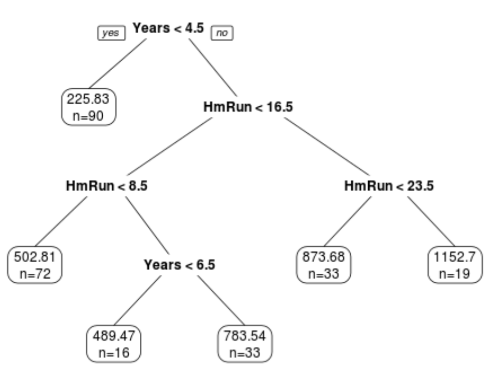

```{r setup, include=FALSE, warning=FALSE, message=FALSE}
knitr::opts_chunk$set(echo = TRUE, warning = FALSE, message = FALSE, 
                      fig.path = paste0("../images/", params$filter_type, "/"))
library(readr)
library(dplyr)
library(tidyr)
library(ggplot2)
library(GGally)
library(caret)
library(corrplot)
library(doParallel)
#install.packages("devtools")
#library(devtools)
#install_github("AppliedDataSciencePartners/xgboostExplainer")
```

## Introduction

The consumption of online news is expediting day by day due to the extensive adoption of smartphones and the rise of social networks. Online news can capture the eye of a significant amount of Internet users within a brief period of your time. Prediction of online news popularity helps news organizations to gain better insights into the audience interests and to deliver more relevant and appealing content in a proactive manner. The company can allocate resources more wisely to prepare stories over their life cycle. Moreover, prediction of news popularity is also beneficial for trend forecasting, understanding the collective human behavior, advertisers to propose more profitable monetization techniques,and readers to filter the huge amount of information quickly and efficiently.

We are going to analyze and predict the number of shares within different data channel of interest using an online news data set from [Machine Learning Repository](https://archive.ics.uci.edu/ml/datasets/Online+News+Popularity#) . This data set summarizes a heterogeneous set of features about articles published by Mashable in a period of two years.

-   We are going to focus on the following predictors:

    1.  url: URL of the article (non-predictive)

    2.  timedelta: Days between the article publication and the dataset acquisition (non-predictive)

    3.  n_tokens_title: Number of words in the title

    4.  n_tokens_content Number of words in the content

    5.  n_unique_tokens: Rate of unique words in the content

    6.  n_non_stop_unique_tokens: Rate of unique non-stop words in the content

    7.  num_hrefs: Number of links

    8.  num_self_hrefs: Number of links to other articles published by Mashable

    9.  num_imgs: Number of images

    10. num_videos: Number of videos

    11. average_token_length: Average length of the words in the content

    12. num_keywords: Number of keywords in the metadata

    13. self_reference_min_shares: Min. shares of referenced articles in Mashable

    14. self_reference_max_shares: Max. shares of referenced articles in Mashable

    15. self_reference_avg_sharess: Avg. shares of referenced articles in Mashable

    16. global_subjectivity: Text subjectivity

    17. global_sentiment_polarity: Text sentiment polarity

    18. global_rate_positive_words: Rate of positive words in the content

    19. global_rate_negative_words: Rate of negative words in the content

    20. rate_positive_words: Rate of positive words among non-neutral tokens

    21. rate_negative_words: Rate of negative words among non-neutral tokens

    22. title_subjectivity: Title subjectivity

    23. title_sentiment_polarity: Title polarity

    24. abs_title_subjectivity: Absolute subjectivity level

    25. abs_title_sentiment_polarity: Absolute polarity level

    26. shares: Number of shares (target)

Stop Words usually refer to the most common words in a language, there is no single universal list of stop words used by all natural language processing tools. For some search engines, these are some of the most common, short function words, such as the, is, at, which, and on.

In order to predict the number of share, we are going to build linear regression and ensemble tree-based model.

## Prepare Data

We'll use the `readr` and `dplyr` packages from the `tidyverse`. First, we are going to read in data as tibble using function `read_csv`. Next, in order to access different data channel of interest automatically, we are going to create a variable called `type`. Last we `filter` the data channel of interest using `params$` automatically.

-   Read in raw data and create new variable `type`

```{r}
# read in raw data
raw_data <- read_csv("../Data/OnlineNewsPopularity.csv") 

# create type column for different data channel
type_data <- raw_data %>% 
  mutate(
    type=ifelse(data_channel_is_lifestyle==1, "lifestyle", 
            ifelse(data_channel_is_entertainment==1, "entertainment", 
                ifelse(data_channel_is_bus==1, "bus", 
                    ifelse(data_channel_is_socmed==1, "socmed", 
                        ifelse(data_channel_is_tech==1, "tech", 
                            ifelse(data_channel_is_world==1, "world", NA)
                            )
                        )
                    )
                )
            )
  )
```

-   Subset data channel of interest automatically with `params`

```{r}
# select data for data channel of interest and create single weekday variable
target_data <- type_data %>% 
  filter(type == params$filter_type) %>%
  mutate(
    weekday=ifelse(
      weekday_is_monday==1, "Monday", 
        ifelse(weekday_is_tuesday==1, "Tuesday", 
          ifelse(weekday_is_wednesday==1, "Wednesday", 
            ifelse(weekday_is_thursday==1, "Thursday", 
              ifelse(weekday_is_friday==1, "Friday", 
                ifelse(weekday_is_saturday==1, "Saturday", 
                  ifelse(weekday_is_sunday==1, "Sunday", NA)
                  )
                )
              )
            )
          )
      )
    )
target_data
```

-   Split data into training and test sets

```{r}
set.seed(100)
train_index <- createDataPartition(target_data$is_weekend, p=0.7, list=FALSE)
train <- target_data[train_index,]
test <- target_data[-train_index, ]
dim(train)
```

## Exploratory Data Analysis

First, we can look at a basic univariate summary and histograms of our target variable, the number of shares:

```{r John summary 1}
summary(train$shares)
train %>% ggplot(aes(shares, ..ndensity..)) +
  geom_histogram() +
  geom_density() +
  geom_vline(xintercept = mean(train$shares), linetype = 2, color = "red") +
  theme_bw() +
  labs(title = "Histogram of Number of Shares", x = "Shares", y = "Normalized Density")

train %>% filter(shares<quantile(shares, p=0.9)) %>%
  ggplot(aes(shares, ..ndensity..)) +
  geom_histogram() +
  geom_density() +
  geom_vline(xintercept = mean(train$shares), linetype = 2, color = "red") +
  theme_bw() +
  labs(title = "Histogram of Number of Shares", subtitle = "(excluding top 10%)", x = "Shares", y = "Normalized Density")
```

In the numeric summary, one thing to look for is the mean compared to the median, as well as where the mean lies relative to the minimum and maximum values. If the mean is significantly higher than the median and/or much closer to the minimum than the maximum, that means our data is right skewed, which we can observe in the histograms. The mean shares value is included as a reference point on the histograms, and the subsetted histogram is included to account for any potential right-skew.


-   descriptive statistics on numeric variables:

```{r}
summary(train %>% select(timedelta, n_tokens_title, n_tokens_content, n_unique_tokens, n_non_stop_unique_tokens, num_hrefs, num_self_hrefs, num_imgs, num_videos, average_token_length, num_keywords, self_reference_avg_sharess, self_reference_min_shares, self_reference_max_shares, global_rate_negative_words, global_rate_positive_words, global_sentiment_polarity, global_subjectivity, rate_negative_words, rate_positive_words, title_subjectivity, title_sentiment_polarity, abs_title_sentiment_polarity, abs_title_subjectivity))
```

We can find the minimum, 25% percentile, mean, median, 75% percentile and maximum values of each numeric variables from this chart.

```{r}
sapply(train %>% select(timedelta, n_tokens_title, n_tokens_content, n_unique_tokens, n_non_stop_unique_tokens, num_hrefs, num_self_hrefs, num_imgs, num_videos, average_token_length, num_keywords, self_reference_avg_sharess, self_reference_min_shares, self_reference_max_shares, global_rate_negative_words, global_rate_positive_words, global_sentiment_polarity, global_subjectivity, rate_negative_words, rate_positive_words, title_subjectivity, title_sentiment_polarity, abs_title_sentiment_polarity, abs_title_subjectivity), sd)
```

From here we can compare standard deviation between numeric variables.

-   Correlation between numeric variables

```{r}
#str(train)
Correlation <- cor(train %>% select(-url, -type, -starts_with("weekday"), -starts_with("data_channel"), -is_weekend ))
corrplot(Correlation, type="upper", tl.pos="lt", cl.cex=0.8)
```

This plot help us to check linear relationship between numeric variables. We want to avoid include predictors with high correlation in the same model.

-   summary across different day of the week

We are going to visualize share performance on different day of the week.

```{r}
# shares on different day
train %>% group_by(weekday) %>% 
  summarize(
    n=n(), 
    min=min(shares), 
    max=max(shares), 
    avg=mean(shares), 
    median=median(shares)
  )
```

We can inspect the effect of `weekday` on the `share`. The number of records on each day as well as the minimum, maximum, mean and median values of shares on each day of the week are included in the table here. If there are big difference across `weekday`, then `weekday` and `share` are dependent.

We also can check the difference in plot.

```{r}
g <- ggplot(train %>% filter(shares<quantile(shares, p=0.75)), aes(x=shares))
g + geom_freqpoly(aes(color=weekday)) +
  ggtitle("Counts of shares across day of the week")
```

```{r}
ggplot(train, aes(x=weekday, y=shares)) +
  geom_boxplot() +
  scale_y_continuous(limits=c(min(train$shares), quantile(train$shares, p=0.75)+IQR(train$shares))) +
  ggtitle("box plot of shares across day of the week")
```

In this plot, we can compare the median, 25% percentile, 75% percentile and IQR of shares between different day of the week. It will show the effect of day on the shares.

We can also examine this relationship by binning the number of shares into groups and constructing a contingency table.

```{r John summary 2}
train %>%
  mutate(Shares = cut(shares, c(seq(0, 10000, by = 1000), max(shares)), dig.lab = 6)) %>%
  group_by(weekday, Shares) %>%
  summarise(n = n()) %>%
  pivot_wider(names_from = weekday, values_from = n, values_fill = 0) %>%
  arrange(Shares)
```

With this contingency table, we can get an idea of how many shares articles tend to get across the different days. We can also observe which days have the most "viral" articles that get an extremely high number of shares.

-   Scatter plot

We want to check the relationship between response variable `share` and other predictors through scatter plot. Linear or non-linear? Positive or negative?

```{r}
g <- ggplot(train, aes(x=num_self_hrefs, y=shares) )
g + geom_jitter() +
    scale_y_continuous(
      limits=c(min(train$shares), quantile(train$shares, p=0.75)+2*IQR(train$shares))
    ) +
    scale_x_continuous(
      limits=c(min(train$num_self_hrefs), quantile(train$num_self_hrefs, p=0.75)+2*IQR(train$num_self_hrefs))
    ) +
    ggtitle("scatter plot of shares against number of links") 
```

```{r}
g <- ggplot(train, aes(x=rate_positive_words, y=shares) )
g + geom_point() +
  scale_y_continuous(
    limits=c(min(train$shares), quantile(train$shares, p=0.75)+2*IQR(train$shares))
  ) +
  ggtitle("scatter plot of shares against rate of positive words")
```

We will also examine the relationship of number of shares with the absolute polarity of the title - perhaps articles with titles that have a more polarizing sentiment are more likely to get shares.

```{r John summary 3}
train %>% filter(shares<quantile(shares, p=0.9)) %>%
  ggplot(aes(abs_title_sentiment_polarity, shares)) +
  geom_jitter() +
  labs(title = "Number of Shares by Abs. Title Sentiment Polarity", subtitle = "(excluding top 10% of shares)", x = "Absolute Title Polarity", y = "Shares") +
  theme_bw()
```

Another thing we can examine is the relationship between the number of shares and the number of shares in referenced articles (min, max, and average).

```{r John summary 4}
train %>% 
  select(shares, self_reference_min_shares, self_reference_avg_sharess, self_reference_max_shares) %>% 
  filter(shares<quantile(shares, p=0.9)) %>%
  ggpairs(columnLabels = c("Shares", "Min. Ref. Shares", "Avg. Ref. Shares", "Max. Ref. Shares")) + 
  labs(title = "(excluding top 10% of shares)") +
  theme_bw()
```

For this grid of plots, we will want to focus on the column/row for shares. We can visually see the relationship between number of shares for an article vs. the number of shares in its referenced articles by examining the scatter plots, or look at the actual numeric correlations. We just want a general idea of whether the relationships are positive or negative, as well as linear or non-linear.

## Model Building

We will be fitting 4 total models for comparison:

-   2 linear regression models
-   1 random forest model
-   1 boosted tree model

For the 2 linear regression models, we will use basic 10-fold cross validation to evaluate the fit on the training data, while using 5-fold 3-times repeated cross-validation for the tree-based models. To ease the computation time, we will also utilize parallel processing, which will require a bit of set-up.

```{r John setup}
# control setup
controlLR <- trainControl(method = "cv", number = 10, allowParallel = TRUE)
controlTree <- trainControl(method = "repeatedcv", number = 5, repeats = 3, allowParallel = TRUE)

# parallel setup
cl <- makeCluster(detectCores() - 2)
registerDoParallel(cl)
```

### Linear Regression Models

-----REGRESSION EXPLANATION PLACEHOLDER-----

#### Fang

```{r}
mlFit <- train(shares~timedelta+weekday+num_self_hrefs+num_imgs+num_videos, data=train, method="lm", preProcess=c("center", "scale"), trControl=controlLR)
mlFit
```

#### John

This model will use stepwise regression to select the optimal model based on the AIC metric, considering all possible predictive variables (aside from the Sunday indicator, weekend indicator, and the rate of negative words, which all caused )

```{r John regression}
mlrFit2 <- train(
  shares ~ .,
  data = train %>% select(-url, -timedelta, -starts_with("data_channel"), -weekday, -weekday_is_sunday, -type, -is_weekend),
  method = "lmStepAIC",
  preProcess = c("center", "scale"),
  trControl = controlLR,
  trace = FALSE,
  scope = list(upper = ~., lower = ~1)
)
mlrFit2
summary(mlrFit2$finalModel)
```

### Tree-based Models

#### Random Forest

Random forest models are based on the more simple regression trees - an example of this is shown here:



Regression trees have many benefits, and are very easily interpretable by looking at the visual. However, they are highly variable based on the specific data used to build them. Random forest models are one way to combat this.

Random forest models use bootstrap sampling to fit many regression trees, each one using a random subset of predictors ($m$). This makes it so that predictions are not dominated by a small number of predictors, leading to more consistent results.

The standard practice is to use $m = p/3$, where $p$ represents the total number of predictors. For this case, that means we would use $m = 53/3 \approx 18$ after removing all non-predictive variables from the dataset. Thus, we will consider $m$ values ranging anywhere from 1 to 24, selecting the optimal model based on the model performance in repeated cross-validation.

```{r John RF}
# saving data as a matrix and vector to take up less memory across workers
x <- as.matrix(train %>% select(-url, -timedelta, -starts_with("data_channel"), -shares, -type, -weekday))
y <- train$shares

# fitting model
# to ease the computation time to create output, mtry values of 1-10 were the only ones tested in the final program
# tuning values of 1 through 24 were still tested before creating final product.
set.seed(91894)
rf <- train(
  x, y,
  method = "rf",
  preProcess = c("center", "scale"),
  trControl = controlTree,
  tuneGrid = data.frame(mtry = 1:10),
  importance = TRUE,
  ntree = 500
)

# showing results / variable importance
rf$results
rf$bestTune
varImp(rf)
plot(varImp(rf), top = 20)
```

#### Boosted Trees

Boosted trees model trains a bunch of trees sequentially. Each subsequent tree learns from the mistakes of the previous tree. So predictions get updated as trees grown. It is used for both regression and classification.

```{r}
n.trees=c(50, 100, 150)
interaction.depth=c(2,3,4)
shrinkage=c(0.1, 0.5)
n.minobsinnode=c(10)
tune_parameter <- expand.grid(
  n.trees=n.trees, 
  interaction.depth=interaction.depth, 
  shrinkage=shrinkage, 
  n.minobsinnode=n.minobsinnode
)

boostedFit <- train(
  shares~timedelta+weekday+num_self_hrefs+num_imgs+num_videos+rate_positive_words, 
  data=train, 
  method="gbm", 
  trControl=controlTree, 
  tuneGrid=tune_parameter
)
boostedFit
```

### Compare models on the test set

```{r}
ml_pred <- predict(mlFit, test)
ml_MSE <- postResample(test$shares, ml_pred)[1]
boosted_pred <- predict(boostedFit, test)
boosted_MSE <- postResample(test$shares, boosted_pred)[1]
comp <- data.frame(LR=ml_MSE, Boosted=boosted_MSE)
comp

evalFit <- function(fit, modelName) {
  pred <- predict(fit, test)
  stats <- postResample(predML1, obs = test$shares)
  statsDF <- data.frame(RMSE = stats[1], Rsq = stats[2], MAE = stats[3])
  statsDF %>%
    pivot_longer(RMSE:MAE, names_to = "metric", values_to = modelName)
}
predML1 <- predict(mlFit, test)
resML1 <- postResample(predML1, obs = test$shares)

```

```{r}
best_model <- which.min(comp["RMSE",])
best_model
```

`r names(best_model)` has the minimum MSE which indicates the best fitting.
