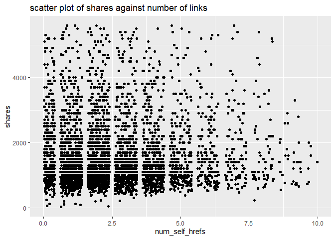

ST 558 Project 2
================
John Hinic & Fang Wu
2022-07-01

-   [Introduction](#introduction)
-   [Prepare Data](#prepare-data)
-   [Exploratory Data Analysis](#exploratory-data-analysis)
-   [Model Building](#model-building)
-   [Model Comparison](#model-comparison)

## Introduction

The consumption of online news is expediting day by day due to the
extensive adoption of smartphones and the rise of social networks.
Online news can capture the eye of a significant amount of Internet users
within a brief period of your time. Prediction of online news popularity
helps news organizations to gain better insights into the audience
interests and to deliver more relevant and appealing content in a
proactive manner. The company can allocate resources more wisely to
prepare stories over their life cycle. Moreover, prediction of news
popularity is also beneficial for trend forecasting, understanding the
collective human behavior, advertisers to propose more profitable
monetization techniques,and readers to filter the huge amount of
information quickly and efficiently.

We are going to analyze and predict the number of shares within
different data channel of interest using an online news data set from
[Machine Learning
Repository](https://archive.ics.uci.edu/ml/datasets/Online+News+Popularity#)
. This data set summarizes a heterogeneous set of features about
articles published by Mashable in a period of two years.

-   We are going to focus on the following predictors:

    1.  url: URL of the article (non-predictive)

    2.  timedelta: Days between the article publication and the dataset
        acquisition (non-predictive)

    3.  n_tokens_title: Number of words in the title

    4.  n_tokens_content Number of words in the content

    5.  n_unique_tokens: Rate of unique words in the content

    6.  n_non_stop_unique_tokens: Rate of unique non-stop words in the
        content

    7.  num_hrefs: Number of links

    8.  num_self_hrefs: Number of links to other articles published by
        Mashable

    9.  num_imgs: Number of images

    10. num_videos: Number of videos

    11. average_token_length: Average length of the words in the content

    12. num_keywords: Number of keywords in the metadata

    13. self_reference_min_shares: Min. shares of referenced articles in
        Mashable

    14. self_reference_max_shares: Max. shares of referenced articles in
        Mashable

    15. self_reference_avg_sharess: Avg. shares of referenced articles
        in Mashable

    16. global_subjectivity: Text subjectivity

    17. global_sentiment_polarity: Text sentiment polarity

    18. global_rate_positive_words: Rate of positive words in the
        content

    19. global_rate_negative_words: Rate of negative words in the
        content

    20. rate_positive_words: Rate of positive words among non-neutral
        tokens

    21. rate_negative_words: Rate of negative words among non-neutral
        tokens

    22. title_subjectivity: Title subjectivity

    23. title_sentiment_polarity: Title polarity

    24. abs_title_subjectivity: Absolute subjectivity level

    25. abs_title_sentiment_polarity: Absolute polarity level

    26. shares: Number of shares (target)

Stop Words usually refer to the most common words in a language, there
is no single universal list of stop words used by all natural language
processing tools. For some search engines, these are some of the most
common, short function words, such as the, is, at, which, and on.

In order to predict the number of share, we are going to build linear
regression and ensemble tree-based model.

## Prepare Data

We’ll use the `readr` and `dplyr` packages from the `tidyverse`. First,
we are going to read in data as tibble using function `read_csv`. Next,
in order to access different data channel of interest automatically, we
are going to create a variable called `type`. Last we `filter` the data
channel of interest using `params$` automatically.

-   Read in raw data and create new variable `type`

``` r
# read in raw data
raw_data <- read_csv("../Data/OnlineNewsPopularity.csv") 

# create type column for different data channel
type_data <- raw_data %>% 
  mutate(
    type=ifelse(data_channel_is_lifestyle==1, "lifestyle", 
            ifelse(data_channel_is_entertainment==1, "entertainment", 
                ifelse(data_channel_is_bus==1, "bus", 
                    ifelse(data_channel_is_socmed==1, "socmed", 
                        ifelse(data_channel_is_tech==1, "tech", 
                            ifelse(data_channel_is_world==1, "world", NA)
                            )
                        )
                    )
                )
            )
  )
```

-   Subset data channel of interest automatically with `params`

``` r
# select data for data channel of interest and create single weekday variable
target_data <- type_data %>% 
  filter(type == params$filter_type) %>%
  mutate(
    weekday=ifelse(
      weekday_is_monday==1, "Monday", 
        ifelse(weekday_is_tuesday==1, "Tuesday", 
          ifelse(weekday_is_wednesday==1, "Wednesday", 
            ifelse(weekday_is_thursday==1, "Thursday", 
              ifelse(weekday_is_friday==1, "Friday", 
                ifelse(weekday_is_saturday==1, "Saturday", 
                  ifelse(weekday_is_sunday==1, "Sunday", NA)
                  )
                )
              )
            )
          )
      )
    )
target_data
```

    ## # A tibble: 6,258 x 63
    ##    url     timedelta n_tokens_title n_tokens_content n_unique_tokens n_non_stop_words n_non_stop_uniq~ num_hrefs num_self_hrefs num_imgs num_videos average_token_l~
    ##    <chr>       <dbl>          <dbl>            <dbl>           <dbl>            <dbl>            <dbl>     <dbl>          <dbl>    <dbl>      <dbl>            <dbl>
    ##  1 http:/~       731              9              255           0.605             1.00            0.792         3              1        1          0             4.91
    ##  2 http:/~       731              9              211           0.575             1.00            0.664         3              1        1          0             4.39
    ##  3 http:/~       731              8              397           0.625             1.00            0.806        11              0        1          0             5.45
    ##  4 http:/~       731             13              244           0.560             1.00            0.680         3              2        1          0             4.42
    ##  5 http:/~       731             11              723           0.491             1.00            0.642        18              1        1          0             5.23
    ##  6 http:/~       731              8              708           0.482             1.00            0.688         8              3        1          1             4.62
    ##  7 http:/~       731             10              142           0.655             1.00            0.792         2              1        1          0             4.27
    ##  8 http:/~       731             12              444           0.601             1.00            0.755         9              8       23          0             4.81
    ##  9 http:/~       731              6              109           0.667             1.00            0.737         3              2        1          0             4.73
    ## 10 http:/~       730             13              306           0.535             1.00            0.705         3              2        1          0             4.58
    ## # ... with 6,248 more rows, and 51 more variables: num_keywords <dbl>, data_channel_is_lifestyle <dbl>, data_channel_is_entertainment <dbl>,
    ## #   data_channel_is_bus <dbl>, data_channel_is_socmed <dbl>, data_channel_is_tech <dbl>, data_channel_is_world <dbl>, kw_min_min <dbl>, kw_max_min <dbl>,
    ## #   kw_avg_min <dbl>, kw_min_max <dbl>, kw_max_max <dbl>, kw_avg_max <dbl>, kw_min_avg <dbl>, kw_max_avg <dbl>, kw_avg_avg <dbl>, self_reference_min_shares <dbl>,
    ## #   self_reference_max_shares <dbl>, self_reference_avg_sharess <dbl>, weekday_is_monday <dbl>, weekday_is_tuesday <dbl>, weekday_is_wednesday <dbl>,
    ## #   weekday_is_thursday <dbl>, weekday_is_friday <dbl>, weekday_is_saturday <dbl>, weekday_is_sunday <dbl>, is_weekend <dbl>, LDA_00 <dbl>, LDA_01 <dbl>,
    ## #   LDA_02 <dbl>, LDA_03 <dbl>, LDA_04 <dbl>, global_subjectivity <dbl>, global_sentiment_polarity <dbl>, global_rate_positive_words <dbl>,
    ## #   global_rate_negative_words <dbl>, rate_positive_words <dbl>, rate_negative_words <dbl>, avg_positive_polarity <dbl>, min_positive_polarity <dbl>, ...

-   Split data into training and test sets

``` r
set.seed(100)
train_index <- createDataPartition(target_data$is_weekend, p=0.7, list=FALSE)
train <- target_data[train_index,]
test <- target_data[-train_index, ]
dim(train)
```

    ## [1] 4381   63

## Exploratory Data Analysis

First, we can look at a basic univariate summary and histograms of our
target variable, the number of shares:

``` r
summary(train$shares)
```

    ##    Min. 1st Qu.  Median    Mean 3rd Qu.    Max. 
    ##       1     948    1400    3211    2500  690400

``` r
train %>% ggplot(aes(shares, ..ndensity..)) +
  geom_histogram() +
  geom_density() +
  geom_vline(xintercept = mean(train$shares), linetype = 2, color = "red") +
  theme_bw() +
  labs(title = "Histogram of Number of Shares", x = "Shares", y = "Normalized Density")
```

<!-- -->

``` r
train %>% filter(shares<quantile(shares, p=0.9)) %>%
  ggplot(aes(shares, ..ndensity..)) +
  geom_histogram() +
  geom_density() +
  geom_vline(xintercept = mean(train$shares), linetype = 2, color = "red") +
  theme_bw() +
  labs(title = "Histogram of Number of Shares", subtitle = "(excluding top 10%)", x = "Shares", y = "Normalized Density")
```

<!-- -->

In the numeric summary, one thing to look for is the mean compared to
the median, as well as where the mean lies relative to the minimum and
maximum values. If the mean is significantly higher than the median
and/or much closer to the minimum than the maximum, that means our data
is right skewed, which we can observe in the histograms. The mean shares
value is included as a reference point on the histograms, and the
subsetted histogram is included to account for any potential right-skew.

-   descriptive statistics on numeric variables:

``` r
summary(
  train %>% 
    select(timedelta, n_tokens_title, n_tokens_content, n_unique_tokens, n_non_stop_unique_tokens, num_hrefs,
           num_self_hrefs, num_imgs, num_videos, average_token_length, num_keywords, self_reference_avg_sharess,
           self_reference_min_shares, self_reference_max_shares, global_rate_negative_words, global_rate_positive_words,
           global_sentiment_polarity, global_subjectivity, rate_negative_words, rate_positive_words, title_subjectivity,
           title_sentiment_polarity, abs_title_sentiment_polarity, abs_title_subjectivity)
)
```

    ##    timedelta     n_tokens_title n_tokens_content n_unique_tokens  n_non_stop_unique_tokens   num_hrefs       num_self_hrefs      num_imgs        num_videos    
    ##  Min.   :  8.0   Min.   : 3.0   Min.   :   0.0   Min.   :0.0000   Min.   :0.0000           Min.   :  0.000   Min.   : 0.000   Min.   : 0.000   Min.   : 0.000  
    ##  1st Qu.:204.0   1st Qu.: 9.0   1st Qu.: 245.0   1st Qu.:0.4783   1st Qu.:0.6491           1st Qu.:  4.000   1st Qu.: 1.000   1st Qu.: 1.000   1st Qu.: 0.000  
    ##  Median :385.0   Median :10.0   Median : 400.0   Median :0.5486   Median :0.7043           Median :  7.000   Median : 2.000   Median : 1.000   Median : 0.000  
    ##  Mean   :381.6   Mean   :10.3   Mean   : 538.2   Mean   :0.5462   Mean   :0.7038           Mean   :  9.283   Mean   : 2.764   Mean   : 1.786   Mean   : 0.617  
    ##  3rd Qu.:567.0   3rd Qu.:12.0   3rd Qu.: 729.0   3rd Qu.:0.6108   3rd Qu.:0.7603           3rd Qu.: 11.000   3rd Qu.: 4.000   3rd Qu.: 1.000   3rd Qu.: 0.000  
    ##  Max.   :731.0   Max.   :19.0   Max.   :4747.0   Max.   :0.8732   Max.   :0.9730           Max.   :102.000   Max.   :56.000   Max.   :40.000   Max.   :75.000  
    ##  average_token_length  num_keywords    self_reference_avg_sharess self_reference_min_shares self_reference_max_shares global_rate_negative_words
    ##  Min.   :0.000        Min.   : 2.000   Min.   :     0             Min.   :     0            Min.   :     0            Min.   :0.000000          
    ##  1st Qu.:4.527        1st Qu.: 5.000   1st Qu.:   549             1st Qu.:   164            1st Qu.:   577            1st Qu.:0.009091          
    ##  Median :4.686        Median : 6.000   Median :  2000             Median :  1100            Median :  2500            Median :0.014085          
    ##  Mean   :4.688        Mean   : 6.481   Mean   :  6017             Mean   :  3375            Mean   : 10212            Mean   :0.014750          
    ##  3rd Qu.:4.860        3rd Qu.: 8.000   3rd Qu.:  4300             3rd Qu.:  2200            3rd Qu.:  6100            3rd Qu.:0.019305          
    ##  Max.   :5.960        Max.   :10.000   Max.   :690400             Max.   :690400            Max.   :690400            Max.   :0.064220          
    ##  global_rate_positive_words global_sentiment_polarity global_subjectivity rate_negative_words rate_positive_words title_subjectivity title_sentiment_polarity
    ##  Min.   :0.00000            Min.   :-0.2176           Min.   :0.0000      Min.   :0.0000      Min.   :0.0000      Min.   :0.0000     Min.   :-1.00000        
    ##  1st Qu.:0.03214            1st Qu.: 0.0839           1st Qu.:0.3866      1st Qu.:0.1667      1st Qu.:0.6667      1st Qu.:0.0000     1st Qu.: 0.00000        
    ##  Median :0.04235            Median : 0.1356           Median :0.4409      Median :0.2500      Median :0.7500      Median :0.1000     Median : 0.00000        
    ##  Mean   :0.04329            Mean   : 0.1357           Mean   :0.4365      Mean   :0.2581      Mean   :0.7382      Mean   :0.2491     Mean   : 0.08099        
    ##  3rd Qu.:0.05365            3rd Qu.: 0.1852           3rd Qu.:0.4894      3rd Qu.:0.3333      3rd Qu.:0.8333      3rd Qu.:0.4750     3rd Qu.: 0.13636        
    ##  Max.   :0.12500            Max.   : 0.5737           Max.   :1.0000      Max.   :1.0000      Max.   :1.0000      Max.   :1.0000     Max.   : 1.00000        
    ##  abs_title_sentiment_polarity abs_title_subjectivity
    ##  Min.   :0.0000               Min.   :0.0000        
    ##  1st Qu.:0.0000               1st Qu.:0.1648        
    ##  Median :0.0000               Median :0.5000        
    ##  Mean   :0.1396               Mean   :0.3398        
    ##  3rd Qu.:0.2121               3rd Qu.:0.5000        
    ##  Max.   :1.0000               Max.   :0.5000

We can find the minimum, 25% percentile, mean, median, 75% percentile
and maximum values of each numeric variables from this chart.

``` r
sapply(
  train %>% 
    select(timedelta, n_tokens_title, n_tokens_content, n_unique_tokens, n_non_stop_unique_tokens, num_hrefs, num_self_hrefs,
           num_imgs, num_videos, average_token_length, num_keywords, self_reference_avg_sharess, self_reference_min_shares,
           self_reference_max_shares, global_rate_negative_words, global_rate_positive_words, global_sentiment_polarity,
           global_subjectivity, rate_negative_words, rate_positive_words, title_subjectivity, title_sentiment_polarity,
           abs_title_sentiment_polarity, abs_title_subjectivity), 
  sd
)
```

    ##                    timedelta               n_tokens_title             n_tokens_content              n_unique_tokens     n_non_stop_unique_tokens 
    ##                 2.084392e+02                 2.156898e+00                 4.258133e+02                 1.004417e-01                 9.472628e-02 
    ##                    num_hrefs               num_self_hrefs                     num_imgs                   num_videos         average_token_length 
    ##                 8.115511e+00                 2.824893e+00                 3.343843e+00                 3.343203e+00                 3.886922e-01 
    ##                 num_keywords   self_reference_avg_sharess    self_reference_min_shares    self_reference_max_shares   global_rate_negative_words 
    ##                 1.963925e+00                 2.678431e+04                 2.022250e+04                 4.785129e+04                 8.560499e-03 
    ##   global_rate_positive_words    global_sentiment_polarity          global_subjectivity          rate_negative_words          rate_positive_words 
    ##                 1.635989e-02                 8.265347e-02                 8.452655e-02                 1.375670e-01                 1.438000e-01 
    ##           title_subjectivity     title_sentiment_polarity abs_title_sentiment_polarity       abs_title_subjectivity 
    ##                 2.980393e-01                 2.389479e-01                 2.101250e-01                 1.905357e-01

From here we can compare standard deviation between numeric variables.

-   Correlation between numeric variables

``` r
#str(train)
Correlation <- cor(train %>% select(-url, -type, -starts_with("weekday"), -starts_with("data_channel"), -is_weekend ))
corrplot(Correlation, type="upper", tl.pos="lt", cl.cex=0.8)
```

<!-- -->

This plot help us to check linear relationship between numeric
variables. We want to avoid include predictors with high correlation in
the same model.

-   summary across different day of the week

We are going to visualize share performance on different day of the
week.

``` r
# shares on different day
train %>% group_by(weekday) %>% 
  summarize(
    n=n(), 
    min=min(shares), 
    max=max(shares), 
    avg=mean(shares), 
    median=median(shares)
  )
```

    ## # A tibble: 7 x 6
    ##   weekday       n   min    max   avg median
    ##   <chr>     <int> <dbl>  <dbl> <dbl>  <dbl>
    ## 1 Friday      572    28 102200 2302.   1400
    ## 2 Monday      803     1 690400 4381.   1400
    ## 3 Saturday    168   150 144400 4392.   2600
    ## 4 Sunday      250   692  56900 3663.   2200
    ## 5 Thursday    861    99 306100 3121.   1300
    ## 6 Tuesday     811    44 310800 2943.   1300
    ## 7 Wednesday   916    63 158900 2733.   1300

We can inspect the effect of `weekday` on the `share`. The number of
records on each day as well as the minimum, maximum, mean and median
values of shares on each day of the week are included in the table here.
If there are big difference across `weekday`, then `weekday` and `share`
are dependent.

We also can check the difference in plot.

``` r
g <- ggplot(train %>% filter(shares<quantile(shares, p=0.75)), aes(x=shares))
g + geom_freqpoly(aes(color=weekday)) +
  ggtitle("Counts of shares across day of the week")
```

<!-- -->

``` r
ggplot(train, aes(x=weekday, y=shares)) +
  geom_boxplot() +
  scale_y_continuous(limits=c(min(train$shares), quantile(train$shares, p=0.75)+IQR(train$shares))) +
  ggtitle("box plot of shares across day of the week")
```

<!-- -->

In this plot, we can compare the median, 25% percentile, 75% percentile
and IQR of shares between different day of the week. It will show the
effect of day on the shares.

We can also examine this relationship by binning the number of shares
into groups and constructing a contingency table.

``` r
train %>%
  mutate(Shares = cut(shares, c(seq(0, 10000, by = 1000), max(shares)), dig.lab = 6)) %>%
  group_by(weekday, Shares) %>%
  summarise(n = n()) %>%
  pivot_wider(names_from = weekday, values_from = n, values_fill = 0) %>%
  arrange(Shares)
```

    ## # A tibble: 11 x 8
    ##    Shares         Friday Monday Saturday Sunday Thursday Tuesday Wednesday
    ##    <fct>           <int>  <int>    <int>  <int>    <int>   <int>     <int>
    ##  1 (0,1000]          162    264        5     19      302     293       345
    ##  2 (1000,2000]       235    279       53     95      298     293       317
    ##  3 (2000,3000]        74     97       44     41      128      86       106
    ##  4 (3000,4000]        37     59       27     38       51      40        49
    ##  5 (4000,5000]        20     22       13     12       13      20        28
    ##  6 (5000,6000]        16     18        4     23       18      21         9
    ##  7 (6000,7000]        12     10        4      8       18       7        12
    ##  8 (7000,8000]         2     10        6      1        7       5        13
    ##  9 (8000,9000]         5      6        1      0        3       9        10
    ## 10 (9000,10000]        0      5        3      0        3       6         3
    ## 11 (10000,690400]      9     33        8     13       20      31        24

With this contingency table, we can get an idea of how many shares
articles tend to get across the different days. We can also observe
which days have the most “viral” articles that get an extremely high
number of shares.

-   Scatter plot

We want to check the relationship between response variable `share` and
other predictors through scatter plot. Linear or non-linear? Positive or
negative?

``` r
g <- ggplot(train, aes(x=num_self_hrefs, y=shares) )
g + geom_jitter() +
    scale_y_continuous(
      limits=c(min(train$shares), quantile(train$shares, p=0.75)+2*IQR(train$shares))
    ) +
    scale_x_continuous(
      limits=c(min(train$num_self_hrefs), quantile(train$num_self_hrefs, p=0.75)+2*IQR(train$num_self_hrefs))
    ) +
    ggtitle("scatter plot of shares against number of links") 
```

<!-- -->

``` r
g <- ggplot(train, aes(x=rate_positive_words, y=shares) )
g + geom_point() +
  scale_y_continuous(
    limits=c(min(train$shares), quantile(train$shares, p=0.75)+2*IQR(train$shares))
  ) +
  ggtitle("scatter plot of shares against rate of positive words")
```

<!-- -->

We will also examine the relationship of number of shares with the
absolute polarity of the title - perhaps articles with titles that have
a more polarizing sentiment are more likely to get shares.

``` r
train %>% filter(shares<quantile(shares, p=0.9)) %>%
  ggplot(aes(abs_title_sentiment_polarity, shares)) +
  geom_jitter() +
  labs(title = "Number of Shares by Abs. Title Sentiment Polarity", subtitle = "(excluding top 10% of shares)", x = "Absolute Title Polarity", y = "Shares") +
  theme_bw()
```

<!-- -->

Another thing we can examine is the relationship between the number of
shares and the number of shares in referenced articles (min, max, and
average).

``` r
train %>% 
  select(shares, self_reference_min_shares, self_reference_avg_sharess, self_reference_max_shares) %>% 
  filter(shares<quantile(shares, p=0.9)) %>%
  ggpairs(columnLabels = c("Shares", "Min. Ref. Shares", "Avg. Ref. Shares", "Max. Ref. Shares")) + 
  labs(title = "(excluding top 10% of shares)") +
  theme_bw()
```

<!-- -->

For this grid of plots, we will want to focus on the column/row for
shares. We can visually see the relationship between number of shares
for an article vs. the number of shares in its referenced articles by
examining the scatter plots, or look at the actual numeric correlations.
We just want a general idea of whether the relationships are positive or
negative, as well as linear or non-linear.

## Model Building

We will be fitting 4 total models for comparison:

-   2 linear regression models
-   1 random forest model
-   1 boosted tree model

For the 2 linear regression models, we will use basic 10-fold cross
validation to evaluate the fit on the training data, while using 5-fold
3-times repeated cross-validation for the tree-based models. To ease the
computation time, we will also utilize parallel processing, which will
require a bit of set-up.

``` r
# control setup
controlLR <- trainControl(method = "cv", number = 10, allowParallel = TRUE)
controlTree <- trainControl(method = "repeatedcv", number = 5, repeats = 3, allowParallel = TRUE)

# parallel setup
cl <- makeCluster(detectCores() - 2)
registerDoParallel(cl)
```

### Linear Regression Models

As mentioned, the first 2 kinds of models we will fit to the data will
be linear regression models. Linear regression is, for the most part,
the most basic form of predictive modeling available. The simplest form,
a single predictor and single response, is essentially just constructing
a line that “agrees” with the data as closely as possible. In this case,
it is similar to the basic slope form of a line, *y* = *m**x* + *b*. We
have a response variable *y*, a predictor variable *x*, a slope *m*, and
a y-intercept *b*. However, since we are modelling real-world data,
there is an additional random error term in our formula:

*Y*<sub>*i*</sub> = *β*<sub>0</sub> + *β*<sub>1</sub>*x*<sub>*i*</sub> + *E*<sub>*i*</sub>
Where *E*<sub>*i*</sub> is our random error term (and assumed to follow
a normal distribution in most cases). To actually calculate the
*β*<sub>0</sub> and *β*<sub>1</sub>, we find the values that minimize
the sum of squared errors:

$$\\sum\_{i = 1}^{n} (y_i - \\beta_0 - \\beta_1 x_i)^2$$

This can also be extended in many ways, such as adding in more predictor
variables or higher-order terms, but the model is still fit by
minimizing the sum of squared errors as with simple linear regression.

#### Fang

``` r
mlFit <- train(shares~timedelta+weekday+num_self_hrefs+num_imgs+num_videos, data=train, method="lm", preProcess=c("center", "scale"), trControl=controlLR)
mlFit
```

    ## Linear Regression 
    ## 
    ## 4381 samples
    ##    5 predictor
    ## 
    ## Pre-processing: centered (10), scaled (10) 
    ## Resampling: Cross-Validated (10 fold) 
    ## Summary of sample sizes: 3943, 3943, 3943, 3942, 3943, 3943, ... 
    ## Resampling results:
    ## 
    ##   RMSE      Rsquared     MAE     
    ##   13618.68  0.006784561  2991.714
    ## 
    ## Tuning parameter 'intercept' was held constant at a value of TRUE

#### John

This model will use stepwise regression to select the optimal model
based on the AIC metric, considering all possible predictive variables
(aside from the Sunday indicator, weekend indicator, and the rate of
negative words, which all caused )

``` r
mlrFit2 <- train(
  shares ~ .,
  data = train %>% select(-url, -timedelta, -starts_with("data_channel"), -weekday, -weekday_is_sunday, -type, -is_weekend),
  method = "lmStepAIC",
  preProcess = c("center", "scale"),
  trControl = controlLR,
  trace = FALSE,
  scope = list(upper = ~., lower = ~1)
)
mlrFit2
```

    ## Linear Regression with Stepwise Selection 
    ## 
    ## 4381 samples
    ##   50 predictor
    ## 
    ## Pre-processing: centered (50), scaled (50) 
    ## Resampling: Cross-Validated (10 fold) 
    ## Summary of sample sizes: 3943, 3943, 3943, 3943, 3942, 3943, ... 
    ## Resampling results:
    ## 
    ##   RMSE      Rsquared   MAE     
    ##   14685.63  0.0147732  3399.806

``` r
summary(mlrFit2$finalModel)
```

    ## 
    ## Call:
    ## lm(formula = .outcome ~ n_unique_tokens + num_self_hrefs + num_imgs + 
    ##     num_videos + average_token_length + kw_max_min + kw_avg_min + 
    ##     kw_min_max + kw_max_avg + kw_avg_avg + self_reference_min_shares + 
    ##     weekday_is_monday + LDA_03 + min_negative_polarity + max_negative_polarity, 
    ##     data = dat)
    ## 
    ## Residuals:
    ##    Min     1Q Median     3Q    Max 
    ## -75453  -2383   -889    655 674655 
    ## 
    ## Coefficients:
    ##                           Estimate Std. Error t value Pr(>|t|)    
    ## (Intercept)                 3210.6      260.6  12.321  < 2e-16 ***
    ## n_unique_tokens              741.7      326.6   2.271 0.023207 *  
    ## num_self_hrefs               435.4      268.6   1.621 0.105016    
    ## num_imgs                     578.4      276.3   2.093 0.036390 *  
    ## num_videos                   701.1      268.2   2.614 0.008986 ** 
    ## average_token_length        -537.6      283.7  -1.895 0.058186 .  
    ## kw_max_min                 -4506.9     1570.7  -2.869 0.004134 ** 
    ## kw_avg_min                  5310.8     1561.9   3.400 0.000679 ***
    ## kw_min_max                  -464.4      279.3  -1.663 0.096408 .  
    ## kw_max_avg                 -2727.9      671.1  -4.065 4.89e-05 ***
    ## kw_avg_avg                  3031.3      637.9   4.752 2.08e-06 ***
    ## self_reference_min_shares   2198.7      266.2   8.261  < 2e-16 ***
    ## weekday_is_monday            419.3      261.1   1.606 0.108409    
    ## LDA_03                       568.3      278.8   2.038 0.041587 *  
    ## min_negative_polarity      -1105.6      289.1  -3.825 0.000133 ***
    ## max_negative_polarity       -400.4      277.7  -1.442 0.149427    
    ## ---
    ## Signif. codes:  0 '***' 0.001 '**' 0.01 '*' 0.05 '.' 0.1 ' ' 1
    ## 
    ## Residual standard error: 17250 on 4365 degrees of freedom
    ## Multiple R-squared:  0.03765,    Adjusted R-squared:  0.03435 
    ## F-statistic: 11.39 on 15 and 4365 DF,  p-value: < 2.2e-16

### Tree-based Models

#### Random Forest

Random forest models are based on the more simple regression trees - an
example of this is shown here:


Regression trees have many benefits, and are very easily interpretable
by looking at the visual. However, they are highly variable based on the
specific data used to build them. Random forest models are one way to
combat this.

Random forest models use bootstrap sampling to fit many regression
trees, each one using a random subset of predictors (*m*). This makes it
so that predictions are not dominated by a small number of predictors,
leading to more consistent results.

The standard practice is to use *m* = *p*/3, where *p* represents the
total number of predictors. For this case, that means we would use
*m* = 53/3 ≈ 18 after removing all non-predictive variables from the
dataset. Thus, we will consider *m* values ranging anywhere from 1 to
24, selecting the optimal model based on the model performance in
repeated cross-validation.

``` r
# saving data as a matrix and vector to take up less memory across workers
x <- as.matrix(train %>% select(-url, -timedelta, -starts_with("data_channel"), -shares, -type, -weekday))
y <- train$shares

# fitting model
# to ease the computation time to create output, mtry values of 1-10 were the only ones tested in the final program
# tuning values of 1 through 24 were still tested before creating final product.
set.seed(91894)
rf <- train(
  x, y,
  method = "rf",
  preProcess = c("center", "scale"),
  trControl = controlTree,
  tuneGrid = data.frame(mtry = 1:10),
  ntree = 500
)

# showing results / variable importance
rf$results
```

    ##    mtry     RMSE    Rsquared      MAE   RMSESD  RsquaredSD    MAESD
    ## 1     1 15863.20 0.023343712 2887.863 7455.051 0.014873972 294.1007
    ## 2     2 15938.60 0.020299047 2957.641 7379.928 0.014481682 275.3840
    ## 3     3 15999.57 0.017418039 3016.877 7306.447 0.007825602 272.0276
    ## 4     4 16086.59 0.015610557 3037.429 7290.039 0.011702350 276.2663
    ## 5     5 16157.28 0.013667363 3079.633 7242.674 0.010506893 274.6342
    ## 6     6 16168.35 0.015180374 3089.997 7209.478 0.014189147 268.6028
    ## 7     7 16248.91 0.011203104 3109.566 7183.029 0.007632509 263.4971
    ## 8     8 16317.34 0.010067507 3133.023 7160.658 0.007249967 264.3724
    ## 9     9 16330.53 0.011987934 3142.568 7115.619 0.011957954 267.1563
    ## 10   10 16435.18 0.008392114 3175.971 7103.894 0.005059819 273.5669

``` r
rf$bestTune
```

    ##   mtry
    ## 1    1

``` r
varImp(rf)
```

    ## rf variable importance
    ## 
    ##   only 20 most important variables shown (out of 52)
    ## 
    ##                            Overall
    ## kw_max_min                  100.00
    ## kw_avg_min                   91.42
    ## self_reference_min_shares    90.04
    ## kw_avg_avg                   76.98
    ## kw_max_avg                   73.80
    ## LDA_03                       69.57
    ## average_token_length         68.30
    ## num_hrefs                    68.14
    ## n_non_stop_words             67.08
    ## self_reference_avg_sharess   65.43
    ## LDA_02                       61.55
    ## avg_negative_polarity        61.09
    ## self_reference_max_shares    57.78
    ## n_tokens_content             55.00
    ## num_videos                   52.31
    ## avg_positive_polarity        49.72
    ## n_non_stop_unique_tokens     47.35
    ## n_unique_tokens              46.53
    ## num_imgs                     44.74
    ## LDA_04                       43.30

``` r
plot(varImp(rf), top = 20, title = "Random Forest Variable Importance")
```

<!-- -->

#### Boosted Trees

Boosted trees model trains a bunch of trees sequentially. Each
subsequent tree learns from the mistakes of the previous tree. So
predictions get updated as trees grown. It is used for both regression
and classification.

``` r
n.trees=c(50, 100, 150)
interaction.depth=c(2,3,4)
shrinkage=c(0.1, 0.5)
n.minobsinnode=c(10)
tune_parameter <- expand.grid(
  n.trees=n.trees, 
  interaction.depth=interaction.depth, 
  shrinkage=shrinkage, 
  n.minobsinnode=n.minobsinnode
)

boostedFit <- train(
  shares~timedelta+weekday+num_self_hrefs+num_imgs+num_videos+rate_positive_words, 
  data=train, 
  method="gbm", 
  trControl=controlTree, 
  tuneGrid=tune_parameter
)
```

    ## Iter   TrainDeviance   ValidDeviance   StepSize   Improve
    ##      1 305922421.5751             nan     0.1000 -165143.1242
    ##      2 302848805.8130             nan     0.1000 497112.2798
    ##      3 299411677.4163             nan     0.1000 -941642.3902
    ##      4 297650103.3324             nan     0.1000 -28954.9028
    ##      5 297510852.0463             nan     0.1000 -52697.1695
    ##      6 297119767.0795             nan     0.1000 188452.0333
    ##      7 295120837.2650             nan     0.1000 -99894.6996
    ##      8 295013395.5859             nan     0.1000 -61310.3186
    ##      9 293525254.6163             nan     0.1000 -585807.6591
    ##     10 291836581.2901             nan     0.1000 -115766.9985
    ##     20 283699944.9381             nan     0.1000 -246983.7813
    ##     40 272174381.5895             nan     0.1000 -302799.2318
    ##     50 267834025.5958             nan     0.1000 -357216.2745

``` r
boostedFit
```

    ## Stochastic Gradient Boosting 
    ## 
    ## 4381 samples
    ##    6 predictor
    ## 
    ## No pre-processing
    ## Resampling: Cross-Validated (5 fold, repeated 3 times) 
    ## Summary of sample sizes: 3506, 3505, 3504, 3505, 3504, 3505, ... 
    ## Resampling results across tuning parameters:
    ## 
    ##   shrinkage  interaction.depth  n.trees  RMSE      Rsquared     MAE     
    ##   0.1        2                   50      16318.92  0.021445530  3143.566
    ##   0.1        2                  100      16583.85  0.020636004  3283.304
    ##   0.1        2                  150      16919.89  0.018204477  3440.172
    ##   0.1        3                   50      16406.47  0.019195273  3206.742
    ##   0.1        3                  100      16804.93  0.016038443  3401.417
    ##   0.1        3                  150      17092.84  0.015454793  3521.873
    ##   0.1        4                   50      16439.57  0.020340073  3233.390
    ##   0.1        4                  100      16685.57  0.018606956  3398.731
    ##   0.1        4                  150      16841.83  0.019336769  3478.648
    ##   0.5        2                   50      17812.91  0.009901530  3898.799
    ##   0.5        2                  100      18341.15  0.008417885  4200.954
    ##   0.5        2                  150      18611.60  0.015386602  4360.176
    ##   0.5        3                   50      17980.68  0.015720035  4071.824
    ##   0.5        3                  100      18913.30  0.010075879  4478.529
    ##   0.5        3                  150      19197.64  0.007152911  4686.617
    ##   0.5        4                   50      18064.39  0.010859094  4067.317
    ##   0.5        4                  100      18851.47  0.012899541  4582.155
    ##   0.5        4                  150      19339.33  0.010985588  4862.740
    ## 
    ## Tuning parameter 'n.minobsinnode' was held constant at a value of 10
    ## RMSE was used to select the optimal model using the smallest value.
    ## The final values used for the model were n.trees = 50, interaction.depth = 2, shrinkage = 0.1 and n.minobsinnode = 10.

``` r
# ending parallel cluster
stopCluster(cl)
```

## Model Comparison

Finally, we will test all 4 models on the test set to select a final
model. We will write a basic helper function that pulls the fit
statistics for each model on the test set, then combine them into a
single table for comparison. We will select the model with the lowest
RMSE as our final model.

``` r
evalFit <- function(fit, modelName) {
  pred <- predict(fit, test)
  stats <- postResample(pred, obs = test$shares)
  statsDF <- data.frame(Model = modelName, RMSE = stats[1], Rsq = stats[2], MAE = stats[3])
  rownames(statsDF) <- NULL
  return(statsDF)
}
eval1 <- evalFit(mlFit, "First Linear Regression")
eval2 <- evalFit(mlrFit2, "Second Linear Regression")
eval3 <- evalFit(rf, "Random Forest")
eval4 <- evalFit(boostedFit, "Boosted Tree")
fits <- rbind(eval1, eval2, eval3, eval4)
best <- fits %>%
  filter(RMSE == min(RMSE))
fits
```

    ##                      Model     RMSE          Rsq      MAE
    ## 1  First Linear Regression 6159.639 0.0005116298 2586.251
    ## 2 Second Linear Regression 6880.223 0.0277950559 2912.086
    ## 3            Random Forest 5995.691 0.0485502877 2414.838
    ## 4             Boosted Tree 7258.993 0.0020694599 2865.334

Thus, our final model will be the Random Forest model, which has an RMSE
of 5995.6909516.
