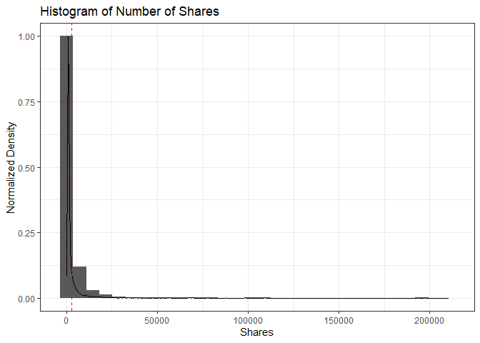
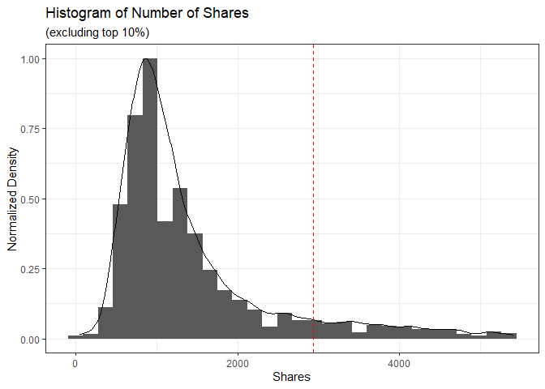
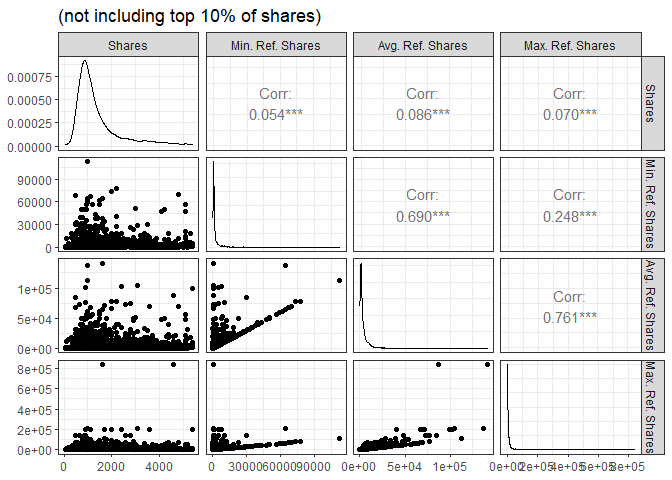
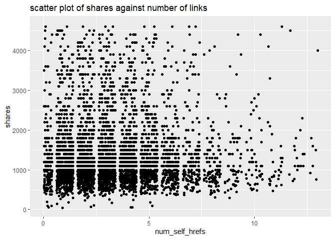
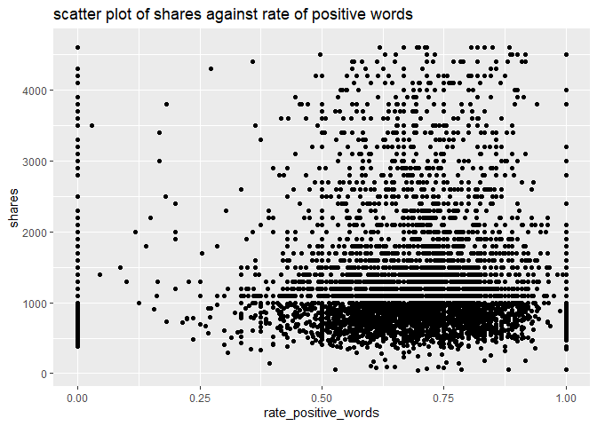

ST 558 Project 2
================
John Hinic & Fang Wu
2022-07-01

-   [Introduction](#introduction)
-   [Prepare Data](#prepare-data)
-   [Exploratory Data Analysis](#exploratory-data-analysis)
-   [Model Building](#model-building)

## Introduction

The consumption of online news is expediting day by day due to the
extensive adoption of smartphones and the rise of social networks.
Online news can capture the eye of a significant amount of Internet users
within a brief period of your time. Prediction of online news popularity
helps news organizations to gain better insights into the audience
interests and to deliver more relevant and appealing content in a
proactive manner. The company can allocate resources more wisely to
prepare stories over their life cycle. Moreover, prediction of news
popularity is also beneficial for trend forecasting, understanding the
collective human behavior, advertisers to propose more profitable
monetization techniques,and readers to filter the huge amount of
information quickly and efficiently.

We are going to analyze and predict the number of shares within
different data channel of interest using an online news data set from
[Machine Learning
Repository](https://archive.ics.uci.edu/ml/datasets/Online+News+Popularity#)
. This data set summarizes a heterogeneous set of features about
articles published by Mashable in a period of two years.

-   We are going to focus on the following predictors:

    1.  url: URL of the article (non-predictive)

    2.  timedelta: Days between the article publication and the dataset
        acquisition (non-predictive)

    3.  n_tokens_title: Number of words in the title

    4.  n_tokens_content Number of words in the content

    5.  n_unique_tokens: Rate of unique words in the content

    6.  n_non_stop_unique_tokens: Rate of unique non-stop words in the
        content

    7.  num_hrefs: Number of links

    8.  num_self_hrefs: Number of links to other articles published by
        Mashable

    9.  num_imgs: Number of images

    10. num_videos: Number of videos

    11. average_token_length: Average length of the words in the content

    12. num_keywords: Number of keywords in the metadata

    13. self_reference_min_shares: Min. shares of referenced articles in
        Mashable

    14. self_reference_max_shares: Max. shares of referenced articles in
        Mashable

    15. self_reference_avg_sharess: Avg. shares of referenced articles
        in Mashable

    16. global_subjectivity: Text subjectivity

    17. global_sentiment_polarity: Text sentiment polarity

    18. global_rate_positive_words: Rate of positive words in the
        content

    19. global_rate_negative_words: Rate of negative words in the
        content

    20. rate_positive_words: Rate of positive words among non-neutral
        tokens

    21. rate_negative_words: Rate of negative words among non-neutral
        tokens

    22. title_subjectivity: Title subjectivity

    23. title_sentiment_polarity: Title polarity

    24. abs_title_subjectivity: Absolute subjectivity level

    25. abs_title_sentiment_polarity: Absolute polarity level

    26. shares: Number of shares (target)

Stop Words usually refer to the most common words in a language, there
is no single universal list of stop words used by all natural language
processing tools. For some search engines, these are some of the most
common, short function words, such as the, is, at, which, and on.

In order to predict the number of share, we are going to build linear
regression and ensemble tree-based model.

## Prepare Data

We’ll use the `readr` and `dplyr` packages from the `tidyverse`. First,
we are going to read in data as tibble using function `read_csv`. Next,
in order to access different data channel of interest automatically, we
are going to create a variable called `type`. Last we `filter` the data
channel of interest using `params$` automatically.

-   Read in raw data and create new variable `type`

``` r
# read in raw data
raw_data <- read_csv("../Data/OnlineNewsPopularity.csv") 

# create type column for different data channel
type_data <- raw_data %>% mutate(type=ifelse(data_channel_is_lifestyle==1, "lifestyle", ifelse(data_channel_is_entertainment==1, "entertainment", ifelse(data_channel_is_bus==1, "bus", ifelse(data_channel_is_socmed==1, "socmed", ifelse(data_channel_is_tech==1, "tech", ifelse(data_channel_is_world==1, "world", NA)))))))
```

-   Subset data channel of interest automatically with `params`

``` r
# select data for data channel of interest and create single weekday variable
target_data <- type_data %>% 
  filter(type == params$filter_type) %>%
  mutate(
    weekday=ifelse(
      weekday_is_monday==1, "Monday", 
        ifelse(weekday_is_tuesday==1, "Tuesday", 
          ifelse(weekday_is_wednesday==1, "Wednesday", 
            ifelse(weekday_is_thursday==1, "Thursday", 
              ifelse(weekday_is_friday==1, "Friday", 
                ifelse(weekday_is_saturday==1, "Saturday", 
                  ifelse(weekday_is_sunday==1, "Sunday", NA)
                  )
                )
              )
            )
          )
      )
    )
target_data
```

    ## # A tibble: 7,057 x 63
    ##    url        timedelta n_tokens_title n_tokens_content n_unique_tokens n_non_stop_words n_non_stop_uniq~ num_hrefs num_self_hrefs
    ##    <chr>          <dbl>          <dbl>            <dbl>           <dbl>            <dbl>            <dbl>     <dbl>          <dbl>
    ##  1 http://ma~       731             12              219           0.664             1.00            0.815         4              2
    ##  2 http://ma~       731              9              531           0.504             1.00            0.666         9              0
    ##  3 http://ma~       731             14              194           0.765             1.00            0.840         4              4
    ##  4 http://ma~       731             12              161           0.669             1.00            0.752         5              4
    ##  5 http://ma~       731             11              454           0.566             1.00            0.755         5              3
    ##  6 http://ma~       731             12              177           0.741             1.00            0.823         4              3
    ##  7 http://ma~       731              5              356           0.618             1.00            0.766         3              3
    ##  8 http://ma~       730             11              281           0.611             1.00            0.766         5              4
    ##  9 http://ma~       730             10              909           0.450             1.00            0.670         3              2
    ## 10 http://ma~       729             10              413           0.606             1.00            0.729         6              1
    ## # ... with 7,047 more rows, and 54 more variables: num_imgs <dbl>, num_videos <dbl>, average_token_length <dbl>,
    ## #   num_keywords <dbl>, data_channel_is_lifestyle <dbl>, data_channel_is_entertainment <dbl>, data_channel_is_bus <dbl>,
    ## #   data_channel_is_socmed <dbl>, data_channel_is_tech <dbl>, data_channel_is_world <dbl>, kw_min_min <dbl>, kw_max_min <dbl>,
    ## #   kw_avg_min <dbl>, kw_min_max <dbl>, kw_max_max <dbl>, kw_avg_max <dbl>, kw_min_avg <dbl>, kw_max_avg <dbl>, kw_avg_avg <dbl>,
    ## #   self_reference_min_shares <dbl>, self_reference_max_shares <dbl>, self_reference_avg_sharess <dbl>, weekday_is_monday <dbl>,
    ## #   weekday_is_tuesday <dbl>, weekday_is_wednesday <dbl>, weekday_is_thursday <dbl>, weekday_is_friday <dbl>,
    ## #   weekday_is_saturday <dbl>, weekday_is_sunday <dbl>, is_weekend <dbl>, LDA_00 <dbl>, LDA_01 <dbl>, LDA_02 <dbl>, ...

-   Split data into train and test sets

``` r
set.seed(100)
train_index <- createDataPartition(target_data$is_weekend, p=0.7, list=FALSE)
train <- target_data[train_index,]
test <- target_data[-train_index, ]
dim(train)
```

    ## [1] 4940   63

## Exploratory Data Analysis

First, we can look at a basic summary and histograms of our target
variable, the number of shares:

``` r
summary(train$shares)
```

    ##    Min. 1st Qu.  Median    Mean 3rd Qu.    Max. 
    ##      47     832    1200    2936    2100  210300

``` r
train %>% ggplot(aes(shares, ..ndensity..)) +
  geom_histogram() +
  geom_density() +
  geom_vline(xintercept = mean(train$shares), linetype = 2, color = "red") +
  theme_bw() +
  labs(title = "Histogram of Number of Shares", x = "Shares", y = "Normalized Density")
```

<!-- -->

``` r
train %>% filter(shares<quantile(shares, p=0.9)) %>%
  ggplot(aes(shares, ..ndensity..)) +
  geom_histogram() +
  geom_density() +
  geom_vline(xintercept = mean(train$shares), linetype = 2, color = "red") +
  theme_bw() +
  labs(title = "Histogram of Number of Shares", subtitle = "(excluding top 10%)", x = "Shares", y = "Normalized Density")
```

<!-- -->

In the numeric summary, one thing to look for is the mean compared to
the median, as well as where the mean lies relative to the minimum and
maximum values. If the mean is significantly higher than the median
and/or much closer to the minimum than the maximum, that means our data
is right skewed, which we can observe in the histograms. The mean shares
value is included as a reference point on the histograms, and the
subsetted histogram is included to account for any potential right-skew.

Another thing we can look at is the relationship between the number of
shares and the number of shares in referenced articles (min, max, and
average).

``` r
train %>% 
  select(shares, self_reference_min_shares, self_reference_avg_sharess, self_reference_max_shares) %>% 
  filter(shares<quantile(shares, p=0.9)) %>%
  ggpairs(columnLabels = c("Shares", "Min. Ref. Shares", "Avg. Ref. Shares", "Max. Ref. Shares")) + 
  theme_bw() +
  labs(title = "(not including top 10% of shares)")
```

<!-- -->

For this grid of plots, we will want to focus on the

-   descriptive statistics on numeric variables:

``` r
summary(train %>% select(timedelta, n_tokens_title, n_tokens_content, n_unique_tokens, n_non_stop_unique_tokens, num_hrefs, num_self_hrefs, num_imgs, num_videos, average_token_length, num_keywords, self_reference_avg_sharess, self_reference_min_shares, self_reference_max_shares, global_rate_negative_words, global_rate_positive_words, global_sentiment_polarity, global_subjectivity, rate_negative_words, rate_positive_words, title_subjectivity, title_sentiment_polarity, abs_title_sentiment_polarity, abs_title_subjectivity))
```

    ##    timedelta     n_tokens_title n_tokens_content n_unique_tokens    n_non_stop_unique_tokens   num_hrefs      num_self_hrefs  
    ##  Min.   :  8.0   Min.   : 3     Min.   :   0.0   Min.   :  0.0000   Min.   :  0.0000         Min.   :  0.00   Min.   : 0.000  
    ##  1st Qu.:147.0   1st Qu.:10     1st Qu.: 252.0   1st Qu.:  0.4703   1st Qu.:  0.6231         1st Qu.:  4.00   1st Qu.: 1.000  
    ##  Median :305.0   Median :11     Median : 428.0   Median :  0.5426   Median :  0.6911         Median :  7.00   Median : 3.000  
    ##  Mean   :333.1   Mean   :11     Mean   : 603.1   Mean   :  0.6747   Mean   :  0.8031         Mean   : 10.78   Mean   : 3.502  
    ##  3rd Qu.:520.0   3rd Qu.:12     3rd Qu.: 796.0   3rd Qu.:  0.6182   3rd Qu.:  0.7611         3rd Qu.: 14.00   3rd Qu.: 5.000  
    ##  Max.   :731.0   Max.   :18     Max.   :6505.0   Max.   :701.0000   Max.   :650.0000         Max.   :187.00   Max.   :36.000  
    ##     num_imgs         num_videos     average_token_length  num_keywords    self_reference_avg_sharess self_reference_min_shares
    ##  Min.   :  0.000   Min.   : 0.000   Min.   :0.000        Min.   : 2.000   Min.   :     0             Min.   :     0           
    ##  1st Qu.:  1.000   1st Qu.: 0.000   1st Qu.:4.426        1st Qu.: 5.000   1st Qu.:  1088             1st Qu.:   702           
    ##  Median :  1.000   Median : 1.000   Median :4.583        Median : 7.000   Median :  2086             Median :  1100           
    ##  Mean   :  6.316   Mean   : 2.506   Mean   :4.476        Mean   : 6.945   Mean   :  4850             Mean   :  2674           
    ##  3rd Qu.:  8.000   3rd Qu.: 1.000   3rd Qu.:4.754        3rd Qu.: 8.000   3rd Qu.:  4844             3rd Qu.:  2000           
    ##  Max.   :101.000   Max.   :74.000   Max.   :7.696        Max.   :10.000   Max.   :143100             Max.   :143100           
    ##  self_reference_max_shares global_rate_negative_words global_rate_positive_words global_sentiment_polarity global_subjectivity
    ##  Min.   :     0            Min.   :0.00000            Min.   :0.00000            Min.   :-0.37766          Min.   :0.0000     
    ##  1st Qu.:  1200            1st Qu.:0.01060            1st Qu.:0.02963            1st Qu.: 0.04881          1st Qu.:0.4128     
    ##  Median :  2700            Median :0.01709            Median :0.04048            Median : 0.11209          Median :0.4642     
    ##  Mean   :  8512            Mean   :0.01881            Mean   :0.04044            Mean   : 0.11175          Mean   :0.4531     
    ##  3rd Qu.:  9100            3rd Qu.:0.02469            3rd Qu.:0.05119            3rd Qu.: 0.17154          3rd Qu.:0.5144     
    ##  Max.   :837700            Max.   :0.09358            Max.   :0.15278            Max.   : 0.72784          Max.   :1.0000     
    ##  rate_negative_words rate_positive_words title_subjectivity title_sentiment_polarity abs_title_sentiment_polarity
    ##  Min.   :0.0000      Min.   :0.0000      Min.   :0.0000     Min.   :-1.00000         Min.   :0.00000             
    ##  1st Qu.:0.2000      1st Qu.:0.5833      1st Qu.:0.0000     1st Qu.: 0.00000         1st Qu.:0.00000             
    ##  Median :0.2989      Median :0.6923      Median :0.2889     Median : 0.00000         Median :0.06818             
    ##  Mean   :0.3027      Mean   :0.6681      Mean   :0.3126     Mean   : 0.06414         Mean   :0.16890             
    ##  3rd Qu.:0.4000      3rd Qu.:0.7857      3rd Qu.:0.5000     3rd Qu.: 0.16667         3rd Qu.:0.29167             
    ##  Max.   :1.0000      Max.   :1.0000      Max.   :1.0000     Max.   : 1.00000         Max.   :1.00000             
    ##  abs_title_subjectivity
    ##  Min.   :0.0000        
    ##  1st Qu.:0.1250        
    ##  Median :0.4000        
    ##  Mean   :0.3232        
    ##  3rd Qu.:0.5000        
    ##  Max.   :0.5000

We can find the minimum, 25% percentile, mean, median, 75% percentile
and maximum values of each numeric variables from this chart.

``` r
sapply(train %>% select(timedelta, n_tokens_title, n_tokens_content, n_unique_tokens, n_non_stop_unique_tokens, num_hrefs, num_self_hrefs, num_imgs, num_videos, average_token_length, num_keywords, self_reference_avg_sharess, self_reference_min_shares, self_reference_max_shares, global_rate_negative_words, global_rate_positive_words, global_sentiment_polarity, global_subjectivity, rate_negative_words, rate_positive_words, title_subjectivity, title_sentiment_polarity, abs_title_sentiment_polarity, abs_title_subjectivity), sd)
```

    ##                    timedelta               n_tokens_title             n_tokens_content              n_unique_tokens 
    ##                 2.096288e+02                 2.092896e+00                 5.310665e+02                 9.967041e+00 
    ##     n_non_stop_unique_tokens                    num_hrefs               num_self_hrefs                     num_imgs 
    ##                 9.239835e+00                 1.287618e+01                 3.136078e+00                 1.147419e+01 
    ##                   num_videos         average_token_length                 num_keywords   self_reference_avg_sharess 
    ##                 6.185936e+00                 8.150547e-01                 1.914197e+00                 9.570805e+03 
    ##    self_reference_min_shares    self_reference_max_shares   global_rate_negative_words   global_rate_positive_words 
    ##                 6.894799e+03                 2.343502e+04                 1.225443e-02                 1.685006e-02 
    ##    global_sentiment_polarity          global_subjectivity          rate_negative_words          rate_positive_words 
    ##                 9.988602e-02                 1.134283e-01                 1.544505e-01                 1.857673e-01 
    ##           title_subjectivity     title_sentiment_polarity abs_title_sentiment_polarity       abs_title_subjectivity 
    ##                 3.261990e-01                 2.753137e-01                 2.266685e-01                 1.922774e-01

From here we can compare standard deviation between numeric variables.

-   Correlation between numeric variables

``` r
#str(train)
Correlation <- cor(train %>% select(-url, -type, -starts_with("weekday"), -starts_with("data_channel"), -is_weekend ))
corrplot(Correlation, type="upper", tl.pos="lt", cl.cex=0.8)
```

<!-- -->

This plot help us to check linear relationship between numeric
variables. We want to avoid include predictors with high correlation in
the same model.

-   summary across different day of the week

We are going to create a new variable named `weekday` and visualize
share performance on different day of the week.

``` r
# shares on different day
train %>% group_by(weekday) %>% 
  summarize(
    n=n(), 
    min=min(shares), 
    max=max(shares), 
    avg=mean(shares), 
    median=median(shares)
  )
```

    ## # A tibble: 7 x 6
    ##   weekday       n   min    max   avg median
    ##   <chr>     <int> <dbl>  <dbl> <dbl>  <dbl>
    ## 1 Friday      705    82 210300 2888.   1200
    ## 2 Monday      937    59  77200 2581.   1100
    ## 3 Saturday    268    65  68300 3701.   1600
    ## 4 Sunday      379   171  69500 3852.   1700
    ## 5 Thursday    822    57 197600 2877.   1100
    ## 6 Tuesday     903    47  98000 2702.   1100
    ## 7 Wednesday   926    49 109500 3018.   1100

We can inspect the effect of `weekday` on the `share`. The number of
records on each day as well as the minimum, maximum, mean and median
values of shares on each day of the week are included in the table here.
If there are big difference across `weekday`, then `weekday` and `share`
are dependent.

We also can check the difference in plot.

``` r
g <- ggplot(train %>% filter(shares<quantile(shares, p=0.75)), aes(x=shares))
g + geom_freqpoly(aes(color=weekday)) +
  ggtitle("Counts of shares across day of the week")
```

<!-- -->

``` r
ggplot(train, aes(x=weekday, y=shares)) +
  geom_boxplot() +
  scale_y_continuous(limits=c(min(train$shares), quantile(train$shares, p=0.75)+IQR(train$shares))) +
  ggtitle("box plot of shares across day of the week")
```

<!-- -->

In this plot, we can compare the median, 25% percentile, 75% percentile
and IQR of shares between different day of the week. It will show the
effect of day on the shares.

-   Scatter plot

We want to check the relationship between response variable `share` and
other predictors through scatter plot. Linear or non-linear? Positive or
negative?

``` r
g <- ggplot(train, aes(x=num_self_hrefs, y=shares) )
g + geom_jitter() +
    scale_y_continuous(limits=c(min(train$shares), quantile(train$shares, p=0.75)+2*IQR(train$shares))) +
    scale_x_continuous(limits=c(min(train$num_self_hrefs), quantile(train$num_self_hrefs, p=0.75)+2*IQR(train$num_self_hrefs))) +
    ggtitle("scatter plot of shares against number of links") 
```

<!-- -->

``` r
g <- ggplot(train, aes(x=rate_positive_words, y=shares) )
g + geom_point() +
  scale_y_continuous(limits=c(min(train$shares), quantile(train$shares, p=0.75)+2*IQR(train$shares))) +
  ggtitle("scatter plot of shares against rate of positive words")
```

<!-- -->

## Model Building

We will be fitting 4 total models for comparison:

-   2 linear regression models
-   1 random forest model
-   1 boosted tree model

For all 4 models, we will use 10-fold cross-validation to select the
best fit.

``` r
control <- trainControl(method="cv", number=10)
```

### Linear Regression Models

—–REGRESSION EXPLANATION PLACEHOLDER—–

#### Fang

``` r
mlFit <- train(shares~timedelta+weekday+num_self_hrefs+num_imgs+num_videos, data=train, method="lm", preProcess=c("center", "scale"), trControl=control)
mlFit
```

#### John

``` r
mlrFit2 <- train(
  shares ~ .,
  data = train %>% select(-url, -timedelta, -starts_with("data_channel"), -starts_with("weekday"), -type, -is_weekend, -rate_negative_words),
  method = "lmStepAIC",
  preProcess = c("center", "scale"),
  trControl = control,
  trace = FALSE,
  scope = list(upper = ~., lower = ~1)
)
mlrFit2
summary(mlrFit2$finalModel)
```

### Tree-based Models

#### Random Forest

Random forest models are based on the more simple regression trees - an
example of this is shown here:


Regression trees have many benefits, and are very easily interpretable
by looking at the visual. However, they are highly variable based on the
specific data used to build them. Random forest models are one way to
combat this.

Random forest models use bootstrap sampling to fit many regression
trees, each one using a random subset of predictors (*m*). This makes it
so that predictions are not dominated by a small number of predictors,
leading to more consistent results.

The standard practice is to use *m* = *p*/3, where *p* represents the
total number of predictors. For this case, that means we would use
*m* = 53/3 ≈ 18 after removing all non-predictive variables from the
dataset. Thus, we will consider *m* values ranging anywhere from - to -,
selecting the optimal model based on the model performance in 10-fold
cross-validation.

We will also ease the computational time by using parallel processing
for this model, which requires a bit of setup first.

``` r
# parallel setup
library(doParallel)
cl <- makeCluster(detectCores() - 2)
registerDoParallel(cl)
controlRF <- trainControl(method = "cv", number = 10, allowParallel = TRUE)

# saving data as a matrix and vector to take up less memory across workers
x <- as.matrix(train %>% select(-url, -timedelta, -starts_with("data_channel"), -shares, -type, -weekday))
y <- train$shares

# fitting model
set.seed(91894)
rf <- train(
  x, y,
  method = "rf",
  preProcess = c("center", "scale"),
  trControl = controlRF,
  tuneGrid = data.frame(mtry = 1:24),
  importance = TRUE,
  ntree = 500
)

# showing results / variable importance
rf$results
rf$bestTune
varImp(rf)
plot(varImp(rf), top = 20)
stopCluster(cl)
```

#### Boosted Trees

Boosted trees model trains a bunch of trees sequentially. Each
subsequent tree learns from the mistakes of the previous tree. So
predictions get updated as trees grown. It is used for both regression
and classification.

``` r
n.trees=c(50, 100, 150)
interaction.depth=c(2,3,4)
shrinkage=c(0.1, 0.5)
n.minobsinnode=c(10)
tune_parameter <- expand.grid(n.trees=n.trees, interaction.depth=interaction.depth, shrinkage=shrinkage, n.minobsinnode=n.minobsinnode)
boostedFit <- train(shares~timedelta+weekday+num_self_hrefs+num_imgs+num_videos+rate_positive_words, data=train, method="gbm", trControl=trainControl(method="repeatedcv", number=5, repeats=3), tuneGrid=tune_parameter)
boostedFit
```

### Compare models on the test set

``` r
ml_pred <- predict(mlFit, test)
ml_MSE <- postResample(test$shares, ml_pred)[1]
boosted_pred <- predict(boostedFit, test)
boosted_MSE <- postResample(test$shares, boosted_pred)[1]
comp <- data.frame(LR=ml_MSE, Boosted=boosted_MSE)
comp
```

``` r
best_model <- which.min(comp["RMSE",])
best_model
```

`names(best_model)` has the minimum MSE which indicates the best
fitting.
