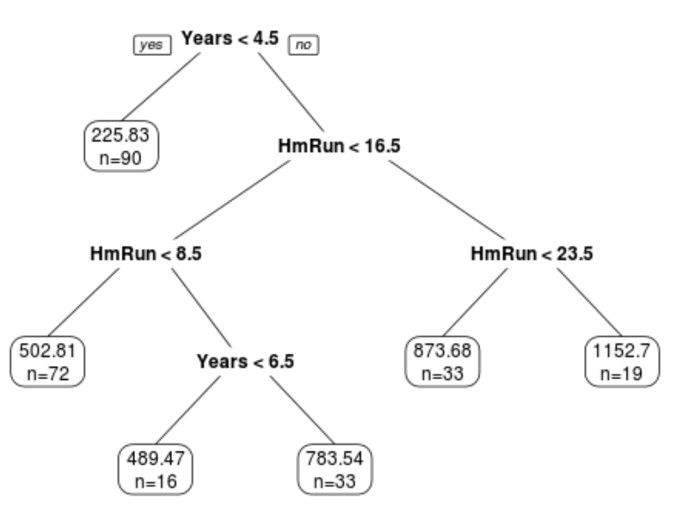

ST 558 Project 2
================
John Hinic & Fang Wu
2022-07-01

-   [Introduction](#introduction)
-   [Prepare Data](#prepare-data)
-   [Exploratory Data Analysis](#exploratory-data-analysis)
-   [Model Building](#model-building)
-   [Model Comparison](#model-comparison)

## Introduction

The consumption of online news is expediting day by day due to the
extensive adoption of smartphones and the rise of social networks.
Online news can capture the eye of a significant amount of Internet users
within a brief period of your time. Prediction of online news popularity
helps news organizations to gain better insights into the audience
interests and to deliver more relevant and appealing content in a
proactive manner. The company can allocate resources more wisely to
prepare stories over their life cycle. Moreover, prediction of news
popularity is also beneficial for trend forecasting, understanding the
collective human behavior, advertisers to propose more profitable
monetization techniques,and readers to filter the huge amount of
information quickly and efficiently.

We are going to analyze and predict the number of shares within
different data channel of interest using an online news data set from
[Machine Learning
Repository](https://archive.ics.uci.edu/ml/datasets/Online+News+Popularity#)
. This data set summarizes a heterogeneous set of features about
articles published by Mashable in a period of two years.

-   We are going to focus on the following predictors:

    1.  url: URL of the article (non-predictive)

    2.  timedelta: Days between the article publication and the dataset
        acquisition (non-predictive)

    3.  n_tokens_title: Number of words in the title

    4.  n_tokens_content Number of words in the content

    5.  n_unique_tokens: Rate of unique words in the content

    6.  n_non_stop_unique_tokens: Rate of unique non-stop words in the
        content

    7.  num_hrefs: Number of links

    8.  num_self_hrefs: Number of links to other articles published by
        Mashable

    9.  num_imgs: Number of images

    10. num_videos: Number of videos

    11. average_token_length: Average length of the words in the content

    12. num_keywords: Number of keywords in the metadata

    13. self_reference_min_shares: Min. shares of referenced articles in
        Mashable

    14. self_reference_max_shares: Max. shares of referenced articles in
        Mashable

    15. self_reference_avg_sharess: Avg. shares of referenced articles
        in Mashable

    16. global_subjectivity: Text subjectivity

    17. global_sentiment_polarity: Text sentiment polarity

    18. global_rate_positive_words: Rate of positive words in the
        content

    19. global_rate_negative_words: Rate of negative words in the
        content

    20. rate_positive_words: Rate of positive words among non-neutral
        tokens

    21. rate_negative_words: Rate of negative words among non-neutral
        tokens

    22. title_subjectivity: Title subjectivity

    23. title_sentiment_polarity: Title polarity

    24. abs_title_subjectivity: Absolute subjectivity level

    25. abs_title_sentiment_polarity: Absolute polarity level

    26. shares: Number of shares (target)

Stop Words usually refer to the most common words in a language, there
is no single universal list of stop words used by all natural language
processing tools. For some search engines, these are some of the most
common, short function words, such as the, is, at, which, and on.

In order to predict the number of share, we are going to build linear
regression and ensemble tree-based model.

## Prepare Data

We’ll use the `readr` and `dplyr` packages from the `tidyverse`. First,
we are going to read in data as tibble using function `read_csv`. Next,
in order to access different data channel of interest automatically, we
are going to create a variable called `type`. Last we `filter` the data
channel of interest using `params$` automatically.

-   Read in raw data and create new variable `type`

``` r
# read in raw data
raw_data <- read_csv("../Data/OnlineNewsPopularity.csv") 

# create type column for different data channel
type_data <- raw_data %>% 
  mutate(
    type=ifelse(data_channel_is_lifestyle==1, "lifestyle", 
            ifelse(data_channel_is_entertainment==1, "entertainment", 
                ifelse(data_channel_is_bus==1, "bus", 
                    ifelse(data_channel_is_socmed==1, "socmed", 
                        ifelse(data_channel_is_tech==1, "tech", 
                            ifelse(data_channel_is_world==1, "world", NA)
                            )
                        )
                    )
                )
            )
  )
```

-   Subset data channel of interest automatically with `params`

``` r
# select data for data channel of interest and create single weekday variable
target_data <- type_data %>% 
  filter(type == params$filter_type) %>%
  mutate(
    weekday=ifelse(
      weekday_is_monday==1, "Monday", 
        ifelse(weekday_is_tuesday==1, "Tuesday", 
          ifelse(weekday_is_wednesday==1, "Wednesday", 
            ifelse(weekday_is_thursday==1, "Thursday", 
              ifelse(weekday_is_friday==1, "Friday", 
                ifelse(weekday_is_saturday==1, "Saturday", 
                  ifelse(weekday_is_sunday==1, "Sunday", NA)
                  )
                )
              )
            )
          )
      )
    )
target_data
```

    ## # A tibble: 7,057 x 63
    ##    url     timedelta n_tokens_title n_tokens_content n_unique_tokens n_non_stop_words n_non_stop_uniq~ num_hrefs num_self_hrefs num_imgs num_videos average_token_l~
    ##    <chr>       <dbl>          <dbl>            <dbl>           <dbl>            <dbl>            <dbl>     <dbl>          <dbl>    <dbl>      <dbl>            <dbl>
    ##  1 http:/~       731             12              219           0.664             1.00            0.815         4              2        1          0             4.68
    ##  2 http:/~       731              9              531           0.504             1.00            0.666         9              0        1          0             4.40
    ##  3 http:/~       731             14              194           0.765             1.00            0.840         4              4        0          1             4.52
    ##  4 http:/~       731             12              161           0.669             1.00            0.752         5              4        0          6             4.45
    ##  5 http:/~       731             11              454           0.566             1.00            0.755         5              3        1          0             4.89
    ##  6 http:/~       731             12              177           0.741             1.00            0.823         4              3        1          0             5.06
    ##  7 http:/~       731              5              356           0.618             1.00            0.766         3              3       12          1             4.47
    ##  8 http:/~       730             11              281           0.611             1.00            0.766         5              4        1          0             4.61
    ##  9 http:/~       730             10              909           0.450             1.00            0.670         3              2        1          1             4.34
    ## 10 http:/~       729             10              413           0.606             1.00            0.729         6              1       13          0             4.70
    ## # ... with 7,047 more rows, and 51 more variables: num_keywords <dbl>, data_channel_is_lifestyle <dbl>, data_channel_is_entertainment <dbl>,
    ## #   data_channel_is_bus <dbl>, data_channel_is_socmed <dbl>, data_channel_is_tech <dbl>, data_channel_is_world <dbl>, kw_min_min <dbl>, kw_max_min <dbl>,
    ## #   kw_avg_min <dbl>, kw_min_max <dbl>, kw_max_max <dbl>, kw_avg_max <dbl>, kw_min_avg <dbl>, kw_max_avg <dbl>, kw_avg_avg <dbl>, self_reference_min_shares <dbl>,
    ## #   self_reference_max_shares <dbl>, self_reference_avg_sharess <dbl>, weekday_is_monday <dbl>, weekday_is_tuesday <dbl>, weekday_is_wednesday <dbl>,
    ## #   weekday_is_thursday <dbl>, weekday_is_friday <dbl>, weekday_is_saturday <dbl>, weekday_is_sunday <dbl>, is_weekend <dbl>, LDA_00 <dbl>, LDA_01 <dbl>,
    ## #   LDA_02 <dbl>, LDA_03 <dbl>, LDA_04 <dbl>, global_subjectivity <dbl>, global_sentiment_polarity <dbl>, global_rate_positive_words <dbl>,
    ## #   global_rate_negative_words <dbl>, rate_positive_words <dbl>, rate_negative_words <dbl>, avg_positive_polarity <dbl>, min_positive_polarity <dbl>, ...

-   Split data into training and test sets

``` r
set.seed(100)
train_index <- createDataPartition(target_data$is_weekend, p=0.7, list=FALSE)
train <- target_data[train_index,]
test <- target_data[-train_index, ]
dim(train)
```

    ## [1] 4940   63

## Exploratory Data Analysis

First, we can look at a basic univariate summary and histograms of our
target variable, the number of shares:

``` r
summary(train$shares)
```

    ##    Min. 1st Qu.  Median    Mean 3rd Qu.    Max. 
    ##      47     832    1200    2936    2100  210300

``` r
train %>% ggplot(aes(shares, ..ndensity..)) +
  geom_histogram() +
  geom_density() +
  geom_vline(xintercept = mean(train$shares), linetype = 2, color = "red") +
  theme_bw() +
  labs(title = "Histogram of Number of Shares", x = "Shares", y = "Normalized Density")
```

<!-- -->

``` r
train %>% filter(shares<quantile(shares, p=0.9)) %>%
  ggplot(aes(shares, ..ndensity..)) +
  geom_histogram() +
  geom_density() +
  geom_vline(xintercept = mean(train$shares), linetype = 2, color = "red") +
  theme_bw() +
  labs(title = "Histogram of Number of Shares", subtitle = "(excluding top 10%)", x = "Shares", y = "Normalized Density")
```

<!-- -->

In the numeric summary, one thing to look for is the mean compared to
the median, as well as where the mean lies relative to the minimum and
maximum values. If the mean is significantly higher than the median
and/or much closer to the minimum than the maximum, that means our data
is right skewed, which we can observe in the histograms. The mean shares
value is included as a reference point on the histograms, and the
subsetted histogram is included to account for any potential right-skew.

-   descriptive statistics on numeric variables:

``` r
summary(
  train %>% 
    select(timedelta, n_tokens_title, n_tokens_content, n_unique_tokens, n_non_stop_unique_tokens, num_hrefs,
           num_self_hrefs, num_imgs, num_videos, average_token_length, num_keywords, self_reference_avg_sharess,
           self_reference_min_shares, self_reference_max_shares, global_rate_negative_words, global_rate_positive_words,
           global_sentiment_polarity, global_subjectivity, rate_negative_words, rate_positive_words, title_subjectivity,
           title_sentiment_polarity, abs_title_sentiment_polarity, abs_title_subjectivity)
)
```

    ##    timedelta     n_tokens_title n_tokens_content n_unique_tokens    n_non_stop_unique_tokens   num_hrefs      num_self_hrefs      num_imgs         num_videos    
    ##  Min.   :  8.0   Min.   : 3     Min.   :   0.0   Min.   :  0.0000   Min.   :  0.0000         Min.   :  0.00   Min.   : 0.000   Min.   :  0.000   Min.   : 0.000  
    ##  1st Qu.:147.0   1st Qu.:10     1st Qu.: 252.0   1st Qu.:  0.4703   1st Qu.:  0.6231         1st Qu.:  4.00   1st Qu.: 1.000   1st Qu.:  1.000   1st Qu.: 0.000  
    ##  Median :305.0   Median :11     Median : 428.0   Median :  0.5426   Median :  0.6911         Median :  7.00   Median : 3.000   Median :  1.000   Median : 1.000  
    ##  Mean   :333.1   Mean   :11     Mean   : 603.1   Mean   :  0.6747   Mean   :  0.8031         Mean   : 10.78   Mean   : 3.502   Mean   :  6.316   Mean   : 2.506  
    ##  3rd Qu.:520.0   3rd Qu.:12     3rd Qu.: 796.0   3rd Qu.:  0.6182   3rd Qu.:  0.7611         3rd Qu.: 14.00   3rd Qu.: 5.000   3rd Qu.:  8.000   3rd Qu.: 1.000  
    ##  Max.   :731.0   Max.   :18     Max.   :6505.0   Max.   :701.0000   Max.   :650.0000         Max.   :187.00   Max.   :36.000   Max.   :101.000   Max.   :74.000  
    ##  average_token_length  num_keywords    self_reference_avg_sharess self_reference_min_shares self_reference_max_shares global_rate_negative_words
    ##  Min.   :0.000        Min.   : 2.000   Min.   :     0             Min.   :     0            Min.   :     0            Min.   :0.00000           
    ##  1st Qu.:4.426        1st Qu.: 5.000   1st Qu.:  1088             1st Qu.:   702            1st Qu.:  1200            1st Qu.:0.01060           
    ##  Median :4.583        Median : 7.000   Median :  2086             Median :  1100            Median :  2700            Median :0.01709           
    ##  Mean   :4.476        Mean   : 6.945   Mean   :  4850             Mean   :  2674            Mean   :  8512            Mean   :0.01881           
    ##  3rd Qu.:4.754        3rd Qu.: 8.000   3rd Qu.:  4844             3rd Qu.:  2000            3rd Qu.:  9100            3rd Qu.:0.02469           
    ##  Max.   :7.696        Max.   :10.000   Max.   :143100             Max.   :143100            Max.   :837700            Max.   :0.09358           
    ##  global_rate_positive_words global_sentiment_polarity global_subjectivity rate_negative_words rate_positive_words title_subjectivity title_sentiment_polarity
    ##  Min.   :0.00000            Min.   :-0.37766          Min.   :0.0000      Min.   :0.0000      Min.   :0.0000      Min.   :0.0000     Min.   :-1.00000        
    ##  1st Qu.:0.02963            1st Qu.: 0.04881          1st Qu.:0.4128      1st Qu.:0.2000      1st Qu.:0.5833      1st Qu.:0.0000     1st Qu.: 0.00000        
    ##  Median :0.04048            Median : 0.11209          Median :0.4642      Median :0.2989      Median :0.6923      Median :0.2889     Median : 0.00000        
    ##  Mean   :0.04044            Mean   : 0.11175          Mean   :0.4531      Mean   :0.3027      Mean   :0.6681      Mean   :0.3126     Mean   : 0.06414        
    ##  3rd Qu.:0.05119            3rd Qu.: 0.17154          3rd Qu.:0.5144      3rd Qu.:0.4000      3rd Qu.:0.7857      3rd Qu.:0.5000     3rd Qu.: 0.16667        
    ##  Max.   :0.15278            Max.   : 0.72784          Max.   :1.0000      Max.   :1.0000      Max.   :1.0000      Max.   :1.0000     Max.   : 1.00000        
    ##  abs_title_sentiment_polarity abs_title_subjectivity
    ##  Min.   :0.00000              Min.   :0.0000        
    ##  1st Qu.:0.00000              1st Qu.:0.1250        
    ##  Median :0.06818              Median :0.4000        
    ##  Mean   :0.16890              Mean   :0.3232        
    ##  3rd Qu.:0.29167              3rd Qu.:0.5000        
    ##  Max.   :1.00000              Max.   :0.5000

We can find the minimum, 25% percentile, mean, median, 75% percentile
and maximum values of each numeric variables from this chart.

``` r
sapply(
  train %>% 
    select(timedelta, n_tokens_title, n_tokens_content, n_unique_tokens, n_non_stop_unique_tokens, num_hrefs, num_self_hrefs,
           num_imgs, num_videos, average_token_length, num_keywords, self_reference_avg_sharess, self_reference_min_shares,
           self_reference_max_shares, global_rate_negative_words, global_rate_positive_words, global_sentiment_polarity,
           global_subjectivity, rate_negative_words, rate_positive_words, title_subjectivity, title_sentiment_polarity,
           abs_title_sentiment_polarity, abs_title_subjectivity), 
  sd
)
```

    ##                    timedelta               n_tokens_title             n_tokens_content              n_unique_tokens     n_non_stop_unique_tokens 
    ##                 2.096288e+02                 2.092896e+00                 5.310665e+02                 9.967041e+00                 9.239835e+00 
    ##                    num_hrefs               num_self_hrefs                     num_imgs                   num_videos         average_token_length 
    ##                 1.287618e+01                 3.136078e+00                 1.147419e+01                 6.185936e+00                 8.150547e-01 
    ##                 num_keywords   self_reference_avg_sharess    self_reference_min_shares    self_reference_max_shares   global_rate_negative_words 
    ##                 1.914197e+00                 9.570805e+03                 6.894799e+03                 2.343502e+04                 1.225443e-02 
    ##   global_rate_positive_words    global_sentiment_polarity          global_subjectivity          rate_negative_words          rate_positive_words 
    ##                 1.685006e-02                 9.988602e-02                 1.134283e-01                 1.544505e-01                 1.857673e-01 
    ##           title_subjectivity     title_sentiment_polarity abs_title_sentiment_polarity       abs_title_subjectivity 
    ##                 3.261990e-01                 2.753137e-01                 2.266685e-01                 1.922774e-01

From here we can compare standard deviation between numeric variables.

-   Correlation between numeric variables

``` r
#str(train)
Correlation <- cor(train %>% select(-url, -type, -starts_with("weekday"), -starts_with("data_channel"), -is_weekend ))
corrplot(Correlation, type="upper", tl.pos="lt", cl.cex=0.8)
```

<!-- -->

This plot help us to check linear relationship between numeric
variables. We want to avoid include predictors with high correlation in
the same model.

-   summary across different day of the week

We are going to visualize share performance on different day of the
week.

``` r
# shares on different day
train %>% group_by(weekday) %>% 
  summarize(
    n=n(), 
    min=min(shares), 
    max=max(shares), 
    avg=mean(shares), 
    median=median(shares)
  )
```

    ## # A tibble: 7 x 6
    ##   weekday       n   min    max   avg median
    ##   <chr>     <int> <dbl>  <dbl> <dbl>  <dbl>
    ## 1 Friday      705    82 210300 2888.   1200
    ## 2 Monday      937    59  77200 2581.   1100
    ## 3 Saturday    268    65  68300 3701.   1600
    ## 4 Sunday      379   171  69500 3852.   1700
    ## 5 Thursday    822    57 197600 2877.   1100
    ## 6 Tuesday     903    47  98000 2702.   1100
    ## 7 Wednesday   926    49 109500 3018.   1100

We can inspect the effect of `weekday` on the `share`. The number of
records on each day as well as the minimum, maximum, mean and median
values of shares on each day of the week are included in the table here.
If there are big difference across `weekday`, then `weekday` and `share`
are dependent.

We also can check the difference in plot.

``` r
g <- ggplot(train %>% filter(shares<quantile(shares, p=0.75)), aes(x=shares))
g + geom_freqpoly(aes(color=weekday)) +
  ggtitle("Counts of shares across day of the week")
```

<!-- -->

``` r
ggplot(train, aes(x=weekday, y=shares)) +
  geom_boxplot() +
  scale_y_continuous(limits=c(min(train$shares), quantile(train$shares, p=0.75)+IQR(train$shares))) +
  ggtitle("box plot of shares across day of the week")
```

<!-- -->

In this plot, we can compare the median, 25% percentile, 75% percentile
and IQR of shares between different day of the week. It will show the
effect of day on the shares.

We can also examine this relationship by binning the number of shares
into groups and constructing a contingency table.

``` r
train %>%
  mutate(Shares = cut(shares, c(seq(0, 10000, by = 1000), max(shares)), dig.lab = 6)) %>%
  group_by(weekday, Shares) %>%
  summarise(n = n()) %>%
  pivot_wider(names_from = weekday, values_from = n, values_fill = 0) %>%
  arrange(Shares)
```

    ## # A tibble: 11 x 8
    ##    Shares         Friday Monday Saturday Sunday Thursday Tuesday Wednesday
    ##    <fct>           <int>  <int>    <int>  <int>    <int>   <int>     <int>
    ##  1 (0,1000]          295    435       48     63      391     429       438
    ##  2 (1000,2000]       237    288      123    155      241     268       273
    ##  3 (2000,3000]        51     59       31     44       63      62        64
    ##  4 (3000,4000]        40     30       19     30       25      35        38
    ##  5 (4000,5000]        13     25        8     17       24      19        23
    ##  6 (5000,6000]        10     18        8     14       15      21        13
    ##  7 (6000,7000]         8     15        2      7       10      12        10
    ##  8 (7000,8000]         8      8        7      8        6       6         5
    ##  9 (8000,9000]         7      7        0      2        4       5         4
    ## 10 (9000,10000]        2      4        3      7        7       5         2
    ## 11 (10000,210300]     34     48       19     32       36      41        56

With this contingency table, we can get an idea of how many shares
articles tend to get across the different days. We can also observe
which days have the most “viral” articles that get an extremely high
number of shares.

-   Scatter plot

We want to check the relationship between response variable `share` and
other predictors through scatter plot. Linear or non-linear? Positive or
negative?

``` r
g <- ggplot(train, aes(x=num_self_hrefs, y=shares) )
g + geom_jitter() +
    scale_y_continuous(
      limits=c(min(train$shares), quantile(train$shares, p=0.75)+2*IQR(train$shares))
    ) +
    scale_x_continuous(
      limits=c(min(train$num_self_hrefs), quantile(train$num_self_hrefs, p=0.75)+2*IQR(train$num_self_hrefs))
    ) +
    ggtitle("scatter plot of shares against number of links") 
```

<!-- -->

``` r
g <- ggplot(train, aes(x=rate_positive_words, y=shares) )
g + geom_point() +
  scale_y_continuous(
    limits=c(min(train$shares), quantile(train$shares, p=0.75)+2*IQR(train$shares))
  ) +
  ggtitle("scatter plot of shares against rate of positive words")
```

<!-- -->

We will also examine the relationship of number of shares with the
absolute polarity of the title - perhaps articles with titles that have
a more polarizing sentiment are more likely to get shares.

``` r
train %>% filter(shares<quantile(shares, p=0.9)) %>%
  ggplot(aes(abs_title_sentiment_polarity, shares)) +
  geom_jitter() +
  labs(title = "Number of Shares by Abs. Title Sentiment Polarity", subtitle = "(excluding top 10% of shares)", x = "Absolute Title Polarity", y = "Shares") +
  theme_bw()
```

<!-- -->

Another thing we can examine is the relationship between the number of
shares and the number of shares in referenced articles (min, max, and
average).

``` r
train %>% 
  select(shares, self_reference_min_shares, self_reference_avg_sharess, self_reference_max_shares) %>% 
  filter(shares<quantile(shares, p=0.9)) %>%
  ggpairs(columnLabels = c("Shares", "Min. Ref. Shares", "Avg. Ref. Shares", "Max. Ref. Shares")) + 
  labs(title = "(excluding top 10% of shares)") +
  theme_bw()
```

<!-- -->

For this grid of plots, we will want to focus on the column/row for
shares. We can visually see the relationship between number of shares
for an article vs. the number of shares in its referenced articles by
examining the scatter plots, or look at the actual numeric correlations.
We just want a general idea of whether the relationships are positive or
negative, as well as linear or non-linear.

## Model Building

We will be fitting 4 total models for comparison:

-   2 linear regression models
-   1 random forest model
-   1 boosted tree model

For the 2 linear regression models, we will use basic 10-fold cross
validation to evaluate the fit on the training data, while using 5-fold
3-times repeated cross-validation for the tree-based models. To ease the
computation time, we will also utilize parallel processing, which will
require a bit of set-up.

``` r
# control setup
controlLR <- trainControl(method = "cv", number = 10, allowParallel = TRUE)
controlTree <- trainControl(method = "repeatedcv", number = 5, repeats = 3, allowParallel = TRUE)

# parallel setup
cl <- makeCluster(detectCores() - 2)
registerDoParallel(cl)
```

### Linear Regression Models

As mentioned, the first 2 kinds of models we will fit to the data will
be linear regression models. Linear regression is, for the most part,
the most basic form of predictive modeling available. The simplest form,
a single predictor and single response, is essentially just constructing
a line that “agrees” with the data as closely as possible. In this case,
it is similar to the basic slope form of a line, *y* = *m**x* + *b*. We
have a response variable *y*, a predictor variable *x*, a slope *m*, and
a y-intercept *b*. However, since we are modelling real-world data,
there is an additional random error term in our formula:

*Y*<sub>*i*</sub> = *β*<sub>0</sub> + *β*<sub>1</sub>*x*<sub>*i*</sub> + *E*<sub>*i*</sub>
Where *E*<sub>*i*</sub> is our random error term (and assumed to follow
a normal distribution in most cases). To actually calculate the
*β*<sub>0</sub> and *β*<sub>1</sub>, we find the values that minimize
the sum of squared errors:

$$\\sum\_{i = 1}^{n} (y_i - \\beta_0 - \\beta_1 x_i)^2$$

This can also be extended in many ways, such as adding in more predictor
variables or higher-order terms, but the model is still fit by
minimizing the sum of squared errors as with simple linear regression.

#### Fang

``` r
mlFit <- train(shares~timedelta+weekday+num_self_hrefs+num_imgs+num_videos, data=train, method="lm", preProcess=c("center", "scale"), trControl=controlLR)
mlFit
```

    ## Linear Regression 
    ## 
    ## 4940 samples
    ##    5 predictor
    ## 
    ## Pre-processing: centered (10), scaled (10) 
    ## Resampling: Cross-Validated (10 fold) 
    ## Summary of sample sizes: 4445, 4446, 4447, 4447, 4445, 4446, ... 
    ## Resampling results:
    ## 
    ##   RMSE      Rsquared     MAE     
    ##   7496.291  0.005363849  2885.532
    ## 
    ## Tuning parameter 'intercept' was held constant at a value of TRUE

#### John

This model will use stepwise regression to select the optimal model
based on the AIC metric, considering all possible predictive variables
(aside from the Sunday indicator and weekend indicator, which were
removed to preserve linear independence in the model matrix).

``` r
mlrFit2 <- train(
  shares ~ .,
  data = train %>% select(-url, -timedelta, -starts_with("data_channel"), -weekday_is_sunday, -type, -is_weekend),
  method = "lmStepAIC",
  preProcess = c("center", "scale"),
  trControl = controlLR,
  trace = FALSE,
  scope = list(upper = ~., lower = ~1)
)
mlrFit2
```

    ## Linear Regression with Stepwise Selection 
    ## 
    ## 4940 samples
    ##   51 predictor
    ## 
    ## Pre-processing: centered (56), scaled (56) 
    ## Resampling: Cross-Validated (10 fold) 
    ## Summary of sample sizes: 4445, 4446, 4446, 4445, 4446, 4446, ... 
    ## Resampling results:
    ## 
    ##   RMSE      Rsquared    MAE     
    ##   8550.558  0.01258187  2994.939

``` r
summary(mlrFit2$finalModel)
```

    ## 
    ## Call:
    ## lm(formula = .outcome ~ n_tokens_content + n_unique_tokens + 
    ##     n_non_stop_words + n_non_stop_unique_tokens + num_self_hrefs + 
    ##     average_token_length + kw_min_min + kw_max_min + kw_avg_min + 
    ##     kw_min_max + kw_min_avg + kw_max_avg + kw_avg_avg + self_reference_avg_sharess + 
    ##     global_subjectivity + global_sentiment_polarity + global_rate_positive_words + 
    ##     weekdaySunday + weekday_is_saturday, data = dat)
    ## 
    ## Residuals:
    ##    Min     1Q Median     3Q    Max 
    ## -31515  -2103  -1038     46 205938 
    ## 
    ## Coefficients:
    ##                            Estimate Std. Error t value Pr(>|t|)    
    ## (Intercept)                  2936.3      110.0  26.697  < 2e-16 ***
    ## n_tokens_content              752.8      181.7   4.144 3.46e-05 ***
    ## n_unique_tokens            134883.0    29172.8   4.624 3.87e-06 ***
    ## n_non_stop_words           -53282.6    16228.9  -3.283 0.001034 ** 
    ## n_non_stop_unique_tokens   -81549.8    21915.7  -3.721 0.000201 ***
    ## num_self_hrefs               -250.2      121.1  -2.067 0.038833 *  
    ## average_token_length          285.0      150.8   1.890 0.058789 .  
    ## kw_min_min                    581.3      123.0   4.726 2.35e-06 ***
    ## kw_max_min                   3959.8      462.6   8.560  < 2e-16 ***
    ## kw_avg_min                  -3499.8      458.6  -7.632 2.77e-14 ***
    ## kw_min_max                   -238.2      131.2  -1.815 0.069554 .  
    ## kw_min_avg                   -627.4      166.0  -3.779 0.000159 ***
    ## kw_max_avg                   -581.8      275.7  -2.111 0.034861 *  
    ## kw_avg_avg                   2020.9      290.2   6.963 3.77e-12 ***
    ## self_reference_avg_sharess    473.5      113.9   4.159 3.26e-05 ***
    ## global_subjectivity           308.0      153.1   2.013 0.044220 *  
    ## global_sentiment_polarity     259.0      127.3   2.035 0.041893 *  
    ## global_rate_positive_words   -262.6      143.6  -1.829 0.067456 .  
    ## weekdaySunday                 233.1      110.9   2.103 0.035519 *  
    ## weekday_is_saturday           162.1      110.6   1.465 0.142951    
    ## ---
    ## Signif. codes:  0 '***' 0.001 '**' 0.01 '*' 0.05 '.' 0.1 ' ' 1
    ## 
    ## Residual standard error: 7730 on 4920 degrees of freedom
    ## Multiple R-squared:  0.07108,    Adjusted R-squared:  0.06749 
    ## F-statistic: 19.81 on 19 and 4920 DF,  p-value: < 2.2e-16

### Tree-based Models

#### Random Forest

Random forest models are based on the more simple regression trees - an
example of this is shown here:



Regression trees have many benefits, and are very easily interpretable
by looking at the visual. However, they are highly variable based on the
specific data used to build them. Random forest models are one way to
combat this.

Random forest models use bootstrap sampling to fit many regression
trees, each one using a random subset of predictors (*m*). This makes it
so that predictions are not dominated by a small number of predictors,
leading to more consistent results.

The standard practice is to use *m* = *p*/3, where *p* represents the
total number of predictors. For this case, that means we would use
*m* = 53/3 ≈ 18 after removing all non-predictive variables from the
dataset. Thus, we will consider *m* values ranging anywhere from 1 to
24, selecting the optimal model based on the model performance in
repeated cross-validation.

``` r
# saving data as a matrix and vector to take up less memory across workers
x <- as.matrix(train %>% select(-url, -timedelta, -starts_with("data_channel"), -shares, -type, -weekday))
y <- train$shares

# fitting model
# to ease the computation time to create output, mtry values of 1-10 were the only ones tested in the final program
# tuning values of 1 through 24 were still tested before creating final product.
set.seed(91894)
rf <- train(
  x, y,
  method = "rf",
  preProcess = c("center", "scale"),
  trControl = controlTree,
  tuneGrid = data.frame(mtry = 1:10),
  ntree = 500
)

# showing results / variable importance
rf$results
```

    ##    mtry     RMSE   Rsquared      MAE   RMSESD  RsquaredSD    MAESD
    ## 1     1 7687.696 0.02308940 2858.452 2001.341 0.009039946 195.7930
    ## 2     2 7718.108 0.02319445 2917.923 1953.603 0.010615699 193.0627
    ## 3     3 7750.342 0.02287809 2949.671 1925.217 0.010219662 185.4569
    ## 4     4 7790.709 0.02184045 2974.475 1890.115 0.009000347 185.5789
    ## 5     5 7825.878 0.02152864 2996.694 1862.322 0.010170715 184.0681
    ## 6     6 7850.227 0.02195291 3007.498 1845.766 0.010631412 189.0658
    ## 7     7 7878.289 0.02125462 3027.451 1839.105 0.011535118 194.3749
    ## 8     8 7889.974 0.02062723 3036.338 1850.728 0.010191815 192.5887
    ## 9     9 7938.653 0.01818478 3048.998 1815.058 0.008272071 185.0029
    ## 10   10 7955.501 0.02038801 3058.115 1809.986 0.011987831 196.5260

``` r
rf$bestTune
```

    ##   mtry
    ## 1    1

``` r
varImp(rf)
```

    ## rf variable importance
    ## 
    ##   only 20 most important variables shown (out of 52)
    ## 
    ##                            Overall
    ## kw_avg_avg                  100.00
    ## kw_max_avg                   92.81
    ## kw_avg_min                   78.53
    ## n_tokens_content             75.95
    ## kw_max_min                   70.73
    ## n_non_stop_words             60.37
    ## average_token_length         55.04
    ## LDA_01                       55.03
    ## n_unique_tokens              50.80
    ## global_sentiment_polarity    50.46
    ## self_reference_max_shares    47.48
    ## kw_avg_max                   46.91
    ## self_reference_min_shares    45.84
    ## avg_negative_polarity        45.77
    ## self_reference_avg_sharess   45.62
    ## LDA_04                       44.55
    ## num_imgs                     44.50
    ## title_sentiment_polarity     44.30
    ## avg_positive_polarity        41.63
    ## LDA_02                       41.61

``` r
plot(varImp(rf), top = 20, title = "Random Forest Variable Importance")
```

<!-- -->

#### Boosted Trees

Boosted trees model trains a bunch of trees sequentially. Each
subsequent tree learns from the mistakes of the previous tree. So
predictions get updated as trees grown. It is used for both regression
and classification.

``` r
n.trees=c(50, 100, 150)
interaction.depth=c(2,3,4)
shrinkage=c(0.1, 0.5)
n.minobsinnode=c(10)
tune_parameter <- expand.grid(
  n.trees=n.trees, 
  interaction.depth=interaction.depth, 
  shrinkage=shrinkage, 
  n.minobsinnode=n.minobsinnode
)

boostedFit <- train(
  shares~timedelta+weekday+num_self_hrefs+num_imgs+num_videos+rate_positive_words, 
  data=train, 
  method="gbm", 
  trControl=controlTree, 
  tuneGrid=tune_parameter
)
```

    ## Iter   TrainDeviance   ValidDeviance   StepSize   Improve
    ##      1 63959614.7336             nan     0.1000 -4807.4417
    ##      2 63894330.0724             nan     0.1000 6875.8338
    ##      3 63856398.4408             nan     0.1000 11706.9278
    ##      4 63808539.6522             nan     0.1000 34073.6472
    ##      5 63748516.8568             nan     0.1000 45138.2648
    ##      6 63710387.2999             nan     0.1000 12592.6048
    ##      7 63665937.9703             nan     0.1000 14029.1399
    ##      8 63626794.9011             nan     0.1000 -36700.9142
    ##      9 63581696.8198             nan     0.1000   84.6009
    ##     10 63512911.5127             nan     0.1000 -9008.4736
    ##     20 63116028.8087             nan     0.1000 -17725.0497
    ##     40 61697687.2109             nan     0.1000 -30972.9300
    ##     50 61463141.0119             nan     0.1000 -16926.8590

``` r
boostedFit
```

    ## Stochastic Gradient Boosting 
    ## 
    ## 4940 samples
    ##    6 predictor
    ## 
    ## No pre-processing
    ## Resampling: Cross-Validated (5 fold, repeated 3 times) 
    ## Summary of sample sizes: 3954, 3951, 3953, 3950, 3952, 3953, ... 
    ## Resampling results across tuning parameters:
    ## 
    ##   shrinkage  interaction.depth  n.trees  RMSE      Rsquared     MAE     
    ##   0.1        2                   50      7899.563  0.007589196  2870.711
    ##   0.1        2                  100      7915.824  0.009712222  2887.596
    ##   0.1        2                  150      7934.509  0.011111529  2901.720
    ##   0.1        3                   50      7912.853  0.010327402  2878.393
    ##   0.1        3                  100      7943.955  0.013549800  2909.836
    ##   0.1        3                  150      7987.796  0.013408119  2955.786
    ##   0.1        4                   50      7914.835  0.016307386  2887.142
    ##   0.1        4                  100      7971.660  0.016982330  2945.243
    ##   0.1        4                  150      8013.583  0.017041574  3000.305
    ##   0.5        2                   50      8096.351  0.011603221  3115.002
    ##   0.5        2                  100      8125.076  0.017141494  3258.154
    ##   0.5        2                  150      8188.047  0.015242111  3357.295
    ##   0.5        3                   50      8273.756  0.012368417  3303.760
    ##   0.5        3                  100      8446.642  0.011098535  3572.876
    ##   0.5        3                  150      8603.184  0.008783074  3746.034
    ##   0.5        4                   50      8382.784  0.012143099  3442.166
    ##   0.5        4                  100      8649.340  0.008018735  3759.830
    ##   0.5        4                  150      8792.134  0.010015534  3983.122
    ## 
    ## Tuning parameter 'n.minobsinnode' was held constant at a value of 10
    ## RMSE was used to select the optimal model using the smallest value.
    ## The final values used for the model were n.trees = 50, interaction.depth = 2, shrinkage = 0.1 and n.minobsinnode = 10.

``` r
# ending parallel cluster
stopCluster(cl)
```

## Model Comparison

Finally, we will test all 4 models on the test set to select a final
model. We will write a basic helper function that pulls the fit
statistics for each model on the test set, then combine them into a
single table for comparison. We will select the model with the lowest
RMSE as our final model.

``` r
evalFit <- function(fit, modelName) {
  pred <- predict(fit, test)
  stats <- postResample(pred, obs = test$shares)
  statsDF <- data.frame(Model = modelName, RMSE = stats[1], Rsq = stats[2], MAE = stats[3])
  rownames(statsDF) <- NULL
  return(statsDF)
}
eval1 <- evalFit(mlFit, "First Linear Regression")
eval2 <- evalFit(mlrFit2, "Second Linear Regression")
eval3 <- evalFit(rf, "Random Forest")
eval4 <- evalFit(boostedFit, "Boosted Tree")
fits <- rbind(eval1, eval2, eval3, eval4)
best <- fits %>%
  filter(RMSE == min(RMSE))
fits
```

    ##                      Model     RMSE          Rsq      MAE
    ## 1  First Linear Regression 7505.495 0.0008786526 2971.112
    ## 2 Second Linear Regression 7492.615 0.0171433002 2956.318
    ## 3            Random Forest 7368.166 0.0389501836 2914.246
    ## 4             Boosted Tree 7462.567 0.0110749004 2971.277

Thus, our final model will be the Random Forest model, which has an RMSE
of 7368.1656409.
