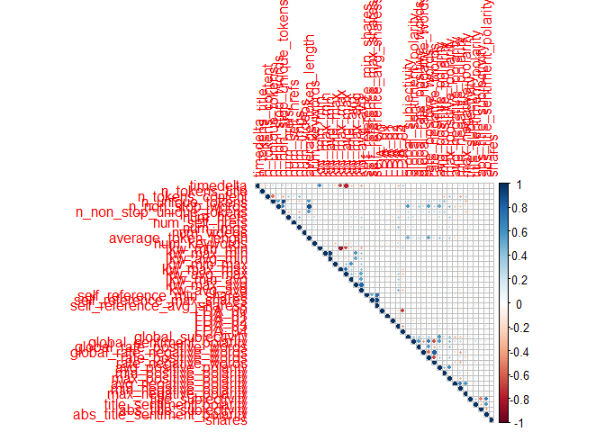
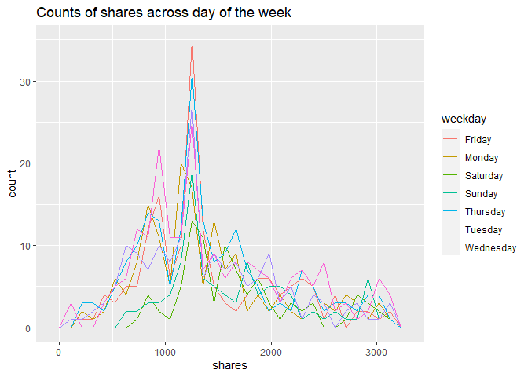
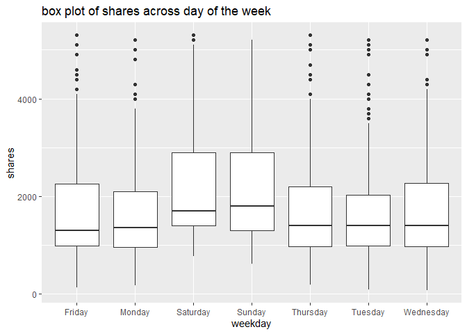
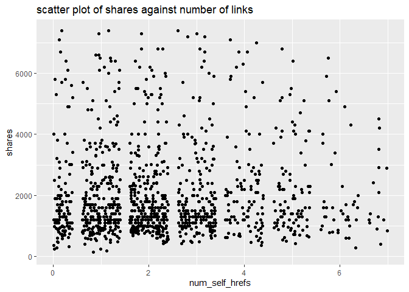
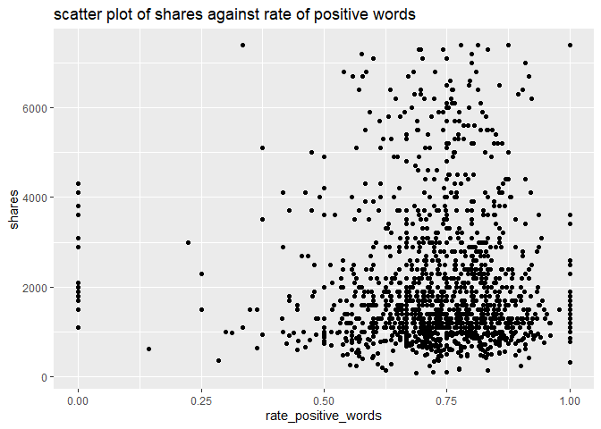

ST 558 Project 2
================
John Hinic & Fang Wu
2022-07-01

-   [Introduction](#introduction)
-   [Prepare Data](#prepare-data)
-   [Exploratory Data Analysis](#exploratory-data-analysis)
-   [Model Building](#model-building)
-   [Model Comparison](#model-comparison)

## Introduction

The consumption of online news is expediting day by day due to the
extensive adoption of smartphones and the rise of social networks.
Online news can capture the eye of a significant amount of Internet users
within a brief period of your time. Prediction of online news popularity
helps news organizations to gain better insights into the audience
interests and to deliver more relevant and appealing content in a
proactive manner. The company can allocate resources more wisely to
prepare stories over their life cycle. Moreover, prediction of news
popularity is also beneficial for trend forecasting, understanding the
collective human behavior, advertisers to propose more profitable
monetization techniques,and readers to filter the huge amount of
information quickly and efficiently.

We are going to analyze and predict the number of shares within
different data channel of interest using an online news data set from
[Machine Learning
Repository](https://archive.ics.uci.edu/ml/datasets/Online+News+Popularity#)
. This data set summarizes a heterogeneous set of features about
articles published by Mashable in a period of two years.

-   We are going to focus on the following predictors:

    1.  url: URL of the article (non-predictive)

    2.  timedelta: Days between the article publication and the dataset
        acquisition (non-predictive)

    3.  n_tokens_title: Number of words in the title

    4.  n_tokens_content Number of words in the content

    5.  n_unique_tokens: Rate of unique words in the content

    6.  n_non_stop_unique_tokens: Rate of unique non-stop words in the
        content

    7.  num_hrefs: Number of links

    8.  num_self_hrefs: Number of links to other articles published by
        Mashable

    9.  num_imgs: Number of images

    10. num_videos: Number of videos

    11. average_token_length: Average length of the words in the content

    12. num_keywords: Number of keywords in the metadata

    13. self_reference_min_shares: Min. shares of referenced articles in
        Mashable

    14. self_reference_max_shares: Max. shares of referenced articles in
        Mashable

    15. self_reference_avg_sharess: Avg. shares of referenced articles
        in Mashable

    16. global_subjectivity: Text subjectivity

    17. global_sentiment_polarity: Text sentiment polarity

    18. global_rate_positive_words: Rate of positive words in the
        content

    19. global_rate_negative_words: Rate of negative words in the
        content

    20. rate_positive_words: Rate of positive words among non-neutral
        tokens

    21. rate_negative_words: Rate of negative words among non-neutral
        tokens

    22. title_subjectivity: Title subjectivity

    23. title_sentiment_polarity: Title polarity

    24. abs_title_subjectivity: Absolute subjectivity level

    25. abs_title_sentiment_polarity: Absolute polarity level

    26. shares: Number of shares (target)

Stop Words usually refer to the most common words in a language, there
is no single universal list of stop words used by all natural language
processing tools. For some search engines, these are some of the most
common, short function words, such as the, is, at, which, and on.

In order to predict the number of share, we are going to build linear
regression and ensemble tree-based model.

## Prepare Data

We’ll use the `readr` and `dplyr` packages from the `tidyverse`. First,
we are going to read in data as tibble using function `read_csv`. Next,
in order to access different data channel of interest automatically, we
are going to create a variable called `type`. Last we `filter` the data
channel of interest using `params$` automatically.

-   Read in raw data and create new variable `type`

``` r
# read in raw data
raw_data <- read_csv("../Data/OnlineNewsPopularity.csv") 

# create type column for different data channel
type_data <- raw_data %>% 
  mutate(
    type=ifelse(data_channel_is_lifestyle==1, "lifestyle", 
            ifelse(data_channel_is_entertainment==1, "entertainment", 
                ifelse(data_channel_is_bus==1, "bus", 
                    ifelse(data_channel_is_socmed==1, "socmed", 
                        ifelse(data_channel_is_tech==1, "tech", 
                            ifelse(data_channel_is_world==1, "world", NA)
                            )
                        )
                    )
                )
            )
  )
```

-   Subset data channel of interest automatically with `params`

``` r
# select data for data channel of interest and create single weekday variable
target_data <- type_data %>% 
  filter(type == params$filter_type) %>%
  mutate(
    weekday=ifelse(
      weekday_is_monday==1, "Monday", 
        ifelse(weekday_is_tuesday==1, "Tuesday", 
          ifelse(weekday_is_wednesday==1, "Wednesday", 
            ifelse(weekday_is_thursday==1, "Thursday", 
              ifelse(weekday_is_friday==1, "Friday", 
                ifelse(weekday_is_saturday==1, "Saturday", 
                  ifelse(weekday_is_sunday==1, "Sunday", NA)
                  )
                )
              )
            )
          )
      )
    )
target_data
```

    ## # A tibble: 2,099 x 63
    ##    url     timedelta n_tokens_title n_tokens_content n_unique_tokens n_non_stop_words n_non_stop_uniq~ num_hrefs num_self_hrefs num_imgs num_videos average_token_l~
    ##    <chr>       <dbl>          <dbl>            <dbl>           <dbl>            <dbl>            <dbl>     <dbl>          <dbl>    <dbl>      <dbl>            <dbl>
    ##  1 http:/~       731              8              960           0.418             1.00            0.550        21             20       20          0             4.65
    ##  2 http:/~       731             10              187           0.667             1.00            0.800         7              0        1          0             4.66
    ##  3 http:/~       731             11              103           0.689             1.00            0.806         3              1        1          0             4.84
    ##  4 http:/~       731             10              243           0.619             1.00            0.824         1              1        0          0             4.38
    ##  5 http:/~       731              8              204           0.586             1.00            0.698         7              2        1          0             4.67
    ##  6 http:/~       731             11              315           0.551             1.00            0.702         4              4        1          0             4.38
    ##  7 http:/~       731             10             1190           0.409             1.00            0.561        25             24       20          0             4.62
    ##  8 http:/~       731              6              374           0.641             1.00            0.828         7              0        1          0             4.91
    ##  9 http:/~       730             12              499           0.513             1.00            0.662        14              1        1          0             5.08
    ## 10 http:/~       729             11              223           0.662             1.00            0.826         5              3        0          0             4.55
    ## # ... with 2,089 more rows, and 51 more variables: num_keywords <dbl>, data_channel_is_lifestyle <dbl>, data_channel_is_entertainment <dbl>,
    ## #   data_channel_is_bus <dbl>, data_channel_is_socmed <dbl>, data_channel_is_tech <dbl>, data_channel_is_world <dbl>, kw_min_min <dbl>, kw_max_min <dbl>,
    ## #   kw_avg_min <dbl>, kw_min_max <dbl>, kw_max_max <dbl>, kw_avg_max <dbl>, kw_min_avg <dbl>, kw_max_avg <dbl>, kw_avg_avg <dbl>, self_reference_min_shares <dbl>,
    ## #   self_reference_max_shares <dbl>, self_reference_avg_sharess <dbl>, weekday_is_monday <dbl>, weekday_is_tuesday <dbl>, weekday_is_wednesday <dbl>,
    ## #   weekday_is_thursday <dbl>, weekday_is_friday <dbl>, weekday_is_saturday <dbl>, weekday_is_sunday <dbl>, is_weekend <dbl>, LDA_00 <dbl>, LDA_01 <dbl>,
    ## #   LDA_02 <dbl>, LDA_03 <dbl>, LDA_04 <dbl>, global_subjectivity <dbl>, global_sentiment_polarity <dbl>, global_rate_positive_words <dbl>,
    ## #   global_rate_negative_words <dbl>, rate_positive_words <dbl>, rate_negative_words <dbl>, avg_positive_polarity <dbl>, min_positive_polarity <dbl>, ...

-   Split data into training and test sets

``` r
set.seed(100)
train_index <- createDataPartition(target_data$is_weekend, p=0.7, list=FALSE)
train <- target_data[train_index,]
test <- target_data[-train_index, ]
dim(train)
```

    ## [1] 1470   63

## Exploratory Data Analysis

First, we can look at a basic univariate summary and histograms of our
target variable, the number of shares:

``` r
summary(train$shares)
```

    ##    Min. 1st Qu.  Median    Mean 3rd Qu.    Max. 
    ##      78    1100    1700    3665    3200  196700

``` r
train %>% ggplot(aes(shares, ..ndensity..)) +
  geom_histogram() +
  geom_density() +
  geom_vline(xintercept = mean(train$shares), linetype = 2, color = "red") +
  theme_bw() +
  labs(title = "Histogram of Number of Shares", x = "Shares", y = "Normalized Density")
```

<!-- -->

``` r
train %>% filter(shares<quantile(shares, p=0.9)) %>%
  ggplot(aes(shares, ..ndensity..)) +
  geom_histogram() +
  geom_density() +
  geom_vline(xintercept = mean(train$shares), linetype = 2, color = "red") +
  theme_bw() +
  labs(title = "Histogram of Number of Shares", subtitle = "(excluding top 10%)", x = "Shares", y = "Normalized Density")
```

<!-- -->

In the numeric summary, one thing to look for is the mean compared to
the median, as well as where the mean lies relative to the minimum and
maximum values. If the mean is significantly higher than the median
and/or much closer to the minimum than the maximum, that means our data
is right skewed, which we can observe in the histograms. The mean shares
value is included as a reference point on the histograms, and the
subsetted histogram is included to account for any potential right-skew.

-   descriptive statistics on numeric variables:

``` r
summary(
  train %>% 
    select(timedelta, n_tokens_title, n_tokens_content, n_unique_tokens, n_non_stop_unique_tokens, num_hrefs,
           num_self_hrefs, num_imgs, num_videos, average_token_length, num_keywords, self_reference_avg_sharess,
           self_reference_min_shares, self_reference_max_shares, global_rate_negative_words, global_rate_positive_words,
           global_sentiment_polarity, global_subjectivity, rate_negative_words, rate_positive_words, title_subjectivity,
           title_sentiment_polarity, abs_title_sentiment_polarity, abs_title_subjectivity)
)
```

    ##    timedelta     n_tokens_title   n_tokens_content n_unique_tokens  n_non_stop_unique_tokens   num_hrefs      num_self_hrefs      num_imgs         num_videos     
    ##  Min.   :  9.0   Min.   : 3.000   Min.   :   0.0   Min.   :0.0000   Min.   :0.0000           Min.   :  0.00   Min.   : 0.000   Min.   :  0.000   Min.   : 0.0000  
    ##  1st Qu.:211.2   1st Qu.: 8.000   1st Qu.: 306.2   1st Qu.:0.4616   1st Qu.:0.6251           1st Qu.:  6.00   1st Qu.: 1.000   1st Qu.:  1.000   1st Qu.: 0.0000  
    ##  Median :413.5   Median :10.000   Median : 505.0   Median :0.5187   Median :0.6849           Median : 10.00   Median : 2.000   Median :  1.000   Median : 0.0000  
    ##  Mean   :405.1   Mean   : 9.741   Mean   : 623.4   Mean   :0.5219   Mean   :0.6818           Mean   : 13.37   Mean   : 2.467   Mean   :  4.836   Mean   : 0.5143  
    ##  3rd Qu.:613.8   3rd Qu.:11.000   3rd Qu.: 802.8   3rd Qu.:0.5907   3rd Qu.:0.7527           3rd Qu.: 18.00   3rd Qu.: 3.000   3rd Qu.:  8.000   3rd Qu.: 0.0000  
    ##  Max.   :731.0   Max.   :18.000   Max.   :7764.0   Max.   :0.8681   Max.   :0.9697           Max.   :145.00   Max.   :40.000   Max.   :111.000   Max.   :50.0000  
    ##  average_token_length  num_keywords    self_reference_avg_sharess self_reference_min_shares self_reference_max_shares global_rate_negative_words
    ##  Min.   :0.000        Min.   : 3.000   Min.   :     0.0           Min.   :     0.0          Min.   :     0.0          Min.   :0.00000           
    ##  1st Qu.:4.441        1st Qu.: 7.000   1st Qu.:   919.5           1st Qu.:   625.2          1st Qu.:   919.5          1st Qu.:0.01003           
    ##  Median :4.614        Median : 8.000   Median :  2500.0           Median :  1600.0          Median :  2800.0          Median :0.01520           
    ##  Mean   :4.574        Mean   : 8.239   Mean   :  6227.8           Mean   :  4594.4          Mean   :  8489.6          Mean   :0.01615           
    ##  3rd Qu.:4.793        3rd Qu.:10.000   3rd Qu.:  5700.0           3rd Qu.:  3800.0          3rd Qu.:  7300.0          3rd Qu.:0.02085           
    ##  Max.   :5.813        Max.   :10.000   Max.   :401450.0           Max.   :144900.0          Max.   :690400.0          Max.   :0.06061           
    ##  global_rate_positive_words global_sentiment_polarity global_subjectivity rate_negative_words rate_positive_words title_subjectivity title_sentiment_polarity
    ##  Min.   :0.00000            Min.   :-0.3727           Min.   :0.0000      Min.   :0.0000      Min.   :0.0000      Min.   :0.0000     Min.   :-1.0000         
    ##  1st Qu.:0.03483            1st Qu.: 0.1027           1st Qu.:0.4270      1st Qu.:0.1818      1st Qu.:0.6667      1st Qu.:0.0000     1st Qu.: 0.0000         
    ##  Median :0.04396            Median : 0.1509           Median :0.4782      Median :0.2540      Median :0.7407      Median :0.1000     Median : 0.0000         
    ##  Mean   :0.04436            Mean   : 0.1524           Mean   :0.4738      Mean   :0.2632      Mean   :0.7239      Mean   :0.2831     Mean   : 0.1072         
    ##  3rd Qu.:0.05333            3rd Qu.: 0.2048           3rd Qu.:0.5251      3rd Qu.:0.3333      3rd Qu.:0.8125      3rd Qu.:0.5000     3rd Qu.: 0.2138         
    ##  Max.   :0.12139            Max.   : 0.5800           Max.   :0.8667      Max.   :1.0000      Max.   :1.0000      Max.   :1.0000     Max.   : 1.0000         
    ##  abs_title_sentiment_polarity abs_title_subjectivity
    ##  Min.   :0.0000               Min.   :0.0000        
    ##  1st Qu.:0.0000               1st Qu.:0.1667        
    ##  Median :0.0000               Median :0.5000        
    ##  Mean   :0.1720               Mean   :0.3453        
    ##  3rd Qu.:0.2733               3rd Qu.:0.5000        
    ##  Max.   :1.0000               Max.   :0.5000

We can find the minimum, 25% percentile, mean, median, 75% percentile
and maximum values of each numeric variables from this chart.

``` r
sapply(
  train %>% 
    select(timedelta, n_tokens_title, n_tokens_content, n_unique_tokens, n_non_stop_unique_tokens, num_hrefs, num_self_hrefs,
           num_imgs, num_videos, average_token_length, num_keywords, self_reference_avg_sharess, self_reference_min_shares,
           self_reference_max_shares, global_rate_negative_words, global_rate_positive_words, global_sentiment_polarity,
           global_subjectivity, rate_negative_words, rate_positive_words, title_subjectivity, title_sentiment_polarity,
           abs_title_sentiment_polarity, abs_title_subjectivity), 
  sd
)
```

    ##                    timedelta               n_tokens_title             n_tokens_content              n_unique_tokens     n_non_stop_unique_tokens 
    ##                 2.175971e+02                 1.905488e+00                 5.554316e+02                 1.109071e-01                 1.215647e-01 
    ##                    num_hrefs               num_self_hrefs                     num_imgs                   num_videos         average_token_length 
    ##                 1.165726e+01                 2.667132e+00                 7.902206e+00                 2.155178e+00                 5.882446e-01 
    ##                 num_keywords   self_reference_avg_sharess    self_reference_min_shares    self_reference_max_shares   global_rate_negative_words 
    ##                 1.673424e+00                 1.637630e+04                 1.041287e+04                 2.968491e+04                 8.842470e-03 
    ##   global_rate_positive_words    global_sentiment_polarity          global_subjectivity          rate_negative_words          rate_positive_words 
    ##                 1.533425e-02                 8.909151e-02                 9.670292e-02                 1.260146e-01                 1.477793e-01 
    ##           title_subjectivity     title_sentiment_polarity abs_title_sentiment_polarity       abs_title_subjectivity 
    ##                 3.284506e-01                 2.880336e-01                 2.546508e-01                 1.886902e-01

From here we can compare standard deviation between numeric variables.

-   Correlation between numeric variables

``` r
#str(train)
Correlation <- cor(train %>% select(-url, -type, -starts_with("weekday"), -starts_with("data_channel"), -is_weekend ))
corrplot(Correlation, type="upper", tl.pos="lt", cl.cex=0.8)
```

<!-- -->

This plot help us to check linear relationship between numeric
variables. We want to avoid include predictors with high correlation in
the same model.

-   summary across different day of the week

We are going to visualize share performance on different day of the
week.

``` r
# shares on different day
train %>% group_by(weekday) %>% 
  summarize(
    n=n(), 
    min=min(shares), 
    max=max(shares), 
    avg=mean(shares), 
    median=median(shares)
  )
```

    ## # A tibble: 7 x 6
    ##   weekday       n   min    max   avg median
    ##   <chr>     <int> <dbl>  <dbl> <dbl>  <dbl>
    ## 1 Friday      221   127  40400 2933.   1400
    ## 2 Monday      218   171 196700 4938.   1550
    ## 3 Saturday    133   776  29200 3832.   1900
    ## 4 Sunday      152   613  27500 3488.   2050
    ## 5 Thursday    260   184  56000 3630.   1600
    ## 6 Tuesday     227    93  54900 3738.   1600
    ## 7 Wednesday   259    78  73100 3205.   1600

We can inspect the effect of `weekday` on the `share`. The number of
records on each day as well as the minimum, maximum, mean and median
values of shares on each day of the week are included in the table here.
If there are big difference across `weekday`, then `weekday` and `share`
are dependent.

We also can check the difference in plot.

``` r
g <- ggplot(train %>% filter(shares<quantile(shares, p=0.75)), aes(x=shares))
g + geom_freqpoly(aes(color=weekday)) +
  ggtitle("Counts of shares across day of the week")
```

<!-- -->

``` r
ggplot(train, aes(x=weekday, y=shares)) +
  geom_boxplot() +
  scale_y_continuous(limits=c(min(train$shares), quantile(train$shares, p=0.75)+IQR(train$shares))) +
  ggtitle("box plot of shares across day of the week")
```

<!-- -->

In this plot, we can compare the median, 25% percentile, 75% percentile
and IQR of shares between different day of the week. It will show the
effect of day on the shares.

We can also examine this relationship by binning the number of shares
into groups and constructing a contingency table.

``` r
train %>%
  mutate(Shares = cut(shares, c(seq(0, 10000, by = 1000), max(shares)), dig.lab = 6)) %>%
  group_by(weekday, Shares) %>%
  summarise(n = n()) %>%
  pivot_wider(names_from = weekday, values_from = n, values_fill = 0) %>%
  arrange(Shares)
```

    ## # A tibble: 11 x 8
    ##    Shares         Friday Monday Saturday Sunday Thursday Tuesday Wednesday
    ##    <fct>           <int>  <int>    <int>  <int>    <int>   <int>     <int>
    ##  1 (0,1000]           54     54        8     14       63      56        73
    ##  2 (1000,2000]        83     79       62     62       99      88        87
    ##  3 (2000,3000]        30     27       19     24       35      23        43
    ##  4 (3000,4000]        18     16       13     15       14      13        15
    ##  5 (4000,5000]         8      4        6      9        6      10         7
    ##  6 (5000,6000]         5      7        8      7        9      10         7
    ##  7 (6000,7000]         5      5        2      6        5       7         5
    ##  8 (7000,8000]         4      4        1      3        4       5         3
    ##  9 (8000,9000]         2      1        1      3        2       2         1
    ## 10 (9000,10000]        1      1        1      1        2       1         1
    ## 11 (10000,196700]     11     20       12      8       21      12        17

With this contingency table, we can get an idea of how many shares
articles tend to get across the different days. We can also observe
which days have the most “viral” articles that get an extremely high
number of shares.

-   Scatter plot

We want to check the relationship between response variable `share` and
other predictors through scatter plot. Linear or non-linear? Positive or
negative?

``` r
g <- ggplot(train, aes(x=num_self_hrefs, y=shares) )
g + geom_jitter() +
    scale_y_continuous(
      limits=c(min(train$shares), quantile(train$shares, p=0.75)+2*IQR(train$shares))
    ) +
    scale_x_continuous(
      limits=c(min(train$num_self_hrefs), quantile(train$num_self_hrefs, p=0.75)+2*IQR(train$num_self_hrefs))
    ) +
    ggtitle("scatter plot of shares against number of links") 
```

<!-- -->

``` r
g <- ggplot(train, aes(x=rate_positive_words, y=shares) )
g + geom_point() +
  scale_y_continuous(
    limits=c(min(train$shares), quantile(train$shares, p=0.75)+2*IQR(train$shares))
  ) +
  ggtitle("scatter plot of shares against rate of positive words")
```

<!-- -->

We will also examine the relationship of number of shares with the
absolute polarity of the title - perhaps articles with titles that have
a more polarizing sentiment are more likely to get shares.

``` r
train %>% filter(shares<quantile(shares, p=0.9)) %>%
  ggplot(aes(abs_title_sentiment_polarity, shares)) +
  geom_jitter() +
  labs(title = "Number of Shares by Abs. Title Sentiment Polarity", subtitle = "(excluding top 10% of shares)", x = "Absolute Title Polarity", y = "Shares") +
  theme_bw()
```

<!-- -->

Another thing we can examine is the relationship between the number of
shares and the number of shares in referenced articles (min, max, and
average).

``` r
train %>% 
  select(shares, self_reference_min_shares, self_reference_avg_sharess, self_reference_max_shares) %>% 
  filter(shares<quantile(shares, p=0.9)) %>%
  ggpairs(columnLabels = c("Shares", "Min. Ref. Shares", "Avg. Ref. Shares", "Max. Ref. Shares")) + 
  labs(title = "(excluding top 10% of shares)") +
  theme_bw()
```

<!-- -->

For this grid of plots, we will want to focus on the column/row for
shares. We can visually see the relationship between number of shares
for an article vs. the number of shares in its referenced articles by
examining the scatter plots, or look at the actual numeric correlations.
We just want a general idea of whether the relationships are positive or
negative, as well as linear or non-linear.

## Model Building

We will be fitting 4 total models for comparison:

-   2 linear regression models
-   1 random forest model
-   1 boosted tree model

For the 2 linear regression models, we will use basic 10-fold cross
validation to evaluate the fit on the training data, while using 5-fold
3-times repeated cross-validation for the tree-based models. To ease the
computation time, we will also utilize parallel processing, which will
require a bit of set-up.

``` r
# control setup
controlLR <- trainControl(method = "cv", number = 10, allowParallel = TRUE)
controlTree <- trainControl(method = "repeatedcv", number = 5, repeats = 3, allowParallel = TRUE)

# parallel setup
cl <- makeCluster(detectCores() - 2)
registerDoParallel(cl)
```

### Linear Regression Models

As mentioned, the first 2 kinds of models we will fit to the data will
be linear regression models. Linear regression is, for the most part,
the most basic form of predictive modeling available. The simplest form,
a single predictor and single response, is essentially just constructing
a line that “agrees” with the data as closely as possible. In this case,
it is similar to the basic slope form of a line, *y* = *m**x* + *b*. We
have a response variable *y*, a predictor variable *x*, a slope *m*, and
a y-intercept *b*. However, since we are modelling real-world data,
there is an additional random error term in our formula:

*Y*<sub>*i*</sub> = *β*<sub>0</sub> + *β*<sub>1</sub>*x*<sub>*i*</sub> + *E*<sub>*i*</sub>
Where *E*<sub>*i*</sub> is our random error term (and assumed to follow
a normal distribution in most cases). To actually calculate the
*β*<sub>0</sub> and *β*<sub>1</sub>, we find the values that minimize
the sum of squared errors:

$$\\sum\_{i = 1}^{n} (y_i - \\beta_0 - \\beta_1 x_i)^2$$

This can also be extended in many ways, such as adding in more predictor
variables or higher-order terms, but the model is still fit by
minimizing the sum of squared errors as with simple linear regression.

#### Fang

``` r
mlFit <- train(shares~timedelta+weekday+num_self_hrefs+num_imgs+num_videos, data=train, method="lm", preProcess=c("center", "scale"), trControl=controlLR)
mlFit
```

    ## Linear Regression 
    ## 
    ## 1470 samples
    ##    5 predictor
    ## 
    ## Pre-processing: centered (10), scaled (10) 
    ## Resampling: Cross-Validated (10 fold) 
    ## Summary of sample sizes: 1324, 1323, 1322, 1322, 1323, 1324, ... 
    ## Resampling results:
    ## 
    ##   RMSE     Rsquared    MAE     
    ##   7636.52  0.01040242  3337.395
    ## 
    ## Tuning parameter 'intercept' was held constant at a value of TRUE

#### John

This model will use stepwise regression to select the optimal model
based on the AIC metric, considering all possible predictive variables
(aside from the Sunday indicator, weekend indicator, and the rate of
negative words, which all caused )

``` r
mlrFit2 <- train(
  shares ~ .,
  data = train %>% select(-url, -timedelta, -starts_with("data_channel"), -weekday, -weekday_is_sunday, -type, -is_weekend),
  method = "lmStepAIC",
  preProcess = c("center", "scale"),
  trControl = controlLR,
  trace = FALSE,
  scope = list(upper = ~., lower = ~1)
)
mlrFit2
```

    ## Linear Regression with Stepwise Selection 
    ## 
    ## 1470 samples
    ##   50 predictor
    ## 
    ## Pre-processing: centered (50), scaled (50) 
    ## Resampling: Cross-Validated (10 fold) 
    ## Summary of sample sizes: 1324, 1324, 1323, 1322, 1323, 1323, ... 
    ## Resampling results:
    ## 
    ##   RMSE      Rsquared     MAE    
    ##   7695.101  0.008990587  3443.47

``` r
summary(mlrFit2$finalModel)
```

    ## 
    ## Call:
    ## lm(formula = .outcome ~ n_tokens_content + n_unique_tokens + 
    ##     n_non_stop_words + n_non_stop_unique_tokens + num_hrefs + 
    ##     num_videos + kw_avg_avg + self_reference_min_shares + weekday_is_monday + 
    ##     abs_title_subjectivity, data = dat)
    ## 
    ## Residuals:
    ##    Min     1Q Median     3Q    Max 
    ## -25435  -2595  -1454    108 184512 
    ## 
    ## Coefficients:
    ##                           Estimate Std. Error t value Pr(>|t|)    
    ## (Intercept)                 3664.6      216.9  16.892  < 2e-16 ***
    ## n_tokens_content             537.0      320.6   1.675  0.09413 .  
    ## n_unique_tokens            -1189.6      630.1  -1.888  0.05925 .  
    ## n_non_stop_words           -1004.1      353.4  -2.841  0.00456 ** 
    ## n_non_stop_unique_tokens    2004.2      626.0   3.202  0.00140 ** 
    ## num_hrefs                    456.0      254.9   1.789  0.07389 .  
    ## num_videos                   894.5      218.9   4.087 4.61e-05 ***
    ## kw_avg_avg                   391.0      230.4   1.697  0.08989 .  
    ## self_reference_min_shares    353.9      219.5   1.612  0.10713    
    ## weekday_is_monday            514.1      217.5   2.363  0.01824 *  
    ## abs_title_subjectivity       311.8      217.8   1.432  0.15247    
    ## ---
    ## Signif. codes:  0 '***' 0.001 '**' 0.01 '*' 0.05 '.' 0.1 ' ' 1
    ## 
    ## Residual standard error: 8318 on 1459 degrees of freedom
    ## Multiple R-squared:  0.03483,    Adjusted R-squared:  0.02821 
    ## F-statistic: 5.265 on 10 and 1459 DF,  p-value: 1.209e-07

### Tree-based Models

#### Random Forest

Random forest models are based on the more simple regression trees - an
example of this is shown here:


Regression trees have many benefits, and are very easily interpretable
by looking at the visual. However, they are highly variable based on the
specific data used to build them. Random forest models are one way to
combat this.

Random forest models use bootstrap sampling to fit many regression
trees, each one using a random subset of predictors (*m*). This makes it
so that predictions are not dominated by a small number of predictors,
leading to more consistent results.

The standard practice is to use *m* = *p*/3, where *p* represents the
total number of predictors. For this case, that means we would use
*m* = 53/3 ≈ 18 after removing all non-predictive variables from the
dataset. Thus, we will consider *m* values ranging anywhere from 1 to
24, selecting the optimal model based on the model performance in
repeated cross-validation.

``` r
# saving data as a matrix and vector to take up less memory across workers
x <- as.matrix(train %>% select(-url, -timedelta, -starts_with("data_channel"), -shares, -type, -weekday))
y <- train$shares

# fitting model
# to ease the computation time to create output, mtry values of 1-10 were the only ones tested in the final program
# tuning values of 1 through 24 were still tested before creating final product.
set.seed(91894)
rf <- train(
  x, y,
  method = "rf",
  preProcess = c("center", "scale"),
  trControl = controlTree,
  tuneGrid = data.frame(mtry = 1:10),
  ntree = 500
)

# showing results / variable importance
rf$results
```

    ##    mtry     RMSE    Rsquared      MAE   RMSESD  RsquaredSD    MAESD
    ## 1     1 7892.135 0.013274332 3322.109 3002.565 0.013410074 342.1813
    ## 2     2 7937.477 0.012223939 3401.023 2973.268 0.015038069 349.7596
    ## 3     3 7981.243 0.009916801 3437.657 2963.140 0.012656446 348.8651
    ## 4     4 8021.479 0.009912232 3467.938 2936.666 0.010545724 352.4080
    ## 5     5 8062.401 0.009626688 3494.135 2914.149 0.011210182 355.9921
    ## 6     6 8098.680 0.008429689 3515.285 2911.124 0.009248759 372.6854
    ## 7     7 8139.916 0.009186234 3535.767 2872.151 0.009992930 364.7452
    ## 8     8 8157.486 0.008496225 3533.112 2879.234 0.009558935 361.3199
    ## 9     9 8186.923 0.009196098 3549.468 2881.424 0.010516951 384.2275
    ## 10   10 8257.344 0.008576192 3573.768 2820.404 0.009338496 372.7450

``` r
rf$bestTune
```

    ##   mtry
    ## 1    1

``` r
varImp(rf)
```

    ## rf variable importance
    ## 
    ##   only 20 most important variables shown (out of 52)
    ## 
    ##                            Overall
    ## num_videos                  100.00
    ## LDA_00                       65.32
    ## LDA_04                       54.06
    ## n_non_stop_words             52.78
    ## LDA_01                       46.40
    ## kw_avg_avg                   45.47
    ## self_reference_avg_sharess   43.51
    ## n_unique_tokens              42.60
    ## kw_avg_max                   42.54
    ## num_hrefs                    42.14
    ## self_reference_max_shares    41.77
    ## kw_avg_min                   41.33
    ## n_non_stop_unique_tokens     40.75
    ## n_tokens_content             39.78
    ## self_reference_min_shares    39.72
    ## kw_max_avg                   37.70
    ## LDA_02                       36.78
    ## rate_negative_words          35.65
    ## kw_max_min                   34.95
    ## global_rate_positive_words   34.41

``` r
plot(varImp(rf), top = 20, title = "Random Forest Variable Importance")
```

<!-- -->

#### Boosted Trees

Boosted trees model trains a bunch of trees sequentially. Each
subsequent tree learns from the mistakes of the previous tree. So
predictions get updated as trees grown. It is used for both regression
and classification.

``` r
n.trees=c(50, 100, 150)
interaction.depth=c(2,3,4)
shrinkage=c(0.1, 0.5)
n.minobsinnode=c(10)
tune_parameter <- expand.grid(
  n.trees=n.trees, 
  interaction.depth=interaction.depth, 
  shrinkage=shrinkage, 
  n.minobsinnode=n.minobsinnode
)

boostedFit <- train(
  shares~timedelta+weekday+num_self_hrefs+num_imgs+num_videos+rate_positive_words, 
  data=train, 
  method="gbm", 
  trControl=controlTree, 
  tuneGrid=tune_parameter
)
```

    ## Iter   TrainDeviance   ValidDeviance   StepSize   Improve
    ##      1 70639663.6079             nan     0.1000 48691.6794
    ##      2 70530469.3909             nan     0.1000 12740.1484
    ##      3 70184824.6443             nan     0.1000 -49334.2115
    ##      4 70074777.0802             nan     0.1000 71615.1859
    ##      5 69742860.5532             nan     0.1000 -91182.0925
    ##      6 69483359.6686             nan     0.1000 -136299.0799
    ##      7 69260423.5530             nan     0.1000 -167479.9078
    ##      8 69279845.6141             nan     0.1000 -215501.6628
    ##      9 69296334.0948             nan     0.1000 -211889.5695
    ##     10 69210620.6174             nan     0.1000 -53494.1974
    ##     20 68413703.6541             nan     0.1000 -334688.8054
    ##     40 67712507.3116             nan     0.1000 -208529.7611
    ##     50 67026452.8483             nan     0.1000 -169573.0476

``` r
boostedFit
```

    ## Stochastic Gradient Boosting 
    ## 
    ## 1470 samples
    ##    6 predictor
    ## 
    ## No pre-processing
    ## Resampling: Cross-Validated (5 fold, repeated 3 times) 
    ## Summary of sample sizes: 1175, 1178, 1175, 1176, 1176, 1176, ... 
    ## Resampling results across tuning parameters:
    ## 
    ##   shrinkage  interaction.depth  n.trees  RMSE      Rsquared      MAE     
    ##   0.1        2                   50      8080.700  0.0060348293  3328.467
    ##   0.1        2                  100      8102.986  0.0065683422  3344.965
    ##   0.1        2                  150      8101.016  0.0049679116  3365.450
    ##   0.1        3                   50      8113.215  0.0062906529  3352.484
    ##   0.1        3                  100      8214.000  0.0035427596  3415.915
    ##   0.1        3                  150      8274.344  0.0017536798  3473.043
    ##   0.1        4                   50      8162.484  0.0035305202  3387.759
    ##   0.1        4                  100      8263.770  0.0041990974  3477.828
    ##   0.1        4                  150      8381.085  0.0031980646  3602.887
    ##   0.5        2                   50      8519.377  0.0029288224  3645.374
    ##   0.5        2                  100      8714.716  0.0013960806  3842.017
    ##   0.5        2                  150      8876.476  0.0009789948  3997.908
    ##   0.5        3                   50      8689.216  0.0012873886  3915.408
    ##   0.5        3                  100      9068.038  0.0009564165  4244.233
    ##   0.5        3                  150      9140.590  0.0011816717  4396.486
    ##   0.5        4                   50      8985.884  0.0017271964  4282.549
    ##   0.5        4                  100      9304.006  0.0007531977  4529.290
    ##   0.5        4                  150      9410.402  0.0007440278  4701.945
    ## 
    ## Tuning parameter 'n.minobsinnode' was held constant at a value of 10
    ## RMSE was used to select the optimal model using the smallest value.
    ## The final values used for the model were n.trees = 50, interaction.depth = 2, shrinkage = 0.1 and n.minobsinnode = 10.

``` r
# ending parallel cluster
stopCluster(cl)
```

## Model Comparison

Finally, we will test all 4 models on the test set to select a final
model. We will write a basic helper function that pulls the fit
statistics for each model on the test set, then combine them into a
single table for comparison. We will select the model with the lowest
RMSE as our final model.

``` r
evalFit <- function(fit, modelName) {
  pred <- predict(fit, test)
  stats <- postResample(pred, obs = test$shares)
  statsDF <- data.frame(Model = modelName, RMSE = stats[1], Rsq = stats[2], MAE = stats[3])
  rownames(statsDF) <- NULL
  return(statsDF)
}
eval1 <- evalFit(mlFit, "First Linear Regression")
eval2 <- evalFit(mlrFit2, "Second Linear Regression")
eval3 <- evalFit(rf, "Random Forest")
eval4 <- evalFit(boostedFit, "Boosted Tree")
fits <- rbind(eval1, eval2, eval3, eval4)
best <- fits %>%
  filter(RMSE == min(RMSE))
fits
```

    ##                      Model     RMSE          Rsq      MAE
    ## 1  First Linear Regression 9848.823 0.0022486456 3295.163
    ## 2 Second Linear Regression 9766.965 0.0173600637 3300.551
    ## 3            Random Forest 9787.738 0.0134280610 3311.166
    ## 4             Boosted Tree 9943.685 0.0001413263 3373.743

Thus, our final model will be the Second Linear Regression model, which
has an RMSE of 9766.9646507.
