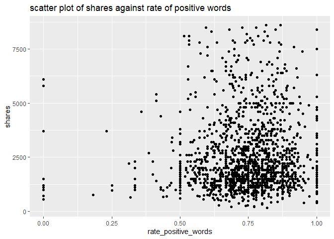

ST 558 Project 2
================
John Hinic & Fang Wu
2022-07-01

-   [Introduction](#introduction)
-   [Prepare Data](#prepare-data)
-   [Exploratory Data Analysis](#exploratory-data-analysis)
-   [Model Building](#model-building)
-   [Model Comparison](#model-comparison)

## Introduction

The consumption of online news is expediting day by day due to the
extensive adoption of smartphones and the rise of social networks.
Online news can capture the eye of a significant amount of Internet users
within a brief period of your time. Prediction of online news popularity
helps news organizations to gain better insights into the audience
interests and to deliver more relevant and appealing content in a
proactive manner. The company can allocate resources more wisely to
prepare stories over their life cycle. Moreover, prediction of news
popularity is also beneficial for trend forecasting, understanding the
collective human behavior, advertisers to propose more profitable
monetization techniques,and readers to filter the huge amount of
information quickly and efficiently.

We are going to analyze and predict the number of shares within
different data channel of interest using an online news data set from
[Machine Learning
Repository](https://archive.ics.uci.edu/ml/datasets/Online+News+Popularity#)
. This data set summarizes a heterogeneous set of features about
articles published by Mashable in a period of two years.

-   We are going to focus on the following predictors:

    1.  url: URL of the article (non-predictive)

    2.  timedelta: Days between the article publication and the dataset
        acquisition (non-predictive)

    3.  n_tokens_title: Number of words in the title

    4.  n_tokens_content Number of words in the content

    5.  n_unique_tokens: Rate of unique words in the content

    6.  n_non_stop_unique_tokens: Rate of unique non-stop words in the
        content

    7.  num_hrefs: Number of links

    8.  num_self_hrefs: Number of links to other articles published by
        Mashable

    9.  num_imgs: Number of images

    10. num_videos: Number of videos

    11. average_token_length: Average length of the words in the content

    12. num_keywords: Number of keywords in the metadata

    13. self_reference_min_shares: Min. shares of referenced articles in
        Mashable

    14. self_reference_max_shares: Max. shares of referenced articles in
        Mashable

    15. self_reference_avg_sharess: Avg. shares of referenced articles
        in Mashable

    16. global_subjectivity: Text subjectivity

    17. global_sentiment_polarity: Text sentiment polarity

    18. global_rate_positive_words: Rate of positive words in the
        content

    19. global_rate_negative_words: Rate of negative words in the
        content

    20. rate_positive_words: Rate of positive words among non-neutral
        tokens

    21. rate_negative_words: Rate of negative words among non-neutral
        tokens

    22. title_subjectivity: Title subjectivity

    23. title_sentiment_polarity: Title polarity

    24. abs_title_subjectivity: Absolute subjectivity level

    25. abs_title_sentiment_polarity: Absolute polarity level

    26. shares: Number of shares (target)

Stop Words usually refer to the most common words in a language, there
is no single universal list of stop words used by all natural language
processing tools. For some search engines, these are some of the most
common, short function words, such as the, is, at, which, and on.

In order to predict the number of share, we are going to build linear
regression and ensemble tree-based model.

## Prepare Data

We’ll use the `readr` and `dplyr` packages from the `tidyverse`. First,
we are going to read in data as tibble using function `read_csv`. Next,
in order to access different data channel of interest automatically, we
are going to create a variable called `type`. Last we `filter` the data
channel of interest using `params$` automatically.

-   Read in raw data and create new variable `type`

``` r
# read in raw data
raw_data <- read_csv("../Data/OnlineNewsPopularity.csv") 

# create type column for different data channel
type_data <- raw_data %>% 
  mutate(
    type=ifelse(data_channel_is_lifestyle==1, "lifestyle", 
            ifelse(data_channel_is_entertainment==1, "entertainment", 
                ifelse(data_channel_is_bus==1, "bus", 
                    ifelse(data_channel_is_socmed==1, "socmed", 
                        ifelse(data_channel_is_tech==1, "tech", 
                            ifelse(data_channel_is_world==1, "world", NA)
                            )
                        )
                    )
                )
            )
  )
```

-   Subset data channel of interest automatically with `params`

``` r
# select data for data channel of interest and create single weekday variable
target_data <- type_data %>% 
  filter(type == params$filter_type) %>%
  mutate(
    weekday=ifelse(
      weekday_is_monday==1, "Monday", 
        ifelse(weekday_is_tuesday==1, "Tuesday", 
          ifelse(weekday_is_wednesday==1, "Wednesday", 
            ifelse(weekday_is_thursday==1, "Thursday", 
              ifelse(weekday_is_friday==1, "Friday", 
                ifelse(weekday_is_saturday==1, "Saturday", 
                  ifelse(weekday_is_sunday==1, "Sunday", NA)
                  )
                )
              )
            )
          )
      )
    )
target_data
```

    ## # A tibble: 2,323 x 63
    ##    url               timedelta n_tokens_title n_tokens_content n_unique_tokens n_non_stop_words n_non_stop_uniq~ num_hrefs
    ##    <chr>                 <dbl>          <dbl>            <dbl>           <dbl>            <dbl>            <dbl>     <dbl>
    ##  1 http://mashable.~       731              8              257           0.568             1.00            0.671         9
    ##  2 http://mashable.~       731              8              218           0.663             1.00            0.688        14
    ##  3 http://mashable.~       731              9             1226           0.410             1.00            0.617        10
    ##  4 http://mashable.~       731             10             1121           0.451             1.00            0.629        15
    ##  5 http://mashable.~       729              9              168           0.778             1.00            0.865         6
    ##  6 http://mashable.~       729              9              100           0.760             1.00            0.803         3
    ##  7 http://mashable.~       729             10             1596           0.420             1.00            0.632        19
    ##  8 http://mashable.~       728              7              518           0.486             1.00            0.654        11
    ##  9 http://mashable.~       727              8              358           0.503             1.00            0.687         4
    ## 10 http://mashable.~       727              6              358           0.622             1.00            0.777        24
    ## # ... with 2,313 more rows, and 55 more variables: num_self_hrefs <dbl>, num_imgs <dbl>, num_videos <dbl>,
    ## #   average_token_length <dbl>, num_keywords <dbl>, data_channel_is_lifestyle <dbl>, data_channel_is_entertainment <dbl>,
    ## #   data_channel_is_bus <dbl>, data_channel_is_socmed <dbl>, data_channel_is_tech <dbl>, data_channel_is_world <dbl>,
    ## #   kw_min_min <dbl>, kw_max_min <dbl>, kw_avg_min <dbl>, kw_min_max <dbl>, kw_max_max <dbl>, kw_avg_max <dbl>,
    ## #   kw_min_avg <dbl>, kw_max_avg <dbl>, kw_avg_avg <dbl>, self_reference_min_shares <dbl>,
    ## #   self_reference_max_shares <dbl>, self_reference_avg_sharess <dbl>, weekday_is_monday <dbl>, weekday_is_tuesday <dbl>,
    ## #   weekday_is_wednesday <dbl>, weekday_is_thursday <dbl>, weekday_is_friday <dbl>, weekday_is_saturday <dbl>, ...

-   Split data into training and test sets

``` r
set.seed(100)
train_index <- createDataPartition(target_data$is_weekend, p=0.7, list=FALSE)
train <- target_data[train_index,]
test <- target_data[-train_index, ]
dim(train)
```

    ## [1] 1627   63

## Exploratory Data Analysis

First, we can look at a basic univariate summary and histograms of our
target variable, the number of shares:

``` r
summary(train$shares)
```

    ##    Min. 1st Qu.  Median    Mean 3rd Qu.    Max. 
    ##     165    1400    2100    3753    3800  122800

``` r
train %>% ggplot(aes(shares, ..ndensity..)) +
  geom_histogram() +
  geom_density() +
  geom_vline(xintercept = mean(train$shares), linetype = 2, color = "red") +
  theme_bw() +
  labs(title = "Histogram of Number of Shares", x = "Shares", y = "Normalized Density")
```

<!-- -->

``` r
train %>% filter(shares<quantile(shares, p=0.9)) %>%
  ggplot(aes(shares, ..ndensity..)) +
  geom_histogram() +
  geom_density() +
  geom_vline(xintercept = mean(train$shares), linetype = 2, color = "red") +
  theme_bw() +
  labs(title = "Histogram of Number of Shares", subtitle = "(excluding top 10%)", x = "Shares", y = "Normalized Density")
```

<!-- -->

In the numeric summary, one thing to look for is the mean compared to
the median, as well as where the mean lies relative to the minimum and
maximum values. If the mean is significantly higher than the median
and/or much closer to the minimum than the maximum, that means our data
is right skewed, which we can observe in the histograms. The mean shares
value is included as a reference point on the histograms, and the
subsetted histogram is included to account for any potential right-skew.

-   descriptive statistics on numeric variables:

``` r
summary(
  train %>% 
    select(timedelta, n_tokens_title, n_tokens_content, n_unique_tokens, n_non_stop_unique_tokens, num_hrefs,
           num_self_hrefs, num_imgs, num_videos, average_token_length, num_keywords, self_reference_avg_sharess,
           self_reference_min_shares, self_reference_max_shares, global_rate_negative_words, global_rate_positive_words,
           global_sentiment_polarity, global_subjectivity, rate_negative_words, rate_positive_words, title_subjectivity,
           title_sentiment_polarity, abs_title_sentiment_polarity, abs_title_subjectivity)
)
```

    ##    timedelta     n_tokens_title   n_tokens_content n_unique_tokens  n_non_stop_unique_tokens   num_hrefs     
    ##  Min.   : 11.0   Min.   : 4.000   Min.   :   0.0   Min.   :0.0000   Min.   :0.0000           Min.   :  0.00  
    ##  1st Qu.:259.5   1st Qu.: 8.000   1st Qu.: 250.5   1st Qu.:0.4635   1st Qu.:0.6172           1st Qu.:  5.00  
    ##  Median :429.0   Median : 9.000   Median : 434.0   Median :0.5366   Median :0.6830           Median :  8.00  
    ##  Mean   :420.4   Mean   : 9.555   Mean   : 607.9   Mean   :0.5372   Mean   :0.6833           Mean   : 13.27  
    ##  3rd Qu.:597.0   3rd Qu.:11.000   3rd Qu.: 764.0   3rd Qu.:0.6080   3rd Qu.:0.7559           3rd Qu.: 15.00  
    ##  Max.   :731.0   Max.   :18.000   Max.   :3735.0   Max.   :0.9714   Max.   :1.0000           Max.   :110.00  
    ##  num_self_hrefs      num_imgs       num_videos     average_token_length  num_keywords    self_reference_avg_sharess
    ##  Min.   : 0.000   Min.   : 0.00   Min.   : 0.000   Min.   :0.000        Min.   : 1.000   Min.   :     0            
    ##  1st Qu.: 2.000   1st Qu.: 1.00   1st Qu.: 0.000   1st Qu.:4.496        1st Qu.: 5.000   1st Qu.:  1506            
    ##  Median : 3.000   Median : 1.00   Median : 0.000   Median :4.657        Median : 7.000   Median :  3300            
    ##  Mean   : 4.856   Mean   : 4.27   Mean   : 1.052   Mean   :4.644        Mean   : 6.615   Mean   :  8963            
    ##  3rd Qu.: 5.000   3rd Qu.: 3.00   3rd Qu.: 1.000   3rd Qu.:4.813        3rd Qu.: 8.000   3rd Qu.:  7403            
    ##  Max.   :74.000   Max.   :62.00   Max.   :34.000   Max.   :5.774        Max.   :10.000   Max.   :690400            
    ##  self_reference_min_shares self_reference_max_shares global_rate_negative_words global_rate_positive_words
    ##  Min.   :     0.0          Min.   :     0            Min.   :0.000000           Min.   :0.00000           
    ##  1st Qu.:   779.5          1st Qu.:  1700            1st Qu.:0.009091           1st Qu.:0.03549           
    ##  Median :  1600.0          Median :  4400            Median :0.014286           Median :0.04583           
    ##  Mean   :  5408.6          Mean   : 16378            Mean   :0.015659           Mean   :0.04682           
    ##  3rd Qu.:  3350.0          3rd Qu.: 13100            3rd Qu.:0.020628           3rd Qu.:0.05677           
    ##  Max.   :690400.0          Max.   :690400            Max.   :0.139831           Max.   :0.15549           
    ##  global_sentiment_polarity global_subjectivity rate_negative_words rate_positive_words title_subjectivity
    ##  Min.   :-0.37500          Min.   :0.0000      Min.   :0.0000      Min.   :0.0000      Min.   :0.00000   
    ##  1st Qu.: 0.08963          1st Qu.:0.4080      1st Qu.:0.1610      1st Qu.:0.6667      1st Qu.:0.00000   
    ##  Median : 0.14360          Median :0.4612      Median :0.2414      Median :0.7569      Median :0.06667   
    ##  Mean   : 0.14654          Mean   :0.4596      Mean   :0.2486      Mean   :0.7471      Mean   :0.26377   
    ##  3rd Qu.: 0.19737          3rd Qu.:0.5144      3rd Qu.:0.3277      3rd Qu.:0.8375      3rd Qu.:0.47614   
    ##  Max.   : 0.56667          Max.   :0.9222      Max.   :1.0000      Max.   :1.0000      Max.   :1.00000   
    ##  title_sentiment_polarity abs_title_sentiment_polarity abs_title_subjectivity
    ##  Min.   :-1.00000         Min.   :0.0000               Min.   :0.0000        
    ##  1st Qu.: 0.00000         1st Qu.:0.0000               1st Qu.:0.1875        
    ##  Median : 0.00000         Median :0.0000               Median :0.5000        
    ##  Mean   : 0.09804         Mean   :0.1568               Mean   :0.3501        
    ##  3rd Qu.: 0.15590         3rd Qu.:0.2500               3rd Qu.:0.5000        
    ##  Max.   : 1.00000         Max.   :1.0000               Max.   :0.5000

We can find the minimum, 25% percentile, mean, median, 75% percentile
and maximum values of each numeric variables from this chart.

``` r
sapply(
  train %>% 
    select(timedelta, n_tokens_title, n_tokens_content, n_unique_tokens, n_non_stop_unique_tokens, num_hrefs, num_self_hrefs,
           num_imgs, num_videos, average_token_length, num_keywords, self_reference_avg_sharess, self_reference_min_shares,
           self_reference_max_shares, global_rate_negative_words, global_rate_positive_words, global_sentiment_polarity,
           global_subjectivity, rate_negative_words, rate_positive_words, title_subjectivity, title_sentiment_polarity,
           abs_title_sentiment_polarity, abs_title_subjectivity), 
  sd
)
```

    ##                    timedelta               n_tokens_title             n_tokens_content              n_unique_tokens 
    ##                 1.969391e+02                 2.094012e+00                 5.438069e+02                 1.202043e-01 
    ##     n_non_stop_unique_tokens                    num_hrefs               num_self_hrefs                     num_imgs 
    ##                 1.137613e-01                 1.534742e+01                 6.733202e+00                 8.230572e+00 
    ##                   num_videos         average_token_length                 num_keywords   self_reference_avg_sharess 
    ##                 3.055107e+00                 3.756737e-01                 2.200461e+00                 2.716347e+04 
    ##    self_reference_min_shares    self_reference_max_shares   global_rate_negative_words   global_rate_positive_words 
    ##                 2.177762e+04                 5.200357e+04                 1.021347e-02                 1.684749e-02 
    ##    global_sentiment_polarity          global_subjectivity          rate_negative_words          rate_positive_words 
    ##                 9.352095e-02                 9.099611e-02                 1.342739e-01                 1.420393e-01 
    ##           title_subjectivity     title_sentiment_polarity abs_title_sentiment_polarity       abs_title_subjectivity 
    ##                 3.178333e-01                 2.677698e-01                 2.381791e-01                 1.849411e-01

From here we can compare standard deviation between numeric variables.

-   Correlation between numeric variables

``` r
#str(train)
Correlation <- cor(train %>% select(-url, -type, -starts_with("weekday"), -starts_with("data_channel"), -is_weekend ))
corrplot(Correlation, type="upper", tl.pos="lt", cl.cex=0.8)
```

<!-- -->

This plot help us to check linear relationship between numeric
variables. We want to avoid include predictors with high correlation in
the same model.

-   summary across different day of the week

We are going to visualize share performance on different day of the
week.

``` r
# shares on different day
train %>% group_by(weekday) %>% 
  summarize(
    n=n(), 
    min=min(shares), 
    max=max(shares), 
    avg=mean(shares), 
    median=median(shares)
  )
```

    ## # A tibble: 7 x 6
    ##   weekday       n   min    max   avg median
    ##   <chr>     <int> <dbl>  <dbl> <dbl>  <dbl>
    ## 1 Friday      227   213  57000 4226.   2200
    ## 2 Monday      240   200  57600 4079.   2550
    ## 3 Saturday    124   217  34500 3567.   2300
    ## 4 Sunday       92   636  54100 5273.   2750
    ## 5 Thursday    324   165  26900 3227.   2100
    ## 6 Tuesday     318   238 122800 3594.   1900
    ## 7 Wednesday   302   398  59000 3486.   2000

We can inspect the effect of `weekday` on the `share`. The number of
records on each day as well as the minimum, maximum, mean and median
values of shares on each day of the week are included in the table here.
If there are big difference across `weekday`, then `weekday` and `share`
are dependent.

We also can check the difference in plot.

``` r
g <- ggplot(train %>% filter(shares<quantile(shares, p=0.75)), aes(x=shares))
g + geom_freqpoly(aes(color=weekday)) +
  ggtitle("Counts of shares across day of the week")
```

<!-- -->

``` r
ggplot(train, aes(x=weekday, y=shares)) +
  geom_boxplot() +
  scale_y_continuous(limits=c(min(train$shares), quantile(train$shares, p=0.75)+IQR(train$shares))) +
  ggtitle("box plot of shares across day of the week")
```

<!-- -->

In this plot, we can compare the median, 25% percentile, 75% percentile
and IQR of shares between different day of the week. It will show the
effect of day on the shares.

We can also examine this relationship by binning the number of shares
into groups and constructing a contingency table.

``` r
train %>%
  mutate(Shares = cut(shares, c(seq(0, 10000, by = 1000), max(shares)), dig.lab = 6)) %>%
  group_by(weekday, Shares) %>%
  summarise(n = n()) %>%
  pivot_wider(names_from = weekday, values_from = n, values_fill = 0) %>%
  arrange(Shares)
```

    ## # A tibble: 11 x 8
    ##    Shares         Friday Monday Saturday Sunday Thursday Tuesday Wednesday
    ##    <fct>           <int>  <int>    <int>  <int>    <int>   <int>     <int>
    ##  1 (0,1000]           22     26        5      6       34      45        32
    ##  2 (1000,2000]        82     80       49     26      125     130       125
    ##  3 (2000,3000]        41     37       29     17       66      46        61
    ##  4 (3000,4000]        26     35       13     10       22      32        27
    ##  5 (4000,5000]        10     19        9     10       23      18        15
    ##  6 (5000,6000]        13      9        7      2        9       9         5
    ##  7 (6000,7000]         4      8        1      5       12       8         7
    ##  8 (7000,8000]         3      7        3      1       10       3         2
    ##  9 (8000,9000]         6      3        0      2        7       7         4
    ## 10 (9000,10000]        1      2        2      2        4       2         6
    ## 11 (10000,122800]     19     14        6     11       12      18        18

With this contingency table, we can get an idea of how many shares
articles tend to get across the different days. We can also observe
which days have the most “viral” articles that get an extremely high
number of shares.

-   Scatter plot

We want to check the relationship between response variable `share` and
other predictors through scatter plot. Linear or non-linear? Positive or
negative?

``` r
g <- ggplot(train, aes(x=num_self_hrefs, y=shares) )
g + geom_jitter() +
    scale_y_continuous(
      limits=c(min(train$shares), quantile(train$shares, p=0.75)+2*IQR(train$shares))
    ) +
    scale_x_continuous(
      limits=c(min(train$num_self_hrefs), quantile(train$num_self_hrefs, p=0.75)+2*IQR(train$num_self_hrefs))
    ) +
    ggtitle("scatter plot of shares against number of links") 
```

<!-- -->

``` r
g <- ggplot(train, aes(x=rate_positive_words, y=shares) )
g + geom_point() +
  scale_y_continuous(
    limits=c(min(train$shares), quantile(train$shares, p=0.75)+2*IQR(train$shares))
  ) +
  ggtitle("scatter plot of shares against rate of positive words")
```

<!-- -->

We will also examine the relationship of number of shares with the
absolute polarity of the title - perhaps articles with titles that have
a more polarizing sentiment are more likely to get shares.

``` r
train %>% filter(shares<quantile(shares, p=0.9)) %>%
  ggplot(aes(abs_title_sentiment_polarity, shares)) +
  geom_jitter() +
  labs(title = "Number of Shares by Abs. Title Sentiment Polarity", subtitle = "(excluding top 10% of shares)", x = "Absolute Title Polarity", y = "Shares") +
  theme_bw()
```

<!-- -->

Another thing we can examine is the relationship between the number of
shares and the number of shares in referenced articles (min, max, and
average).

``` r
train %>% 
  select(shares, self_reference_min_shares, self_reference_avg_sharess, self_reference_max_shares) %>% 
  filter(shares<quantile(shares, p=0.9)) %>%
  ggpairs(columnLabels = c("Shares", "Min. Ref. Shares", "Avg. Ref. Shares", "Max. Ref. Shares")) + 
  labs(title = "(excluding top 10% of shares)") +
  theme_bw()
```

<!-- -->

For this grid of plots, we will want to focus on the column/row for
shares. We can visually see the relationship between number of shares
for an article vs. the number of shares in its referenced articles by
examining the scatter plots, or look at the actual numeric correlations.
We just want a general idea of whether the relationships are positive or
negative, as well as linear or non-linear.

## Model Building

We will be fitting 4 total models for comparison:

-   2 linear regression models
-   1 random forest model
-   1 boosted tree model

For the 2 linear regression models, we will use basic 10-fold cross
validation to evaluate the fit on the training data, while using 5-fold
3-times repeated cross-validation for the tree-based models. To ease the
computation time, we will also utilize parallel processing, which will
require a bit of set-up.

``` r
# control setup
controlLR <- trainControl(method = "cv", number = 10, allowParallel = TRUE)
controlTree <- trainControl(method = "repeatedcv", number = 5, repeats = 3, allowParallel = TRUE)

# parallel setup
cl <- makeCluster(detectCores() - 2)
registerDoParallel(cl)
```

### Linear Regression Models

As mentioned, the first 2 kinds of models we will fit to the data will
be linear regression models. Linear regression is, for the most part,
the most basic form of predictive modeling available. The simplest form,
a single predictor and single response, is essentially just constructing
a line that “agrees” with the data as closely as possible. In this case,
it is similar to the basic slope form of a line, *y* = *m**x* + *b*. We
have a response variable *y*, a predictor variable *x*, a slope *m*, and
a y-intercept *b*. However, since we are modelling real-world data,
there is an additional random error term in our formula:

*Y*<sub>*i*</sub> = *β*<sub>0</sub> + *β*<sub>1</sub>*x*<sub>*i*</sub> + *E*<sub>*i*</sub>
Where *E*<sub>*i*</sub> is our random error term (and assumed to follow
a normal distribution in most cases). To actually calculate the
*β*<sub>0</sub> and *β*<sub>1</sub>, we find the values that minimize
the sum of squared errors:

$$\\sum\_{i = 1}^{n} (y_i - \\beta_0 - \\beta_1 x_i)^2$$

This can also be extended in many ways, such as adding in more predictor
variables or higher-order terms, but the model is still fit by
minimizing the sum of squared errors as with simple linear regression.

#### Fang

``` r
mlFit <- train(shares~timedelta+weekday+num_self_hrefs+num_imgs+num_videos, data=train, method="lm", preProcess=c("center", "scale"), trControl=controlLR)
mlFit
```

    ## Linear Regression 
    ## 
    ## 1627 samples
    ##    5 predictor
    ## 
    ## Pre-processing: centered (10), scaled (10) 
    ## Resampling: Cross-Validated (10 fold) 
    ## Summary of sample sizes: 1464, 1465, 1465, 1464, 1463, 1465, ... 
    ## Resampling results:
    ## 
    ##   RMSE      Rsquared     MAE     
    ##   5557.141  0.007712144  2831.625
    ## 
    ## Tuning parameter 'intercept' was held constant at a value of TRUE

#### John

This model will use stepwise regression to select the optimal model
based on the AIC metric, considering all possible predictive variables
(aside from the Sunday indicator and weekend indicator, which were
removed to preserve linear independence in the model matrix).

``` r
mlrFit2 <- train(
  shares ~ .,
  data = train %>% select(-url, -timedelta, -starts_with("data_channel"), -weekday_is_sunday, -type, -is_weekend),
  method = "lmStepAIC",
  preProcess = c("center", "scale"),
  trControl = controlLR,
  trace = FALSE,
  scope = list(upper = ~., lower = ~1)
)
mlrFit2
```

    ## Linear Regression with Stepwise Selection 
    ## 
    ## 1627 samples
    ##   51 predictor
    ## 
    ## Pre-processing: centered (56), scaled (56) 
    ## Resampling: Cross-Validated (10 fold) 
    ## Summary of sample sizes: 1463, 1464, 1464, 1465, 1465, 1464, ... 
    ## Resampling results:
    ## 
    ##   RMSE      Rsquared    MAE     
    ##   5781.362  0.03207241  2822.031

``` r
summary(mlrFit2$finalModel)
```

    ## 
    ## Call:
    ## lm(formula = .outcome ~ n_unique_tokens + n_non_stop_words + 
    ##     num_self_hrefs + num_imgs + num_videos + kw_avg_min + kw_avg_max + 
    ##     kw_max_avg + kw_avg_avg + self_reference_min_shares + weekday_is_thursday + 
    ##     LDA_01 + LDA_02 + LDA_03 + max_positive_polarity + min_negative_polarity + 
    ##     abs_title_sentiment_polarity, data = dat)
    ## 
    ## Residuals:
    ##    Min     1Q Median     3Q    Max 
    ## -12260  -2244  -1080    473 116215 
    ## 
    ## Coefficients:
    ##                              Estimate Std. Error t value Pr(>|t|)    
    ## (Intercept)                    3753.4      146.0  25.711  < 2e-16 ***
    ## n_unique_tokens                -795.5      197.5  -4.027 5.91e-05 ***
    ## n_non_stop_words                316.1      167.7   1.884 0.059711 .  
    ## num_self_hrefs                 -419.4      162.3  -2.583 0.009873 ** 
    ## num_imgs                       -424.3      175.6  -2.417 0.015773 *  
    ## num_videos                      220.7      152.3   1.449 0.147582    
    ## kw_avg_min                      331.6      159.5   2.079 0.037792 *  
    ## kw_avg_max                     -557.8      174.6  -3.194 0.001429 ** 
    ## kw_max_avg                    -1198.6      345.0  -3.474 0.000526 ***
    ## kw_avg_avg                     1797.3      363.5   4.944 8.46e-07 ***
    ## self_reference_min_shares       400.6      147.2   2.721 0.006585 ** 
    ## weekday_is_thursday            -222.7      147.1  -1.514 0.130252    
    ## LDA_01                         -354.0      153.1  -2.312 0.020885 *  
    ## LDA_02                         -389.8      165.2  -2.360 0.018413 *  
    ## LDA_03                         -361.2      164.4  -2.197 0.028155 *  
    ## max_positive_polarity          -339.7      171.7  -1.978 0.048075 *  
    ## min_negative_polarity          -506.6      163.5  -3.099 0.001977 ** 
    ## abs_title_sentiment_polarity    426.2      151.4   2.816 0.004924 ** 
    ## ---
    ## Signif. codes:  0 '***' 0.001 '**' 0.01 '*' 0.05 '.' 0.1 ' ' 1
    ## 
    ## Residual standard error: 5888 on 1609 degrees of freedom
    ## Multiple R-squared:  0.07285,    Adjusted R-squared:  0.06305 
    ## F-statistic: 7.437 on 17 and 1609 DF,  p-value: < 2.2e-16

### Tree-based Models

#### Random Forest

Random forest models are based on the more simple regression trees - an
example of this is shown here:


Regression trees have many benefits, and are very easily interpretable
by looking at the visual. However, they are highly variable based on the
specific data used to build them. Random forest models are one way to
combat this.

Random forest models use bootstrap sampling to fit many regression
trees, each one using a random subset of predictors (*m*). This makes it
so that predictions are not dominated by a small number of predictors,
leading to more consistent results.

The standard practice is to use *m* = *p*/3, where *p* represents the
total number of predictors. For this case, that means we would use
*m* = 53/3 ≈ 18 after removing all non-predictive variables from the
dataset. Thus, we will consider *m* values ranging anywhere from 1 to
24, selecting the optimal model based on the model performance in
repeated cross-validation.

``` r
# saving data as a matrix and vector to take up less memory across workers
x <- as.matrix(train %>% select(-url, -timedelta, -starts_with("data_channel"), -shares, -type, -weekday))
y <- train$shares

# fitting model
# to ease the computation time to create output, mtry values of 1-10 were the only ones tested in the final program
# tuning values of 1 through 24 were still tested before creating final product.
set.seed(91894)
rf <- train(
  x, y,
  method = "rf",
  preProcess = c("center", "scale"),
  trControl = controlTree,
  tuneGrid = data.frame(mtry = 1:10),
  ntree = 500
)

# showing results / variable importance
rf$results
```

    ##    mtry     RMSE   Rsquared      MAE   RMSESD RsquaredSD    MAESD
    ## 1     1 5653.423 0.08006399 2716.502 1811.270 0.04090880 269.2798
    ## 2     2 5641.547 0.07996777 2733.233 1798.612 0.04782043 266.7973
    ## 3     3 5650.425 0.07784028 2755.371 1781.876 0.04227149 269.7222
    ## 4     4 5657.221 0.07709073 2761.721 1781.386 0.04568294 266.6537
    ## 5     5 5681.870 0.07208740 2782.847 1779.527 0.04482243 267.3422
    ## 6     6 5688.197 0.07291586 2780.048 1772.666 0.04457964 269.7199
    ## 7     7 5710.305 0.06994712 2798.564 1773.947 0.04424399 276.1627
    ## 8     8 5722.792 0.06991748 2810.820 1768.011 0.04827382 268.7679
    ## 9     9 5746.583 0.06401291 2816.908 1755.930 0.03916168 276.2681
    ## 10   10 5748.074 0.06660532 2818.209 1770.010 0.04587348 281.4893

``` r
rf$bestTune
```

    ##   mtry
    ## 2    2

``` r
varImp(rf)
```

    ## rf variable importance
    ## 
    ##   only 20 most important variables shown (out of 52)
    ## 
    ##                            Overall
    ## LDA_04                      100.00
    ## n_non_stop_unique_tokens     56.36
    ## self_reference_avg_sharess   53.56
    ## n_unique_tokens              49.35
    ## kw_avg_avg                   47.21
    ## self_reference_min_shares    45.96
    ## average_token_length         45.32
    ## self_reference_max_shares    44.73
    ## rate_negative_words          44.34
    ## global_sentiment_polarity    44.34
    ## n_non_stop_words             42.01
    ## n_tokens_content             41.93
    ## kw_avg_max                   41.59
    ## global_rate_positive_words   40.53
    ## title_sentiment_polarity     40.35
    ## kw_avg_min                   40.08
    ## kw_max_min                   39.33
    ## LDA_00                       37.48
    ## avg_negative_polarity        36.31
    ## rate_positive_words          35.70

``` r
plot(varImp(rf), top = 20, title = "Random Forest Variable Importance")
```

<!-- -->

#### Boosted Trees

Boosted trees model trains a bunch of trees sequentially. Each
subsequent tree learns from the mistakes of the previous tree. So
predictions get updated as trees grown. It is used for both regression
and classification.

``` r
n.trees=c(50, 100, 150)
interaction.depth=c(2,3,4)
shrinkage=c(0.1, 0.5)
n.minobsinnode=c(10)
tune_parameter <- expand.grid(
  n.trees=n.trees, 
  interaction.depth=interaction.depth, 
  shrinkage=shrinkage, 
  n.minobsinnode=n.minobsinnode
)

boostedFit <- train(
  shares~timedelta+weekday+num_self_hrefs+num_imgs+num_videos+rate_positive_words, 
  data=train, 
  method="gbm", 
  trControl=controlTree, 
  tuneGrid=tune_parameter
)
```

    ## Iter   TrainDeviance   ValidDeviance   StepSize   Improve
    ##      1 36922004.1637             nan     0.1000 29222.8739
    ##      2 36823835.5145             nan     0.1000 -18402.9650
    ##      3 36752652.9833             nan     0.1000 -17603.2779
    ##      4 36687354.8728             nan     0.1000 37327.9525
    ##      5 36612966.7199             nan     0.1000 61023.1976
    ##      6 36567295.2724             nan     0.1000 13737.9330
    ##      7 36494830.6658             nan     0.1000 22723.9512
    ##      8 36452829.3233             nan     0.1000   95.0361
    ##      9 36393511.5686             nan     0.1000 -52421.5664
    ##     10 36259938.9259             nan     0.1000 -44112.2346
    ##     20 35530832.8789             nan     0.1000 -59107.5826
    ##     40 34694023.2678             nan     0.1000 -56558.5007
    ##     50 34451404.7642             nan     0.1000 -78948.6300

``` r
boostedFit
```

    ## Stochastic Gradient Boosting 
    ## 
    ## 1627 samples
    ##    6 predictor
    ## 
    ## No pre-processing
    ## Resampling: Cross-Validated (5 fold, repeated 3 times) 
    ## Summary of sample sizes: 1301, 1303, 1301, 1302, 1301, 1302, ... 
    ## Resampling results across tuning parameters:
    ## 
    ##   shrinkage  interaction.depth  n.trees  RMSE      Rsquared     MAE     
    ##   0.1        2                   50      5957.845  0.007630535  2837.502
    ##   0.1        2                  100      6007.893  0.007167960  2876.165
    ##   0.1        2                  150      6055.601  0.006306153  2912.591
    ##   0.1        3                   50      5997.017  0.007883535  2867.560
    ##   0.1        3                  100      6076.892  0.007677273  2930.900
    ##   0.1        3                  150      6142.416  0.006624032  2984.280
    ##   0.1        4                   50      6030.699  0.006930965  2895.055
    ##   0.1        4                  100      6122.442  0.006768453  2969.608
    ##   0.1        4                  150      6160.049  0.007659633  3017.199
    ##   0.5        2                   50      6211.386  0.008299354  3117.578
    ##   0.5        2                  100      6374.528  0.004267988  3286.658
    ##   0.5        2                  150      6486.268  0.003522614  3400.561
    ##   0.5        3                   50      6449.318  0.005548671  3362.949
    ##   0.5        3                  100      6625.275  0.005383387  3571.885
    ##   0.5        3                  150      6727.773  0.007016261  3691.796
    ##   0.5        4                   50      6574.099  0.003800428  3444.434
    ##   0.5        4                  100      6780.472  0.004590746  3698.164
    ##   0.5        4                  150      6923.079  0.004280116  3825.801
    ## 
    ## Tuning parameter 'n.minobsinnode' was held constant at a value of 10
    ## RMSE was used to select the optimal model using the smallest value.
    ## The final values used for the model were n.trees = 50, interaction.depth = 2, shrinkage = 0.1 and n.minobsinnode = 10.

``` r
# ending parallel cluster
stopCluster(cl)
```

## Model Comparison

Finally, we will test all 4 models on the test set to select a final
model. We will write a basic helper function that pulls the fit
statistics for each model on the test set, then combine them into a
single table for comparison. We will select the model with the lowest
RMSE as our final model.

``` r
evalFit <- function(fit, modelName) {
  pred <- predict(fit, test)
  stats <- postResample(pred, obs = test$shares)
  statsDF <- data.frame(Model = modelName, RMSE = stats[1], Rsq = stats[2], MAE = stats[3])
  rownames(statsDF) <- NULL
  return(statsDF)
}
eval1 <- evalFit(mlFit, "First Linear Regression")
eval2 <- evalFit(mlrFit2, "Second Linear Regression")
eval3 <- evalFit(rf, "Random Forest")
eval4 <- evalFit(boostedFit, "Boosted Tree")
fits <- rbind(eval1, eval2, eval3, eval4)
best <- fits %>%
  filter(RMSE == min(RMSE))
fits
```

    ##                      Model     RMSE         Rsq      MAE
    ## 1  First Linear Regression 3946.262 0.003166302 2475.397
    ## 2 Second Linear Regression 4063.624 0.036732831 2422.214
    ## 3            Random Forest 3864.786 0.053348449 2452.597
    ## 4             Boosted Tree 3941.191 0.007895642 2449.917

Thus, our final model will be the Random Forest model, which has an RMSE
of 3864.786199.
