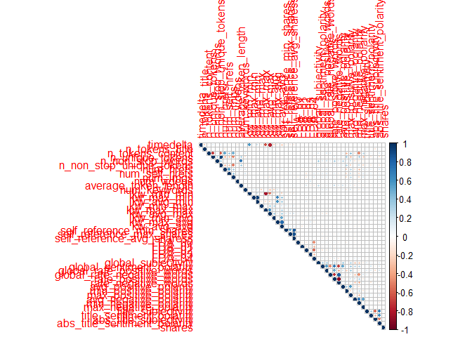
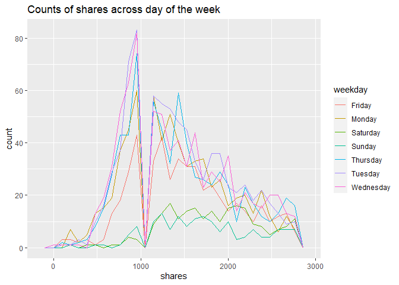
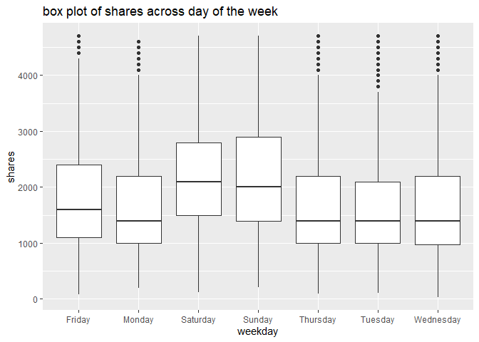
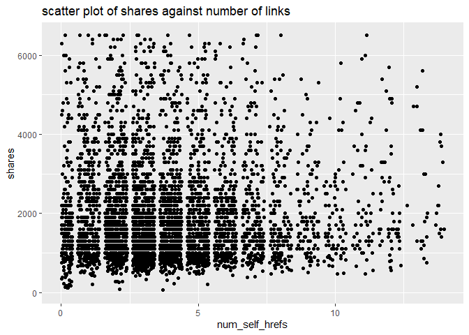
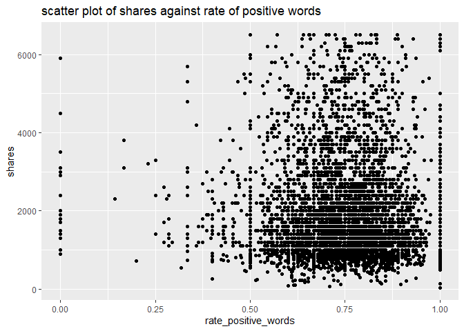

ST 558 Project 2
================
John Hinic & Fang Wu
2022-07-01

-   [Introduction](#introduction)
-   [Prepare Data](#prepare-data)
-   [Exploratory Data Analysis](#exploratory-data-analysis)
-   [Model Building](#model-building)
-   [Model Comparison](#model-comparison)

## Introduction

The consumption of online news is expediting day by day due to the
extensive adoption of smartphones and the rise of social networks.
Online news can capture the eye of a significant amount of Internet users
within a brief period of your time. Prediction of online news popularity
helps news organizations to gain better insights into the audience
interests and to deliver more relevant and appealing content in a
proactive manner. The company can allocate resources more wisely to
prepare stories over their life cycle. Moreover, prediction of news
popularity is also beneficial for trend forecasting, understanding the
collective human behavior, advertisers to propose more profitable
monetization techniques,and readers to filter the huge amount of
information quickly and efficiently.

We are going to analyze and predict the number of shares within
different data channel of interest using an online news data set from
[Machine Learning
Repository](https://archive.ics.uci.edu/ml/datasets/Online+News+Popularity#)
. This data set summarizes a heterogeneous set of features about
articles published by Mashable in a period of two years.

-   We are going to focus on the following predictors:

    1.  url: URL of the article (non-predictive)

    2.  timedelta: Days between the article publication and the dataset
        acquisition (non-predictive)

    3.  n_tokens_title: Number of words in the title

    4.  n_tokens_content Number of words in the content

    5.  n_unique_tokens: Rate of unique words in the content

    6.  n_non_stop_unique_tokens: Rate of unique non-stop words in the
        content

    7.  num_hrefs: Number of links

    8.  num_self_hrefs: Number of links to other articles published by
        Mashable

    9.  num_imgs: Number of images

    10. num_videos: Number of videos

    11. average_token_length: Average length of the words in the content

    12. num_keywords: Number of keywords in the metadata

    13. self_reference_min_shares: Min. shares of referenced articles in
        Mashable

    14. self_reference_max_shares: Max. shares of referenced articles in
        Mashable

    15. self_reference_avg_sharess: Avg. shares of referenced articles
        in Mashable

    16. global_subjectivity: Text subjectivity

    17. global_sentiment_polarity: Text sentiment polarity

    18. global_rate_positive_words: Rate of positive words in the
        content

    19. global_rate_negative_words: Rate of negative words in the
        content

    20. rate_positive_words: Rate of positive words among non-neutral
        tokens

    21. rate_negative_words: Rate of negative words among non-neutral
        tokens

    22. title_subjectivity: Title subjectivity

    23. title_sentiment_polarity: Title polarity

    24. abs_title_subjectivity: Absolute subjectivity level

    25. abs_title_sentiment_polarity: Absolute polarity level

    26. shares: Number of shares (target)

Stop Words usually refer to the most common words in a language, there
is no single universal list of stop words used by all natural language
processing tools. For some search engines, these are some of the most
common, short function words, such as the, is, at, which, and on.

In order to predict the number of share, we are going to build linear
regression and ensemble tree-based model.

## Prepare Data

We’ll use the `readr` and `dplyr` packages from the `tidyverse`. First,
we are going to read in data as tibble using function `read_csv`. Next,
in order to access different data channel of interest automatically, we
are going to create a variable called `type`. Last we `filter` the data
channel of interest using `params$` automatically.

-   Read in raw data and create new variable `type`

``` r
# read in raw data
raw_data <- read_csv("../Data/OnlineNewsPopularity.csv") 

# create type column for different data channel
type_data <- raw_data %>% 
  mutate(
    type=ifelse(data_channel_is_lifestyle==1, "lifestyle", 
            ifelse(data_channel_is_entertainment==1, "entertainment", 
                ifelse(data_channel_is_bus==1, "bus", 
                    ifelse(data_channel_is_socmed==1, "socmed", 
                        ifelse(data_channel_is_tech==1, "tech", 
                            ifelse(data_channel_is_world==1, "world", NA)
                            )
                        )
                    )
                )
            )
  )
```

-   Subset data channel of interest automatically with `params`

``` r
# select data for data channel of interest and create single weekday variable
target_data <- type_data %>% 
  filter(type == params$filter_type) %>%
  mutate(
    weekday=ifelse(
      weekday_is_monday==1, "Monday", 
        ifelse(weekday_is_tuesday==1, "Tuesday", 
          ifelse(weekday_is_wednesday==1, "Wednesday", 
            ifelse(weekday_is_thursday==1, "Thursday", 
              ifelse(weekday_is_friday==1, "Friday", 
                ifelse(weekday_is_saturday==1, "Saturday", 
                  ifelse(weekday_is_sunday==1, "Sunday", NA)
                  )
                )
              )
            )
          )
      )
    )
target_data
```

    ## # A tibble: 7,346 x 63
    ##    url     timedelta n_tokens_title n_tokens_content n_unique_tokens n_non_stop_words n_non_stop_uniq~ num_hrefs num_self_hrefs num_imgs num_videos average_token_l~
    ##    <chr>       <dbl>          <dbl>            <dbl>           <dbl>            <dbl>            <dbl>     <dbl>          <dbl>    <dbl>      <dbl>            <dbl>
    ##  1 http:/~       731             13             1072           0.416             1.00            0.541        19             19       20          0             4.68
    ##  2 http:/~       731             10              370           0.560             1.00            0.698         2              2        0          0             4.36
    ##  3 http:/~       731             12              989           0.434             1.00            0.572        20             20       20          0             4.62
    ##  4 http:/~       731             11               97           0.670             1.00            0.837         2              0        0          0             4.86
    ##  5 http:/~       731              8             1207           0.411             1.00            0.549        24             24       42          0             4.72
    ##  6 http:/~       731             13             1248           0.391             1.00            0.523        21             19       20          0             4.69
    ##  7 http:/~       731             11             1154           0.427             1.00            0.573        20             20       20          0             4.63
    ##  8 http:/~       731              8              266           0.573             1.00            0.721         5              2        1          0             4.26
    ##  9 http:/~       731              8              331           0.563             1.00            0.724         5              3        1          0             4.78
    ## 10 http:/~       731             12             1225           0.385             1.00            0.509        22             22       28          0             4.64
    ## # ... with 7,336 more rows, and 51 more variables: num_keywords <dbl>, data_channel_is_lifestyle <dbl>, data_channel_is_entertainment <dbl>,
    ## #   data_channel_is_bus <dbl>, data_channel_is_socmed <dbl>, data_channel_is_tech <dbl>, data_channel_is_world <dbl>, kw_min_min <dbl>, kw_max_min <dbl>,
    ## #   kw_avg_min <dbl>, kw_min_max <dbl>, kw_max_max <dbl>, kw_avg_max <dbl>, kw_min_avg <dbl>, kw_max_avg <dbl>, kw_avg_avg <dbl>, self_reference_min_shares <dbl>,
    ## #   self_reference_max_shares <dbl>, self_reference_avg_sharess <dbl>, weekday_is_monday <dbl>, weekday_is_tuesday <dbl>, weekday_is_wednesday <dbl>,
    ## #   weekday_is_thursday <dbl>, weekday_is_friday <dbl>, weekday_is_saturday <dbl>, weekday_is_sunday <dbl>, is_weekend <dbl>, LDA_00 <dbl>, LDA_01 <dbl>,
    ## #   LDA_02 <dbl>, LDA_03 <dbl>, LDA_04 <dbl>, global_subjectivity <dbl>, global_sentiment_polarity <dbl>, global_rate_positive_words <dbl>,
    ## #   global_rate_negative_words <dbl>, rate_positive_words <dbl>, rate_negative_words <dbl>, avg_positive_polarity <dbl>, min_positive_polarity <dbl>, ...

-   Split data into training and test sets

``` r
set.seed(100)
train_index <- createDataPartition(target_data$is_weekend, p=0.7, list=FALSE)
train <- target_data[train_index,]
test <- target_data[-train_index, ]
dim(train)
```

    ## [1] 5143   63

## Exploratory Data Analysis

First, we can look at a basic univariate summary and histograms of our
target variable, the number of shares:

``` r
summary(train$shares)
```

    ##    Min. 1st Qu.  Median    Mean 3rd Qu.    Max. 
    ##      36    1100    1700    3095    2900  663600

``` r
train %>% ggplot(aes(shares, ..ndensity..)) +
  geom_histogram() +
  geom_density() +
  geom_vline(xintercept = mean(train$shares), linetype = 2, color = "red") +
  theme_bw() +
  labs(title = "Histogram of Number of Shares", x = "Shares", y = "Normalized Density")
```

<!-- -->

``` r
train %>% filter(shares<quantile(shares, p=0.9)) %>%
  ggplot(aes(shares, ..ndensity..)) +
  geom_histogram() +
  geom_density() +
  geom_vline(xintercept = mean(train$shares), linetype = 2, color = "red") +
  theme_bw() +
  labs(title = "Histogram of Number of Shares", subtitle = "(excluding top 10%)", x = "Shares", y = "Normalized Density")
```

<!-- -->

In the numeric summary, one thing to look for is the mean compared to
the median, as well as where the mean lies relative to the minimum and
maximum values. If the mean is significantly higher than the median
and/or much closer to the minimum than the maximum, that means our data
is right skewed, which we can observe in the histograms. The mean shares
value is included as a reference point on the histograms, and the
subsetted histogram is included to account for any potential right-skew.

-   descriptive statistics on numeric variables:

``` r
summary(
  train %>% 
    select(timedelta, n_tokens_title, n_tokens_content, n_unique_tokens, n_non_stop_unique_tokens, num_hrefs,
           num_self_hrefs, num_imgs, num_videos, average_token_length, num_keywords, self_reference_avg_sharess,
           self_reference_min_shares, self_reference_max_shares, global_rate_negative_words, global_rate_positive_words,
           global_sentiment_polarity, global_subjectivity, rate_negative_words, rate_positive_words, title_subjectivity,
           title_sentiment_polarity, abs_title_sentiment_polarity, abs_title_subjectivity)
)
```

    ##    timedelta     n_tokens_title  n_tokens_content n_unique_tokens  n_non_stop_unique_tokens   num_hrefs       num_self_hrefs       num_imgs        num_videos     
    ##  Min.   :  8.0   Min.   : 4.00   Min.   :   0.0   Min.   :0.0000   Min.   :0.0000           Min.   :  0.000   Min.   :  0.000   Min.   : 0.000   Min.   : 0.0000  
    ##  1st Qu.:210.0   1st Qu.: 9.00   1st Qu.: 254.0   1st Qu.:0.4605   1st Qu.:0.6170           1st Qu.:  5.000   1st Qu.:  2.000   1st Qu.: 1.000   1st Qu.: 0.0000  
    ##  Median :418.0   Median :10.00   Median : 405.0   Median :0.5345   Median :0.6911           Median :  7.000   Median :  3.000   Median : 1.000   Median : 0.0000  
    ##  Mean   :392.9   Mean   :10.16   Mean   : 568.9   Mean   :0.5311   Mean   :0.6829           Mean   :  9.359   Mean   :  4.627   Mean   : 4.336   Mean   : 0.4389  
    ##  3rd Qu.:575.0   3rd Qu.:12.00   3rd Qu.: 725.0   3rd Qu.:0.6028   3rd Qu.:0.7581           3rd Qu.: 11.000   3rd Qu.:  6.000   3rd Qu.: 5.000   3rd Qu.: 1.0000  
    ##  Max.   :731.0   Max.   :20.00   Max.   :5530.0   Max.   :0.9143   Max.   :0.9778           Max.   :119.000   Max.   :116.000   Max.   :65.000   Max.   :73.0000  
    ##  average_token_length  num_keywords    self_reference_avg_sharess self_reference_min_shares self_reference_max_shares global_rate_negative_words
    ##  Min.   :0.000        Min.   : 2.000   Min.   :     0             Min.   :     0.0          Min.   :     0            Min.   :0.00000           
    ##  1st Qu.:4.424        1st Qu.: 6.000   1st Qu.:  1450             1st Qu.:   751.5          1st Qu.:  1700            1st Qu.:0.00868           
    ##  Median :4.593        Median : 8.000   Median :  2750             Median :  1300.0          Median :  4000            Median :0.01366           
    ##  Mean   :4.578        Mean   : 7.751   Mean   :  7419             Mean   :  4504.8          Mean   : 12232            Mean   :0.01442           
    ##  3rd Qu.:4.757        3rd Qu.: 9.000   3rd Qu.:  5234             3rd Qu.:  2700.0          3rd Qu.:  8400            3rd Qu.:0.01898           
    ##  Max.   :5.857        Max.   :10.000   Max.   :663600             Max.   :663600.0          Max.   :663600            Max.   :0.07692           
    ##  global_rate_positive_words global_sentiment_polarity global_subjectivity rate_negative_words rate_positive_words title_subjectivity title_sentiment_polarity
    ##  Min.   :0.00000            Min.   :-0.22000          Min.   :0.0000      Min.   :0.0000      Min.   :0.0000      Min.   :0.0000     Min.   :-1.00000        
    ##  1st Qu.:0.03306            1st Qu.: 0.09667          1st Qu.:0.4142      1st Qu.:0.1667      1st Qu.:0.6667      1st Qu.:0.0000     1st Qu.: 0.00000        
    ##  Median :0.04178            Median : 0.14321          Median :0.4600      Median :0.2473      Median :0.7500      Median :0.0000     Median : 0.00000        
    ##  Mean   :0.04280            Mean   : 0.14580          Mean   :0.4569      Mean   :0.2508      Mean   :0.7455      Mean   :0.2477     Mean   : 0.08477        
    ##  3rd Qu.:0.05168            3rd Qu.: 0.19107          3rd Qu.:0.5044      3rd Qu.:0.3333      3rd Qu.:0.8333      3rd Qu.:0.4545     3rd Qu.: 0.13636        
    ##  Max.   :0.15217            Max.   : 0.65000          Max.   :0.8127      Max.   :1.0000      Max.   :1.0000      Max.   :1.0000     Max.   : 1.00000        
    ##  abs_title_sentiment_polarity abs_title_subjectivity
    ##  Min.   :0.0000               Min.   :0.0000        
    ##  1st Qu.:0.0000               1st Qu.:0.1667        
    ##  Median :0.0000               Median :0.5000        
    ##  Mean   :0.1339               Mean   :0.3475        
    ##  3rd Qu.:0.2000               3rd Qu.:0.5000        
    ##  Max.   :1.0000               Max.   :0.5000

We can find the minimum, 25% percentile, mean, median, 75% percentile
and maximum values of each numeric variables from this chart.

``` r
sapply(
  train %>% 
    select(timedelta, n_tokens_title, n_tokens_content, n_unique_tokens, n_non_stop_unique_tokens, num_hrefs, num_self_hrefs,
           num_imgs, num_videos, average_token_length, num_keywords, self_reference_avg_sharess, self_reference_min_shares,
           self_reference_max_shares, global_rate_negative_words, global_rate_positive_words, global_sentiment_polarity,
           global_subjectivity, rate_negative_words, rate_positive_words, title_subjectivity, title_sentiment_polarity,
           abs_title_sentiment_polarity, abs_title_subjectivity), 
  sd
)
```

    ##                    timedelta               n_tokens_title             n_tokens_content              n_unique_tokens     n_non_stop_unique_tokens 
    ##                 2.079062e+02                 2.102971e+00                 4.914171e+02                 1.079739e-01                 1.125437e-01 
    ##                    num_hrefs               num_self_hrefs                     num_imgs                   num_videos         average_token_length 
    ##                 8.564212e+00                 5.218080e+00                 7.005875e+00                 1.490180e+00                 3.752521e-01 
    ##                 num_keywords   self_reference_avg_sharess    self_reference_min_shares    self_reference_max_shares   global_rate_negative_words 
    ##                 1.720443e+00                 3.337744e+04                 2.785624e+04                 5.357786e+04                 8.377804e-03 
    ##   global_rate_positive_words    global_sentiment_polarity          global_subjectivity          rate_negative_words          rate_positive_words 
    ##                 1.478462e-02                 7.741389e-02                 7.689353e-02                 1.291349e-01                 1.360297e-01 
    ##           title_subjectivity     title_sentiment_polarity abs_title_sentiment_polarity       abs_title_subjectivity 
    ##                 3.051022e-01                 2.333869e-01                 2.090782e-01                 1.897079e-01

From here we can compare standard deviation between numeric variables.

-   Correlation between numeric variables

``` r
#str(train)
Correlation <- cor(train %>% select(-url, -type, -starts_with("weekday"), -starts_with("data_channel"), -is_weekend ))
corrplot(Correlation, type="upper", tl.pos="lt", cl.cex=0.8)
```

<!-- -->

This plot help us to check linear relationship between numeric
variables. We want to avoid include predictors with high correlation in
the same model.

-   summary across different day of the week

We are going to visualize share performance on different day of the
week.

``` r
# shares on different day
train %>% group_by(weekday) %>% 
  summarize(
    n=n(), 
    min=min(shares), 
    max=max(shares), 
    avg=mean(shares), 
    median=median(shares)
  )
```

    ## # A tibble: 7 x 6
    ##   weekday       n   min    max   avg median
    ##   <chr>     <int> <dbl>  <dbl> <dbl>  <dbl>
    ## 1 Friday      674    82 104100 3080.   1750
    ## 2 Monday      894   192  51000 2843.   1600
    ## 3 Saturday    352   119  96100 3775.   2300
    ## 4 Sunday      274   206  83300 4065.   2500
    ## 5 Thursday    906    92  55200 2700.   1600
    ## 6 Tuesday    1039   104  67800 2731.   1600
    ## 7 Wednesday  1004    36 663600 3561.   1600

We can inspect the effect of `weekday` on the `share`. The number of
records on each day as well as the minimum, maximum, mean and median
values of shares on each day of the week are included in the table here.
If there are big difference across `weekday`, then `weekday` and `share`
are dependent.

We also can check the difference in plot.

``` r
g <- ggplot(train %>% filter(shares<quantile(shares, p=0.75)), aes(x=shares))
g + geom_freqpoly(aes(color=weekday)) +
  ggtitle("Counts of shares across day of the week")
```

<!-- -->

``` r
ggplot(train, aes(x=weekday, y=shares)) +
  geom_boxplot() +
  scale_y_continuous(limits=c(min(train$shares), quantile(train$shares, p=0.75)+IQR(train$shares))) +
  ggtitle("box plot of shares across day of the week")
```

<!-- -->

In this plot, we can compare the median, 25% percentile, 75% percentile
and IQR of shares between different day of the week. It will show the
effect of day on the shares.

We can also examine this relationship by binning the number of shares
into groups and constructing a contingency table.

``` r
train %>%
  mutate(Shares = cut(shares, c(seq(0, 10000, by = 1000), max(shares)), dig.lab = 6)) %>%
  group_by(weekday, Shares) %>%
  summarise(n = n()) %>%
  pivot_wider(names_from = weekday, values_from = n, values_fill = 0) %>%
  arrange(Shares)
```

    ## # A tibble: 11 x 8
    ##    Shares         Friday Monday Saturday Sunday Thursday Tuesday Wednesday
    ##    <fct>           <int>  <int>    <int>  <int>    <int>   <int>     <int>
    ##  1 (0,1000]          118    203       13     17      219     252       264
    ##  2 (1000,2000]       276    353      129     99      362     413       368
    ##  3 (2000,3000]       118    129       89     51      141     152       150
    ##  4 (3000,4000]        62     64       41     39       53      63        67
    ##  5 (4000,5000]        31     36       25     17       41      38        36
    ##  6 (5000,6000]        16     34       10     11       23      30        17
    ##  7 (6000,7000]        10     16       10      9       14      15        19
    ##  8 (7000,8000]         7     15        6      6        8      13        23
    ##  9 (8000,9000]         3      5        6      2       10       8         8
    ## 10 (9000,10000]        3      8        3      3        8       7         9
    ## 11 (10000,663600]     30     31       20     20       27      48        43

With this contingency table, we can get an idea of how many shares
articles tend to get across the different days. We can also observe
which days have the most “viral” articles that get an extremely high
number of shares.

-   Scatter plot

We want to check the relationship between response variable `share` and
other predictors through scatter plot. Linear or non-linear? Positive or
negative?

``` r
g <- ggplot(train, aes(x=num_self_hrefs, y=shares) )
g + geom_jitter() +
    scale_y_continuous(
      limits=c(min(train$shares), quantile(train$shares, p=0.75)+2*IQR(train$shares))
    ) +
    scale_x_continuous(
      limits=c(min(train$num_self_hrefs), quantile(train$num_self_hrefs, p=0.75)+2*IQR(train$num_self_hrefs))
    ) +
    ggtitle("scatter plot of shares against number of links") 
```

<!-- -->

``` r
g <- ggplot(train, aes(x=rate_positive_words, y=shares) )
g + geom_point() +
  scale_y_continuous(
    limits=c(min(train$shares), quantile(train$shares, p=0.75)+2*IQR(train$shares))
  ) +
  ggtitle("scatter plot of shares against rate of positive words")
```

<!-- -->

We will also examine the relationship of number of shares with the
absolute polarity of the title - perhaps articles with titles that have
a more polarizing sentiment are more likely to get shares.

``` r
train %>% filter(shares<quantile(shares, p=0.9)) %>%
  ggplot(aes(abs_title_sentiment_polarity, shares)) +
  geom_jitter() +
  labs(title = "Number of Shares by Abs. Title Sentiment Polarity", subtitle = "(excluding top 10% of shares)", x = "Absolute Title Polarity", y = "Shares") +
  theme_bw()
```

<!-- -->

Another thing we can examine is the relationship between the number of
shares and the number of shares in referenced articles (min, max, and
average).

``` r
train %>% 
  select(shares, self_reference_min_shares, self_reference_avg_sharess, self_reference_max_shares) %>% 
  filter(shares<quantile(shares, p=0.9)) %>%
  ggpairs(columnLabels = c("Shares", "Min. Ref. Shares", "Avg. Ref. Shares", "Max. Ref. Shares")) + 
  labs(title = "(excluding top 10% of shares)") +
  theme_bw()
```

<!-- -->

For this grid of plots, we will want to focus on the column/row for
shares. We can visually see the relationship between number of shares
for an article vs. the number of shares in its referenced articles by
examining the scatter plots, or look at the actual numeric correlations.
We just want a general idea of whether the relationships are positive or
negative, as well as linear or non-linear.

## Model Building

We will be fitting 4 total models for comparison:

-   2 linear regression models
-   1 random forest model
-   1 boosted tree model

For the 2 linear regression models, we will use basic 10-fold cross
validation to evaluate the fit on the training data, while using 5-fold
3-times repeated cross-validation for the tree-based models. To ease the
computation time, we will also utilize parallel processing, which will
require a bit of set-up.

``` r
# control setup
controlLR <- trainControl(method = "cv", number = 10, allowParallel = TRUE)
controlTree <- trainControl(method = "repeatedcv", number = 5, repeats = 3, allowParallel = TRUE)

# parallel setup
cl <- makeCluster(detectCores() - 2)
registerDoParallel(cl)
```

### Linear Regression Models

As mentioned, the first 2 kinds of models we will fit to the data will
be linear regression models. Linear regression is, for the most part,
the most basic form of predictive modeling available. The simplest form,
a single predictor and single response, is essentially just constructing
a line that “agrees” with the data as closely as possible. In this case,
it is similar to the basic slope form of a line, *y* = *m**x* + *b*. We
have a response variable *y*, a predictor variable *x*, a slope *m*, and
a y-intercept *b*. However, since we are modelling real-world data,
there is an additional random error term in our formula:

*Y*<sub>*i*</sub> = *β*<sub>0</sub> + *β*<sub>1</sub>*x*<sub>*i*</sub> + *E*<sub>*i*</sub>
Where *E*<sub>*i*</sub> is our random error term (and assumed to follow
a normal distribution in most cases). To actually calculate the
*β*<sub>0</sub> and *β*<sub>1</sub>, we find the values that minimize
the sum of squared errors:

$$\\sum\_{i = 1}^{n} (y_i - \\beta_0 - \\beta_1 x_i)^2$$

This can also be extended in many ways, such as adding in more predictor
variables or higher-order terms, but the model is still fit by
minimizing the sum of squared errors as with simple linear regression.

#### Fang

``` r
mlFit <- train(shares~timedelta+weekday+num_self_hrefs+num_imgs+num_videos, data=train, method="lm", preProcess=c("center", "scale"), trControl=controlLR)
mlFit
```

    ## Linear Regression 
    ## 
    ## 5143 samples
    ##    5 predictor
    ## 
    ## Pre-processing: centered (10), scaled (10) 
    ## Resampling: Cross-Validated (10 fold) 
    ## Summary of sample sizes: 4629, 4630, 4628, 4629, 4627, 4628, ... 
    ## Resampling results:
    ## 
    ##   RMSE      Rsquared     MAE     
    ##   7294.318  0.006847235  2409.541
    ## 
    ## Tuning parameter 'intercept' was held constant at a value of TRUE

#### John

This model will use stepwise regression to select the optimal model
based on the AIC metric, considering all possible predictive variables
(aside from the Sunday indicator, weekend indicator, and the rate of
negative words, which all caused )

``` r
mlrFit2 <- train(
  shares ~ .,
  data = train %>% select(-url, -timedelta, -starts_with("data_channel"), -weekday, -weekday_is_sunday, -type, -is_weekend),
  method = "lmStepAIC",
  preProcess = c("center", "scale"),
  trControl = controlLR,
  trace = FALSE,
  scope = list(upper = ~., lower = ~1)
)
mlrFit2
```

    ## Linear Regression with Stepwise Selection 
    ## 
    ## 5143 samples
    ##   50 predictor
    ## 
    ## Pre-processing: centered (50), scaled (50) 
    ## Resampling: Cross-Validated (10 fold) 
    ## Summary of sample sizes: 4628, 4628, 4628, 4629, 4629, 4628, ... 
    ## Resampling results:
    ## 
    ##   RMSE      Rsquared    MAE     
    ##   7282.081  0.01994798  2507.218

``` r
summary(mlrFit2$finalModel)
```

    ## 
    ## Call:
    ## lm(formula = .outcome ~ n_tokens_content + num_hrefs + num_self_hrefs + 
    ##     num_videos + kw_avg_max + kw_max_avg + kw_avg_avg + LDA_00 + 
    ##     global_rate_positive_words + rate_positive_words + avg_negative_polarity + 
    ##     min_negative_polarity + max_negative_polarity + abs_title_subjectivity + 
    ##     weekday_is_wednesday, data = dat)
    ## 
    ## Residuals:
    ##    Min     1Q Median     3Q    Max 
    ## -18756  -1974   -931    367 650473 
    ## 
    ## Coefficients:
    ##                            Estimate Std. Error t value Pr(>|t|)    
    ## (Intercept)                  3095.3      143.7  21.533  < 2e-16 ***
    ## n_tokens_content             1057.1      202.0   5.233 1.74e-07 ***
    ## num_hrefs                     695.4      193.8   3.588 0.000337 ***
    ## num_self_hrefs               -733.9      175.3  -4.186 2.89e-05 ***
    ## num_videos                    265.9      145.1   1.833 0.066931 .  
    ## kw_avg_max                   -419.3      166.3  -2.521 0.011730 *  
    ## kw_max_avg                   -651.3      240.4  -2.709 0.006764 ** 
    ## kw_avg_avg                    951.6      259.8   3.662 0.000253 ***
    ## LDA_00                        360.6      144.5   2.495 0.012637 *  
    ## global_rate_positive_words   -297.4      175.6  -1.694 0.090421 .  
    ## rate_positive_words          -283.2      185.7  -1.525 0.127272    
    ## avg_negative_polarity       -1360.8      356.3  -3.819 0.000135 ***
    ## min_negative_polarity        1447.0      328.3   4.408 1.06e-05 ***
    ## max_negative_polarity         664.4      240.6   2.762 0.005774 ** 
    ## abs_title_subjectivity       -240.5      145.9  -1.648 0.099427 .  
    ## weekday_is_wednesday          246.5      144.1   1.710 0.087292 .  
    ## ---
    ## Signif. codes:  0 '***' 0.001 '**' 0.01 '*' 0.05 '.' 0.1 ' ' 1
    ## 
    ## Residual standard error: 10310 on 5127 degrees of freedom
    ## Multiple R-squared:  0.02193,    Adjusted R-squared:  0.01907 
    ## F-statistic: 7.664 on 15 and 5127 DF,  p-value: < 2.2e-16

### Tree-based Models

#### Random Forest

Random forest models are based on the more simple regression trees - an
example of this is shown here:


Regression trees have many benefits, and are very easily interpretable
by looking at the visual. However, they are highly variable based on the
specific data used to build them. Random forest models are one way to
combat this.

Random forest models use bootstrap sampling to fit many regression
trees, each one using a random subset of predictors (*m*). This makes it
so that predictions are not dominated by a small number of predictors,
leading to more consistent results.

The standard practice is to use *m* = *p*/3, where *p* represents the
total number of predictors. For this case, that means we would use
*m* = 53/3 ≈ 18 after removing all non-predictive variables from the
dataset. Thus, we will consider *m* values ranging anywhere from 1 to
24, selecting the optimal model based on the model performance in
repeated cross-validation.

``` r
# saving data as a matrix and vector to take up less memory across workers
x <- as.matrix(train %>% select(-url, -timedelta, -starts_with("data_channel"), -shares, -type, -weekday))
y <- train$shares

# fitting model
# to ease the computation time to create output, mtry values of 1-10 were the only ones tested in the final program
# tuning values of 1 through 24 were still tested before creating final product.
set.seed(91894)
rf <- train(
  x, y,
  method = "rf",
  preProcess = c("center", "scale"),
  trControl = controlTree,
  tuneGrid = data.frame(mtry = 1:10),
  ntree = 500
)

# showing results / variable importance
rf$results
```

    ##    mtry     RMSE   Rsquared      MAE   RMSESD RsquaredSD    MAESD
    ## 1     1 7939.822 0.02946313 2360.201 6889.649 0.01495123 290.6418
    ## 2     2 7967.824 0.03092512 2404.116 6858.142 0.01745306 276.1277
    ## 3     3 8019.963 0.02870343 2432.383 6821.393 0.01671960 276.6666
    ## 4     4 8098.376 0.02823164 2457.300 6772.678 0.01868456 271.3080
    ## 5     5 8150.181 0.02727784 2466.874 6740.706 0.01791825 266.8598
    ## 6     6 8210.613 0.02700294 2483.769 6710.671 0.01780807 268.7765
    ## 7     7 8273.951 0.02445507 2498.478 6671.147 0.01749110 259.7692
    ## 8     8 8326.520 0.02448333 2501.818 6642.082 0.01664705 257.3288
    ## 9     9 8404.900 0.02245121 2514.506 6612.027 0.01772294 261.3168
    ## 10   10 8496.576 0.02070984 2527.803 6561.994 0.01414218 256.3161

``` r
rf$bestTune
```

    ##   mtry
    ## 1    1

``` r
varImp(rf)
```

    ## rf variable importance
    ## 
    ##   only 20 most important variables shown (out of 52)
    ## 
    ##                              Overall
    ## n_tokens_content              100.00
    ## self_reference_max_shares      62.21
    ## n_non_stop_unique_tokens       58.25
    ## LDA_00                         45.34
    ## rate_negative_words            44.52
    ## global_subjectivity            41.19
    ## global_rate_positive_words     35.56
    ## num_hrefs                      35.00
    ## global_sentiment_polarity      34.56
    ## n_unique_tokens                32.71
    ## n_non_stop_words               32.42
    ## self_reference_avg_sharess     31.60
    ## kw_avg_max                     30.32
    ## LDA_01                         28.72
    ## abs_title_sentiment_polarity   27.18
    ## LDA_02                         25.51
    ## weekday_is_wednesday           25.48
    ## kw_max_min                     25.10
    ## kw_min_max                     23.62
    ## abs_title_subjectivity         23.50

``` r
plot(varImp(rf), top = 20, title = "Random Forest Variable Importance")
```

<!-- -->

#### Boosted Trees

Boosted trees model trains a bunch of trees sequentially. Each
subsequent tree learns from the mistakes of the previous tree. So
predictions get updated as trees grown. It is used for both regression
and classification.

``` r
n.trees=c(50, 100, 150)
interaction.depth=c(2,3,4)
shrinkage=c(0.1, 0.5)
n.minobsinnode=c(10)
tune_parameter <- expand.grid(
  n.trees=n.trees, 
  interaction.depth=interaction.depth, 
  shrinkage=shrinkage, 
  n.minobsinnode=n.minobsinnode
)

boostedFit <- train(
  shares~timedelta+weekday+num_self_hrefs+num_imgs+num_videos+rate_positive_words, 
  data=train, 
  method="gbm", 
  trControl=controlTree, 
  tuneGrid=tune_parameter
)
```

    ## Iter   TrainDeviance   ValidDeviance   StepSize   Improve
    ##      1 108010401.2529             nan     0.1000 7072.4064
    ##      2 107823560.1707             nan     0.1000 63701.5865
    ##      3 107629553.0476             nan     0.1000 -21552.8115
    ##      4 107484183.3727             nan     0.1000 44615.1996
    ##      5 107323355.5155             nan     0.1000 -87059.8408
    ##      6 107288106.4860             nan     0.1000 -15367.8590
    ##      7 107262759.8051             nan     0.1000 -5113.9994
    ##      8 107251105.9254             nan     0.1000 -52376.5073
    ##      9 107226254.8420             nan     0.1000 -15940.8341
    ##     10 106077618.9085             nan     0.1000 -205687.2127
    ##     20 104113731.4260             nan     0.1000 -695193.3322
    ##     40 100439698.6762             nan     0.1000 -219044.0219
    ##     50 98355495.6553             nan     0.1000 -29112.9348

``` r
boostedFit
```

    ## Stochastic Gradient Boosting 
    ## 
    ## 5143 samples
    ##    6 predictor
    ## 
    ## No pre-processing
    ## Resampling: Cross-Validated (5 fold, repeated 3 times) 
    ## Summary of sample sizes: 4114, 4114, 4114, 4116, 4114, 4115, ... 
    ## Resampling results across tuning parameters:
    ## 
    ##   shrinkage  interaction.depth  n.trees  RMSE       Rsquared     MAE     
    ##   0.1        2                   50       8489.586  0.002395223  2502.467
    ##   0.1        2                  100       8708.802  0.002884485  2551.755
    ##   0.1        2                  150       8848.336  0.002620245  2560.037
    ##   0.1        3                   50       8547.824  0.002101696  2525.607
    ##   0.1        3                  100       8685.236  0.002432856  2571.781
    ##   0.1        3                  150       8908.202  0.002842200  2636.019
    ##   0.1        4                   50       8515.007  0.002097302  2518.939
    ##   0.1        4                  100       8630.782  0.002532335  2572.098
    ##   0.1        4                  150       8843.024  0.003028458  2614.982
    ##   0.5        2                   50       9007.414  0.001588975  2640.981
    ##   0.5        2                  100       9505.389  0.002173123  2709.554
    ##   0.5        2                  150       9817.861  0.003321342  2730.561
    ##   0.5        3                   50       9598.366  0.002275027  2849.970
    ##   0.5        3                  100      10280.711  0.001632692  2992.581
    ##   0.5        3                  150      10515.170  0.002887845  3057.760
    ##   0.5        4                   50       9470.559  0.003006095  2868.129
    ##   0.5        4                  100       9885.729  0.002901004  3003.376
    ##   0.5        4                  150      10206.042  0.002398214  3127.935
    ## 
    ## Tuning parameter 'n.minobsinnode' was held constant at a value of 10
    ## RMSE was used to select the optimal model using the smallest value.
    ## The final values used for the model were n.trees = 50, interaction.depth = 2, shrinkage = 0.1 and n.minobsinnode = 10.

``` r
# ending parallel cluster
stopCluster(cl)
```

## Model Comparison

Finally, we will test all 4 models on the test set to select a final
model. We will write a basic helper function that pulls the fit
statistics for each model on the test set, then combine them into a
single table for comparison. We will select the model with the lowest
RMSE as our final model.

``` r
evalFit <- function(fit, modelName) {
  pred <- predict(fit, test)
  stats <- postResample(pred, obs = test$shares)
  statsDF <- data.frame(Model = modelName, RMSE = stats[1], Rsq = stats[2], MAE = stats[3])
  rownames(statsDF) <- NULL
  return(statsDF)
}
eval1 <- evalFit(mlFit, "First Linear Regression")
eval2 <- evalFit(mlrFit2, "Second Linear Regression")
eval3 <- evalFit(rf, "Random Forest")
eval4 <- evalFit(boostedFit, "Boosted Tree")
fits <- rbind(eval1, eval2, eval3, eval4)
best <- fits %>%
  filter(RMSE == min(RMSE))
fits
```

    ##                      Model     RMSE         Rsq      MAE
    ## 1  First Linear Regression 4333.545 0.001995898 2277.375
    ## 2 Second Linear Regression 4364.945 0.020991445 2339.666
    ## 3            Random Forest 4243.651 0.035424841 2231.052
    ## 4             Boosted Tree 4705.257 0.002522649 2374.151

Thus, our final model will be the Random Forest model, which has an RMSE
of 4243.6514312.
