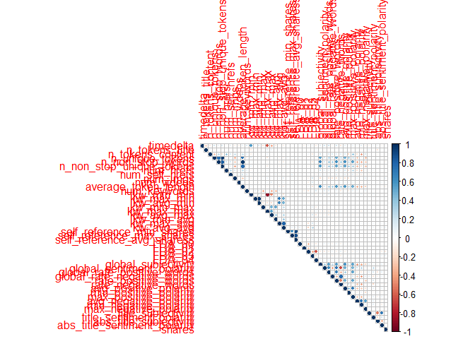
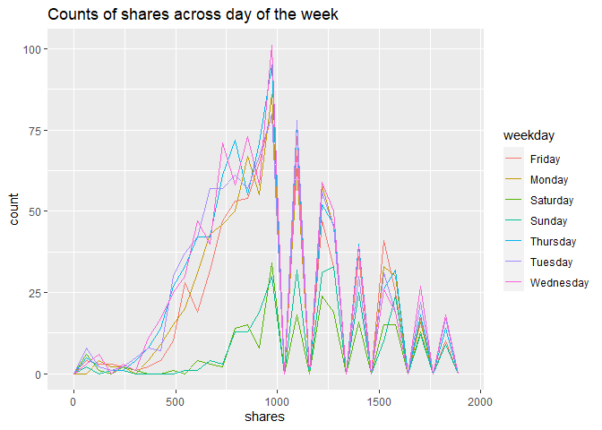
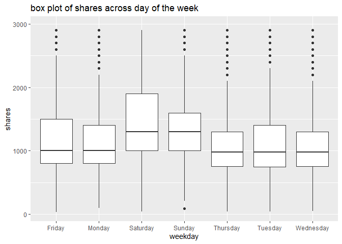
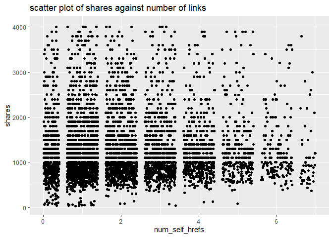
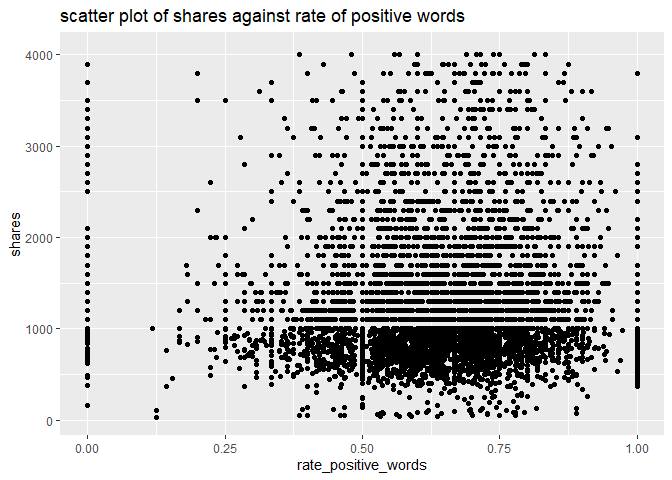

ST 558 Project 2
================
John Hinic & Fang Wu
2022-07-01

-   [Introduction](#introduction)
-   [Prepare Data](#prepare-data)
-   [Exploratory Data Analysis](#exploratory-data-analysis)
-   [Model Building](#model-building)
-   [Model Comparison](#model-comparison)

## Introduction

The consumption of online news is expediting day by day due to the
extensive adoption of smartphones and the rise of social networks.
Online news can capture the eye of a significant amount of Internet users
within a brief period of your time. Prediction of online news popularity
helps news organizations to gain better insights into the audience
interests and to deliver more relevant and appealing content in a
proactive manner. The company can allocate resources more wisely to
prepare stories over their life cycle. Moreover, prediction of news
popularity is also beneficial for trend forecasting, understanding the
collective human behavior, advertisers to propose more profitable
monetization techniques,and readers to filter the huge amount of
information quickly and efficiently.

We are going to analyze and predict the number of shares within
different data channel of interest using an online news data set from
[Machine Learning
Repository](https://archive.ics.uci.edu/ml/datasets/Online+News+Popularity#)
. This data set summarizes a heterogeneous set of features about
articles published by Mashable in a period of two years.

-   We are going to focus on the following predictors:

    1.  url: URL of the article (non-predictive)

    2.  timedelta: Days between the article publication and the dataset
        acquisition (non-predictive)

    3.  n_tokens_title: Number of words in the title

    4.  n_tokens_content Number of words in the content

    5.  n_unique_tokens: Rate of unique words in the content

    6.  n_non_stop_unique_tokens: Rate of unique non-stop words in the
        content

    7.  num_hrefs: Number of links

    8.  num_self_hrefs: Number of links to other articles published by
        Mashable

    9.  num_imgs: Number of images

    10. num_videos: Number of videos

    11. average_token_length: Average length of the words in the content

    12. num_keywords: Number of keywords in the metadata

    13. self_reference_min_shares: Min. shares of referenced articles in
        Mashable

    14. self_reference_max_shares: Max. shares of referenced articles in
        Mashable

    15. self_reference_avg_sharess: Avg. shares of referenced articles
        in Mashable

    16. global_subjectivity: Text subjectivity

    17. global_sentiment_polarity: Text sentiment polarity

    18. global_rate_positive_words: Rate of positive words in the
        content

    19. global_rate_negative_words: Rate of negative words in the
        content

    20. rate_positive_words: Rate of positive words among non-neutral
        tokens

    21. rate_negative_words: Rate of negative words among non-neutral
        tokens

    22. title_subjectivity: Title subjectivity

    23. title_sentiment_polarity: Title polarity

    24. abs_title_subjectivity: Absolute subjectivity level

    25. abs_title_sentiment_polarity: Absolute polarity level

    26. shares: Number of shares (target)

Stop Words usually refer to the most common words in a language, there
is no single universal list of stop words used by all natural language
processing tools. For some search engines, these are some of the most
common, short function words, such as the, is, at, which, and on.

In order to predict the number of share, we are going to build linear
regression and ensemble tree-based model.

## Prepare Data

We’ll use the `readr` and `dplyr` packages from the `tidyverse`. First,
we are going to read in data as tibble using function `read_csv`. Next,
in order to access different data channel of interest automatically, we
are going to create a variable called `type`. Last we `filter` the data
channel of interest using `params$` automatically.

-   Read in raw data and create new variable `type`

``` r
# read in raw data
raw_data <- read_csv("../Data/OnlineNewsPopularity.csv") 

# create type column for different data channel
type_data <- raw_data %>% 
  mutate(
    type=ifelse(data_channel_is_lifestyle==1, "lifestyle", 
            ifelse(data_channel_is_entertainment==1, "entertainment", 
                ifelse(data_channel_is_bus==1, "bus", 
                    ifelse(data_channel_is_socmed==1, "socmed", 
                        ifelse(data_channel_is_tech==1, "tech", 
                            ifelse(data_channel_is_world==1, "world", NA)
                            )
                        )
                    )
                )
            )
  )
```

-   Subset data channel of interest automatically with `params`

``` r
# select data for data channel of interest and create single weekday variable
target_data <- type_data %>% 
  filter(type == params$filter_type) %>%
  mutate(
    weekday=ifelse(
      weekday_is_monday==1, "Monday", 
        ifelse(weekday_is_tuesday==1, "Tuesday", 
          ifelse(weekday_is_wednesday==1, "Wednesday", 
            ifelse(weekday_is_thursday==1, "Thursday", 
              ifelse(weekday_is_friday==1, "Friday", 
                ifelse(weekday_is_saturday==1, "Saturday", 
                  ifelse(weekday_is_sunday==1, "Sunday", NA)
                  )
                )
              )
            )
          )
      )
    )
target_data
```

    ## # A tibble: 8,427 x 63
    ##    url     timedelta n_tokens_title n_tokens_content n_unique_tokens n_non_stop_words n_non_stop_uniq~ num_hrefs num_self_hrefs num_imgs num_videos average_token_l~
    ##    <chr>       <dbl>          <dbl>            <dbl>           <dbl>            <dbl>            <dbl>     <dbl>          <dbl>    <dbl>      <dbl>            <dbl>
    ##  1 http:/~       731             10              231           0.636             1.00            0.797         4              1        1          1             5.09
    ##  2 http:/~       731              9             1248           0.490             1.00            0.732        11              0        1          0             4.62
    ##  3 http:/~       731             12              682           0.460             1.00            0.635        10              0        1          0             4.62
    ##  4 http:/~       731              9              391           0.510             1.00            0.650         9              2        1          1             5.30
    ##  5 http:/~       731             11              125           0.675             1.00            0.797         1              1        1          0             4.82
    ##  6 http:/~       731             11              799           0.504             1.00            0.738         8              6        1          0             4.70
    ##  7 http:/~       731             11              317           0.611             1.00            0.729         7              6        1          0             5.24
    ##  8 http:/~       731             11              399           0.598             1.00            0.806         8              0        1          0             4.58
    ##  9 http:/~       731              9              443           0.467             1.00            0.589         3              1        1          0             5.01
    ## 10 http:/~       730             12              288           0.589             1.00            0.726         5              2        0          0             4.38
    ## # ... with 8,417 more rows, and 51 more variables: num_keywords <dbl>, data_channel_is_lifestyle <dbl>, data_channel_is_entertainment <dbl>,
    ## #   data_channel_is_bus <dbl>, data_channel_is_socmed <dbl>, data_channel_is_tech <dbl>, data_channel_is_world <dbl>, kw_min_min <dbl>, kw_max_min <dbl>,
    ## #   kw_avg_min <dbl>, kw_min_max <dbl>, kw_max_max <dbl>, kw_avg_max <dbl>, kw_min_avg <dbl>, kw_max_avg <dbl>, kw_avg_avg <dbl>, self_reference_min_shares <dbl>,
    ## #   self_reference_max_shares <dbl>, self_reference_avg_sharess <dbl>, weekday_is_monday <dbl>, weekday_is_tuesday <dbl>, weekday_is_wednesday <dbl>,
    ## #   weekday_is_thursday <dbl>, weekday_is_friday <dbl>, weekday_is_saturday <dbl>, weekday_is_sunday <dbl>, is_weekend <dbl>, LDA_00 <dbl>, LDA_01 <dbl>,
    ## #   LDA_02 <dbl>, LDA_03 <dbl>, LDA_04 <dbl>, global_subjectivity <dbl>, global_sentiment_polarity <dbl>, global_rate_positive_words <dbl>,
    ## #   global_rate_negative_words <dbl>, rate_positive_words <dbl>, rate_negative_words <dbl>, avg_positive_polarity <dbl>, min_positive_polarity <dbl>, ...

-   Split data into training and test sets

``` r
set.seed(100)
train_index <- createDataPartition(target_data$is_weekend, p=0.7, list=FALSE)
train <- target_data[train_index,]
test <- target_data[-train_index, ]
dim(train)
```

    ## [1] 5899   63

## Exploratory Data Analysis

First, we can look at a basic univariate summary and histograms of our
target variable, the number of shares:

``` r
summary(train$shares)
```

    ##    Min. 1st Qu.  Median    Mean 3rd Qu.    Max. 
    ##      35     828    1100    2308    1900  284700

``` r
train %>% ggplot(aes(shares, ..ndensity..)) +
  geom_histogram() +
  geom_density() +
  geom_vline(xintercept = mean(train$shares), linetype = 2, color = "red") +
  theme_bw() +
  labs(title = "Histogram of Number of Shares", x = "Shares", y = "Normalized Density")
```

<!-- -->

``` r
train %>% filter(shares<quantile(shares, p=0.9)) %>%
  ggplot(aes(shares, ..ndensity..)) +
  geom_histogram() +
  geom_density() +
  geom_vline(xintercept = mean(train$shares), linetype = 2, color = "red") +
  theme_bw() +
  labs(title = "Histogram of Number of Shares", subtitle = "(excluding top 10%)", x = "Shares", y = "Normalized Density")
```

<!-- -->

In the numeric summary, one thing to look for is the mean compared to
the median, as well as where the mean lies relative to the minimum and
maximum values. If the mean is significantly higher than the median
and/or much closer to the minimum than the maximum, that means our data
is right skewed, which we can observe in the histograms. The mean shares
value is included as a reference point on the histograms, and the
subsetted histogram is included to account for any potential right-skew.

-   descriptive statistics on numeric variables:

``` r
summary(
  train %>% 
    select(timedelta, n_tokens_title, n_tokens_content, n_unique_tokens, n_non_stop_unique_tokens, num_hrefs,
           num_self_hrefs, num_imgs, num_videos, average_token_length, num_keywords, self_reference_avg_sharess,
           self_reference_min_shares, self_reference_max_shares, global_rate_negative_words, global_rate_positive_words,
           global_sentiment_polarity, global_subjectivity, rate_negative_words, rate_positive_words, title_subjectivity,
           title_sentiment_polarity, abs_title_sentiment_polarity, abs_title_subjectivity)
)
```

    ##    timedelta     n_tokens_title  n_tokens_content n_unique_tokens  n_non_stop_unique_tokens   num_hrefs      num_self_hrefs      num_imgs         num_videos     
    ##  Min.   :  8.0   Min.   : 4.00   Min.   :   0.0   Min.   :0.0000   Min.   :0.0000           Min.   :  0.00   Min.   : 0.000   Min.   :  0.000   Min.   : 0.0000  
    ##  1st Qu.:107.0   1st Qu.: 9.00   1st Qu.: 332.0   1st Qu.:0.4656   1st Qu.:0.6286           1st Qu.:  5.00   1st Qu.: 1.000   1st Qu.:  1.000   1st Qu.: 0.0000  
    ##  Median :240.0   Median :11.00   Median : 506.0   Median :0.5203   Median :0.6841           Median :  8.00   Median : 2.000   Median :  1.000   Median : 0.0000  
    ##  Mean   :284.4   Mean   :10.59   Mean   : 594.8   Mean   :0.5098   Mean   :0.6642           Mean   : 10.19   Mean   : 2.402   Mean   :  2.852   Mean   : 0.5372  
    ##  3rd Qu.:435.0   3rd Qu.:12.00   3rd Qu.: 763.0   3rd Qu.:0.5749   3rd Qu.:0.7351           3rd Qu.: 13.00   3rd Qu.: 3.000   3rd Qu.:  2.000   3rd Qu.: 1.0000  
    ##  Max.   :731.0   Max.   :23.00   Max.   :7081.0   Max.   :0.9762   Max.   :1.0000           Max.   :161.00   Max.   :38.000   Max.   :100.000   Max.   :50.0000  
    ##  average_token_length  num_keywords    self_reference_avg_sharess self_reference_min_shares self_reference_max_shares global_rate_negative_words
    ##  Min.   :0.000        Min.   : 2.000   Min.   :     0.0           Min.   :     0.0          Min.   :     0            Min.   :0.00000           
    ##  1st Qu.:4.651        1st Qu.: 6.000   1st Qu.:   641.8           1st Qu.:   451.5          1st Qu.:   660            1st Qu.:0.01092           
    ##  Median :4.823        Median : 7.000   Median :  1400.0           Median :   968.0          Median :  1700            Median :0.01634           
    ##  Mean   :4.670        Mean   : 7.277   Mean   :  4175.4           Mean   :  2937.9          Mean   :  6124            Mean   :0.01695           
    ##  3rd Qu.:4.976        3rd Qu.: 9.000   3rd Qu.:  3100.0           3rd Qu.:  1800.0          3rd Qu.:  4400            3rd Qu.:0.02222           
    ##  Max.   :6.124        Max.   :10.000   Max.   :690400.0           Max.   :690400.0          Max.   :690400            Max.   :0.07504           
    ##  global_rate_positive_words global_sentiment_polarity global_subjectivity rate_negative_words rate_positive_words title_subjectivity title_sentiment_polarity
    ##  Min.   :0.00000            Min.   :-0.35947          Min.   :0.0000      Min.   :0.0000      Min.   :0.0000      Min.   :0.0000     Min.   :-1.00000        
    ##  1st Qu.:0.02174            1st Qu.: 0.02166          1st Qu.:0.3568      1st Qu.:0.2500      1st Qu.:0.5357      1st Qu.:0.0000     1st Qu.: 0.00000        
    ##  Median :0.03058            Median : 0.07292          Median :0.4131      Median :0.3448      Median :0.6429      Median :0.0000     Median : 0.00000        
    ##  Mean   :0.03124            Mean   : 0.07639          Mean   :0.4024      Mean   :0.3454      Mean   :0.6219      Mean   :0.2421     Mean   : 0.03156        
    ##  3rd Qu.:0.03976            3rd Qu.: 0.12622          3rd Qu.:0.4657      3rd Qu.:0.4474      3rd Qu.:0.7391      3rd Qu.:0.4545     3rd Qu.: 0.06818        
    ##  Max.   :0.11273            Max.   : 0.52000          Max.   :0.9500      Max.   :1.0000      Max.   :1.0000      Max.   :1.0000     Max.   : 1.00000        
    ##  abs_title_sentiment_polarity abs_title_subjectivity
    ##  Min.   :0.000                Min.   :0.000         
    ##  1st Qu.:0.000                1st Qu.:0.200         
    ##  Median :0.000                Median :0.500         
    ##  Mean   :0.127                Mean   :0.361         
    ##  3rd Qu.:0.200                3rd Qu.:0.500         
    ##  Max.   :1.000                Max.   :0.500

We can find the minimum, 25% percentile, mean, median, 75% percentile
and maximum values of each numeric variables from this chart.

``` r
sapply(
  train %>% 
    select(timedelta, n_tokens_title, n_tokens_content, n_unique_tokens, n_non_stop_unique_tokens, num_hrefs, num_self_hrefs,
           num_imgs, num_videos, average_token_length, num_keywords, self_reference_avg_sharess, self_reference_min_shares,
           self_reference_max_shares, global_rate_negative_words, global_rate_positive_words, global_sentiment_polarity,
           global_subjectivity, rate_negative_words, rate_positive_words, title_subjectivity, title_sentiment_polarity,
           abs_title_sentiment_polarity, abs_title_subjectivity), 
  sd
)
```

    ##                    timedelta               n_tokens_title             n_tokens_content              n_unique_tokens     n_non_stop_unique_tokens 
    ##                 2.050209e+02                 2.095229e+00                 4.198629e+02                 1.249105e-01                 1.482345e-01 
    ##                    num_hrefs               num_self_hrefs                     num_imgs                   num_videos         average_token_length 
    ##                 9.341597e+00                 2.575797e+00                 5.310263e+00                 1.497516e+00                 8.902140e-01 
    ##                 num_keywords   self_reference_avg_sharess    self_reference_min_shares    self_reference_max_shares   global_rate_negative_words 
    ##                 1.890719e+00                 2.044365e+04                 1.855166e+04                 2.856195e+04                 9.286203e-03 
    ##   global_rate_positive_words    global_sentiment_polarity          global_subjectivity          rate_negative_words          rate_positive_words 
    ##                 1.433299e-02                 8.166989e-02                 1.093956e-01                 1.633576e-01                 1.890396e-01 
    ##           title_subjectivity     title_sentiment_polarity abs_title_sentiment_polarity       abs_title_subjectivity 
    ##                 3.108686e-01                 2.376162e-01                 2.032910e-01                 1.811329e-01

From here we can compare standard deviation between numeric variables.

-   Correlation between numeric variables

``` r
#str(train)
Correlation <- cor(train %>% select(-url, -type, -starts_with("weekday"), -starts_with("data_channel"), -is_weekend ))
corrplot(Correlation, type="upper", tl.pos="lt", cl.cex=0.8)
```

<!-- -->

This plot help us to check linear relationship between numeric
variables. We want to avoid include predictors with high correlation in
the same model.

-   summary across different day of the week

We are going to visualize share performance on different day of the
week.

``` r
# shares on different day
train %>% group_by(weekday) %>% 
  summarize(
    n=n(), 
    min=min(shares), 
    max=max(shares), 
    avg=mean(shares), 
    median=median(shares)
  )
```

    ## # A tibble: 7 x 6
    ##   weekday       n   min    max   avg median
    ##   <chr>     <int> <dbl>  <dbl> <dbl>  <dbl>
    ## 1 Friday      928    35 128500 2310.   1100
    ## 2 Monday      951    97 141400 2400.   1100
    ## 3 Saturday    372    43  75500 2708.   1600
    ## 4 Sunday      379    89  27300 2235.   1400
    ## 5 Thursday   1091    42 284700 2506.   1100
    ## 6 Tuesday    1077    42 115700 2387.   1100
    ## 7 Wednesday  1101    48  49800 1841.   1100

We can inspect the effect of `weekday` on the `share`. The number of
records on each day as well as the minimum, maximum, mean and median
values of shares on each day of the week are included in the table here.
If there are big difference across `weekday`, then `weekday` and `share`
are dependent.

We also can check the difference in plot.

``` r
g <- ggplot(train %>% filter(shares<quantile(shares, p=0.75)), aes(x=shares))
g + geom_freqpoly(aes(color=weekday)) +
  ggtitle("Counts of shares across day of the week")
```

<!-- -->

``` r
ggplot(train, aes(x=weekday, y=shares)) +
  geom_boxplot() +
  scale_y_continuous(limits=c(min(train$shares), quantile(train$shares, p=0.75)+IQR(train$shares))) +
  ggtitle("box plot of shares across day of the week")
```

<!-- -->

In this plot, we can compare the median, 25% percentile, 75% percentile
and IQR of shares between different day of the week. It will show the
effect of day on the shares.

We can also examine this relationship by binning the number of shares
into groups and constructing a contingency table.

``` r
train %>%
  mutate(Shares = cut(shares, c(seq(0, 10000, by = 1000), max(shares)), dig.lab = 6)) %>%
  group_by(weekday, Shares) %>%
  summarise(n = n()) %>%
  pivot_wider(names_from = weekday, values_from = n, values_fill = 0) %>%
  arrange(Shares)
```

    ## # A tibble: 11 x 8
    ##    Shares         Friday Monday Saturday Sunday Thursday Tuesday Wednesday
    ##    <fct>           <int>  <int>    <int>  <int>    <int>   <int>     <int>
    ##  1 (0,1000]          407    434       91     88      533     521       544
    ##  2 (1000,2000]       318    324      156    193      331     337       338
    ##  3 (2000,3000]        76     79       59     42       79      88        83
    ##  4 (3000,4000]        46     27       24     18       43      26        42
    ##  5 (4000,5000]        27     16       14      9       24      20        23
    ##  6 (5000,6000]        13     13        5      7       16      24        17
    ##  7 (6000,7000]         6     11        0      4        9       9        13
    ##  8 (7000,8000]         5      9        4      3        6       7        10
    ##  9 (8000,9000]         3      4        4      2        5       3         2
    ## 10 (9000,10000]        2      5        1      4        7       6         7
    ## 11 (10000,284700]     25     29       14      9       38      36        22

With this contingency table, we can get an idea of how many shares
articles tend to get across the different days. We can also observe
which days have the most “viral” articles that get an extremely high
number of shares.

-   Scatter plot

We want to check the relationship between response variable `share` and
other predictors through scatter plot. Linear or non-linear? Positive or
negative?

``` r
g <- ggplot(train, aes(x=num_self_hrefs, y=shares) )
g + geom_jitter() +
    scale_y_continuous(
      limits=c(min(train$shares), quantile(train$shares, p=0.75)+2*IQR(train$shares))
    ) +
    scale_x_continuous(
      limits=c(min(train$num_self_hrefs), quantile(train$num_self_hrefs, p=0.75)+2*IQR(train$num_self_hrefs))
    ) +
    ggtitle("scatter plot of shares against number of links") 
```

<!-- -->

``` r
g <- ggplot(train, aes(x=rate_positive_words, y=shares) )
g + geom_point() +
  scale_y_continuous(
    limits=c(min(train$shares), quantile(train$shares, p=0.75)+2*IQR(train$shares))
  ) +
  ggtitle("scatter plot of shares against rate of positive words")
```

<!-- -->

We will also examine the relationship of number of shares with the
absolute polarity of the title - perhaps articles with titles that have
a more polarizing sentiment are more likely to get shares.

``` r
train %>% filter(shares<quantile(shares, p=0.9)) %>%
  ggplot(aes(abs_title_sentiment_polarity, shares)) +
  geom_jitter() +
  labs(title = "Number of Shares by Abs. Title Sentiment Polarity", subtitle = "(excluding top 10% of shares)", x = "Absolute Title Polarity", y = "Shares") +
  theme_bw()
```

<!-- -->

Another thing we can examine is the relationship between the number of
shares and the number of shares in referenced articles (min, max, and
average).

``` r
train %>% 
  select(shares, self_reference_min_shares, self_reference_avg_sharess, self_reference_max_shares) %>% 
  filter(shares<quantile(shares, p=0.9)) %>%
  ggpairs(columnLabels = c("Shares", "Min. Ref. Shares", "Avg. Ref. Shares", "Max. Ref. Shares")) + 
  labs(title = "(excluding top 10% of shares)") +
  theme_bw()
```

<!-- -->

For this grid of plots, we will want to focus on the column/row for
shares. We can visually see the relationship between number of shares
for an article vs. the number of shares in its referenced articles by
examining the scatter plots, or look at the actual numeric correlations.
We just want a general idea of whether the relationships are positive or
negative, as well as linear or non-linear.

## Model Building

We will be fitting 4 total models for comparison:

-   2 linear regression models
-   1 random forest model
-   1 boosted tree model

For the 2 linear regression models, we will use basic 10-fold cross
validation to evaluate the fit on the training data, while using 5-fold
3-times repeated cross-validation for the tree-based models. To ease the
computation time, we will also utilize parallel processing, which will
require a bit of set-up.

``` r
# control setup
controlLR <- trainControl(method = "cv", number = 10, allowParallel = TRUE)
controlTree <- trainControl(method = "repeatedcv", number = 5, repeats = 3, allowParallel = TRUE)

# parallel setup
cl <- makeCluster(detectCores() - 2)
registerDoParallel(cl)
```

### Linear Regression Models

As mentioned, the first 2 kinds of models we will fit to the data will
be linear regression models. Linear regression is, for the most part,
the most basic form of predictive modeling available. The simplest form,
a single predictor and single response, is essentially just constructing
a line that “agrees” with the data as closely as possible. In this case,
it is similar to the basic slope form of a line, *y* = *m**x* + *b*. We
have a response variable *y*, a predictor variable *x*, a slope *m*, and
a y-intercept *b*. However, since we are modelling real-world data,
there is an additional random error term in our formula:

*Y*<sub>*i*</sub> = *β*<sub>0</sub> + *β*<sub>1</sub>*x*<sub>*i*</sub> + *E*<sub>*i*</sub>
Where *E*<sub>*i*</sub> is our random error term (and assumed to follow
a normal distribution in most cases). To actually calculate the
*β*<sub>0</sub> and *β*<sub>1</sub>, we find the values that minimize
the sum of squared errors:

$$\\sum\_{i = 1}^{n} (y_i - \\beta_0 - \\beta_1 x_i)^2$$

This can also be extended in many ways, such as adding in more predictor
variables or higher-order terms, but the model is still fit by
minimizing the sum of squared errors as with simple linear regression.

#### Fang

``` r
mlFit <- train(shares~timedelta+weekday+num_self_hrefs+num_imgs+num_videos, data=train, method="lm", preProcess=c("center", "scale"), trControl=controlLR)
mlFit
```

    ## Linear Regression 
    ## 
    ## 5899 samples
    ##    5 predictor
    ## 
    ## Pre-processing: centered (10), scaled (10) 
    ## Resampling: Cross-Validated (10 fold) 
    ## Summary of sample sizes: 5309, 5309, 5310, 5310, 5310, 5308, ... 
    ## Resampling results:
    ## 
    ##   RMSE      Rsquared   MAE     
    ##   6007.423  0.0137026  1969.161
    ## 
    ## Tuning parameter 'intercept' was held constant at a value of TRUE

#### John

This model will use stepwise regression to select the optimal model
based on the AIC metric, considering all possible predictive variables
(aside from the Sunday indicator, weekend indicator, and the rate of
negative words, which all caused )

``` r
mlrFit2 <- train(
  shares ~ .,
  data = train %>% select(-url, -timedelta, -starts_with("data_channel"), -weekday, -weekday_is_sunday, -type, -is_weekend),
  method = "lmStepAIC",
  preProcess = c("center", "scale"),
  trControl = controlLR,
  trace = FALSE,
  scope = list(upper = ~., lower = ~1)
)
mlrFit2
```

    ## Linear Regression with Stepwise Selection 
    ## 
    ## 5899 samples
    ##   50 predictor
    ## 
    ## Pre-processing: centered (50), scaled (50) 
    ## Resampling: Cross-Validated (10 fold) 
    ## Summary of sample sizes: 5310, 5310, 5307, 5307, 5310, 5308, ... 
    ## Resampling results:
    ## 
    ##   RMSE      Rsquared    MAE     
    ##   6003.833  0.03290586  2010.792

``` r
summary(mlrFit2$finalModel)
```

    ## 
    ## Call:
    ## lm(formula = .outcome ~ n_tokens_title + n_tokens_content + n_non_stop_words + 
    ##     num_hrefs + num_imgs + num_videos + average_token_length + 
    ##     kw_min_avg + kw_max_avg + kw_avg_avg + weekday_is_wednesday + 
    ##     LDA_02 + global_subjectivity + global_sentiment_polarity + 
    ##     global_rate_positive_words + rate_positive_words + min_positive_polarity + 
    ##     avg_negative_polarity + max_negative_polarity + title_sentiment_polarity, 
    ##     data = dat)
    ## 
    ## Residuals:
    ##    Min     1Q Median     3Q    Max 
    ##  -7277  -1589   -738    138 278071 
    ## 
    ## Coefficients:
    ##                            Estimate Std. Error t value Pr(>|t|)    
    ## (Intercept)                 2307.55      84.98  27.154  < 2e-16 ***
    ## n_tokens_title               247.15      86.19   2.867 0.004154 ** 
    ## n_tokens_content            -274.86     108.56  -2.532 0.011371 *  
    ## n_non_stop_words             897.67     380.52   2.359 0.018354 *  
    ## num_hrefs                    345.60      98.17   3.521 0.000434 ***
    ## num_imgs                     574.74      95.24   6.035 1.69e-09 ***
    ## num_videos                   169.21      86.09   1.966 0.049394 *  
    ## average_token_length       -1499.94     346.25  -4.332 1.50e-05 ***
    ## kw_min_avg                  -470.68     118.14  -3.984 6.85e-05 ***
    ## kw_max_avg                  -540.31     177.35  -3.047 0.002325 ** 
    ## kw_avg_avg                   902.54     202.27   4.462 8.27e-06 ***
    ## weekday_is_wednesday        -232.81      85.14  -2.734 0.006271 ** 
    ## LDA_02                      -286.53      92.08  -3.112 0.001870 ** 
    ## global_subjectivity          334.83     140.13   2.389 0.016910 *  
    ## global_sentiment_polarity   -534.57     177.63  -3.010 0.002628 ** 
    ## global_rate_positive_words   231.96     136.27   1.702 0.088778 .  
    ## rate_positive_words          312.34     197.84   1.579 0.114442    
    ## min_positive_polarity        158.34      99.23   1.596 0.110613    
    ## avg_negative_polarity        194.88     133.51   1.460 0.144426    
    ## max_negative_polarity       -344.32     112.99  -3.047 0.002318 ** 
    ## title_sentiment_polarity     179.80      88.14   2.040 0.041408 *  
    ## ---
    ## Signif. codes:  0 '***' 0.001 '**' 0.01 '*' 0.05 '.' 0.1 ' ' 1
    ## 
    ## Residual standard error: 6527 on 5878 degrees of freedom
    ## Multiple R-squared:  0.03526,    Adjusted R-squared:  0.03198 
    ## F-statistic: 10.74 on 20 and 5878 DF,  p-value: < 2.2e-16

### Tree-based Models

#### Random Forest

Random forest models are based on the more simple regression trees - an
example of this is shown here:


Regression trees have many benefits, and are very easily interpretable
by looking at the visual. However, they are highly variable based on the
specific data used to build them. Random forest models are one way to
combat this.

Random forest models use bootstrap sampling to fit many regression
trees, each one using a random subset of predictors (*m*). This makes it
so that predictions are not dominated by a small number of predictors,
leading to more consistent results.

The standard practice is to use *m* = *p*/3, where *p* represents the
total number of predictors. For this case, that means we would use
*m* = 53/3 ≈ 18 after removing all non-predictive variables from the
dataset. Thus, we will consider *m* values ranging anywhere from 1 to
24, selecting the optimal model based on the model performance in
repeated cross-validation.

``` r
# saving data as a matrix and vector to take up less memory across workers
x <- as.matrix(train %>% select(-url, -timedelta, -starts_with("data_channel"), -shares, -type, -weekday))
y <- train$shares

# fitting model
# to ease the computation time to create output, mtry values of 1-10 were the only ones tested in the final program
# tuning values of 1 through 24 were still tested before creating final product.
set.seed(91894)
rf <- train(
  x, y,
  method = "rf",
  preProcess = c("center", "scale"),
  trControl = controlTree,
  tuneGrid = data.frame(mtry = 1:10),
  ntree = 500
)

# showing results / variable importance
rf$results
```

    ##    mtry     RMSE   Rsquared      MAE   RMSESD  RsquaredSD    MAESD
    ## 1     1 6233.993 0.02428871 1949.604 2150.271 0.006833148 127.5926
    ## 2     2 6251.560 0.02298236 1997.880 2129.610 0.006328326 123.5658
    ## 3     3 6272.853 0.02131011 2024.354 2118.363 0.006564386 119.4159
    ## 4     4 6288.230 0.02106978 2047.601 2105.833 0.005796284 117.2599
    ## 5     5 6305.541 0.02027654 2064.408 2088.416 0.006897845 114.6462
    ## 6     6 6317.338 0.01989398 2075.537 2086.860 0.006925585 115.7204
    ## 7     7 6330.616 0.01930154 2084.558 2079.287 0.005933185 111.8056
    ## 8     8 6355.196 0.01734332 2094.375 2074.532 0.007563157 115.2779
    ## 9     9 6356.112 0.01827589 2101.538 2064.580 0.005727544 110.2899
    ## 10   10 6375.657 0.01634893 2108.416 2063.392 0.005443752 113.2568

``` r
rf$bestTune
```

    ##   mtry
    ## 1    1

``` r
varImp(rf)
```

    ## rf variable importance
    ## 
    ##   only 20 most important variables shown (out of 52)
    ## 
    ##                            Overall
    ## avg_positive_polarity       100.00
    ## avg_negative_polarity        97.25
    ## n_tokens_title               86.67
    ## self_reference_avg_sharess   85.75
    ## kw_avg_avg                   85.62
    ## global_rate_negative_words   85.02
    ## num_imgs                     84.30
    ## max_negative_polarity        82.79
    ## global_subjectivity          82.29
    ## n_non_stop_unique_tokens     81.38
    ## kw_avg_min                   80.75
    ## n_tokens_content             80.45
    ## LDA_02                       79.54
    ## self_reference_max_shares    79.44
    ## LDA_01                       78.89
    ## kw_max_avg                   74.70
    ## n_non_stop_words             73.46
    ## global_sentiment_polarity    70.46
    ## rate_positive_words          70.19
    ## average_token_length         69.98

``` r
plot(varImp(rf), top = 20, title = "Random Forest Variable Importance")
```

<!-- -->

#### Boosted Trees

Boosted trees model trains a bunch of trees sequentially. Each
subsequent tree learns from the mistakes of the previous tree. So
predictions get updated as trees grown. It is used for both regression
and classification.

``` r
n.trees=c(50, 100, 150)
interaction.depth=c(2,3,4)
shrinkage=c(0.1, 0.5)
n.minobsinnode=c(10)
tune_parameter <- expand.grid(
  n.trees=n.trees, 
  interaction.depth=interaction.depth, 
  shrinkage=shrinkage, 
  n.minobsinnode=n.minobsinnode
)

boostedFit <- train(
  shares~timedelta+weekday+num_self_hrefs+num_imgs+num_videos+rate_positive_words, 
  data=train, 
  method="gbm", 
  trControl=controlTree, 
  tuneGrid=tune_parameter
)
```

    ## Iter   TrainDeviance   ValidDeviance   StepSize   Improve
    ##      1 43819286.9239             nan     0.1000 72394.0472
    ##      2 43741849.5809             nan     0.1000 32922.0661
    ##      3 43584750.4566             nan     0.1000 68572.3062
    ##      4 43481986.2362             nan     0.1000 45656.3806
    ##      5 43411446.2333             nan     0.1000 25086.5994
    ##      6 43278709.3456             nan     0.1000 -29073.3313
    ##      7 43226425.7761             nan     0.1000 20842.5998
    ##      8 43187484.2910             nan     0.1000 6286.6376
    ##      9 43129975.2078             nan     0.1000 -48997.0315
    ##     10 43065849.9498             nan     0.1000  691.4467
    ##     20 42648751.8226             nan     0.1000 -54200.6586
    ##     40 41920776.9795             nan     0.1000  703.6071
    ##     50 41635164.4649             nan     0.1000 -56187.6221

``` r
boostedFit
```

    ## Stochastic Gradient Boosting 
    ## 
    ## 5899 samples
    ##    6 predictor
    ## 
    ## No pre-processing
    ## Resampling: Cross-Validated (5 fold, repeated 3 times) 
    ## Summary of sample sizes: 4720, 4717, 4720, 4720, 4719, 4720, ... 
    ## Resampling results across tuning parameters:
    ## 
    ##   shrinkage  interaction.depth  n.trees  RMSE      Rsquared     MAE     
    ##   0.1        2                   50      6293.635  0.010717119  1997.522
    ##   0.1        2                  100      6329.515  0.009869658  2030.156
    ##   0.1        2                  150      6354.277  0.010128836  2055.919
    ##   0.1        3                   50      6344.016  0.010316699  2004.569
    ##   0.1        3                  100      6412.963  0.009128262  2046.935
    ##   0.1        3                  150      6472.544  0.008777287  2082.408
    ##   0.1        4                   50      6346.562  0.012441451  2020.852
    ##   0.1        4                  100      6420.169  0.010702495  2061.076
    ##   0.1        4                  150      6488.958  0.008829490  2100.964
    ##   0.5        2                   50      6512.032  0.005603329  2165.000
    ##   0.5        2                  100      6610.347  0.005002345  2259.390
    ##   0.5        2                  150      6722.557  0.004083441  2329.689
    ##   0.5        3                   50      6859.071  0.006246856  2330.511
    ##   0.5        3                  100      7035.912  0.006231883  2466.714
    ##   0.5        3                  150      7258.819  0.003361538  2580.914
    ##   0.5        4                   50      6940.791  0.004680863  2339.879
    ##   0.5        4                  100      7268.959  0.002898697  2568.679
    ##   0.5        4                  150      7448.881  0.002778457  2678.018
    ## 
    ## Tuning parameter 'n.minobsinnode' was held constant at a value of 10
    ## RMSE was used to select the optimal model using the smallest value.
    ## The final values used for the model were n.trees = 50, interaction.depth = 2, shrinkage = 0.1 and n.minobsinnode = 10.

``` r
# ending parallel cluster
stopCluster(cl)
```

## Model Comparison

Finally, we will test all 4 models on the test set to select a final
model. We will write a basic helper function that pulls the fit
statistics for each model on the test set, then combine them into a
single table for comparison. We will select the model with the lowest
RMSE as our final model.

``` r
evalFit <- function(fit, modelName) {
  pred <- predict(fit, test)
  stats <- postResample(pred, obs = test$shares)
  statsDF <- data.frame(Model = modelName, RMSE = stats[1], Rsq = stats[2], MAE = stats[3])
  rownames(statsDF) <- NULL
  return(statsDF)
}
eval1 <- evalFit(mlFit, "First Linear Regression")
eval2 <- evalFit(mlrFit2, "Second Linear Regression")
eval3 <- evalFit(rf, "Random Forest")
eval4 <- evalFit(boostedFit, "Boosted Tree")
fits <- rbind(eval1, eval2, eval3, eval4)
best <- fits %>%
  filter(RMSE == min(RMSE))
fits
```

    ##                      Model     RMSE         Rsq      MAE
    ## 1  First Linear Regression 4582.524 0.004284851 1904.861
    ## 2 Second Linear Regression 4501.214 0.039157365 1884.255
    ## 3            Random Forest 4469.575 0.046940797 1841.822
    ## 4             Boosted Tree 4570.218 0.011812407 1874.687

Thus, our final model will be the Random Forest model, which has an RMSE
of 4469.5747446.
